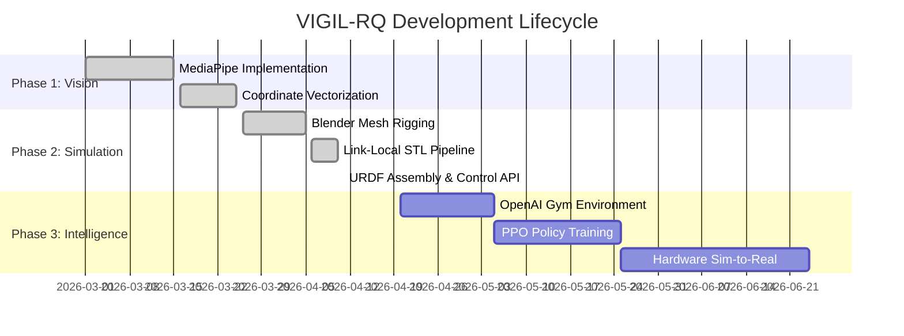
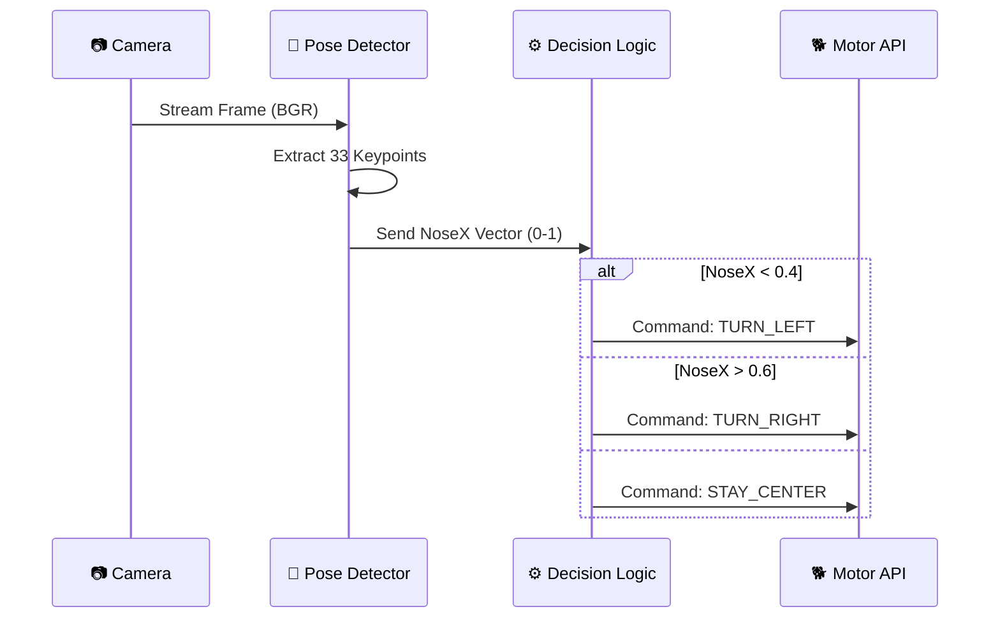
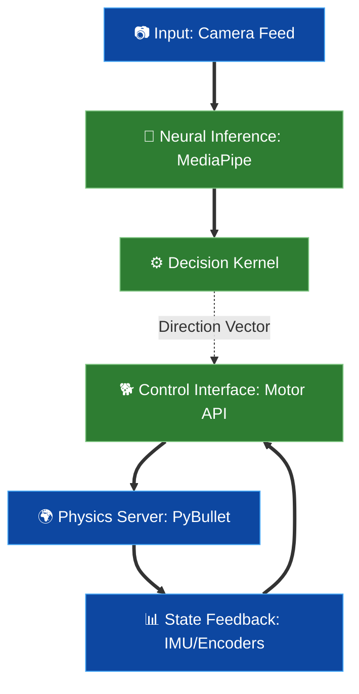

# <p align="center">🦾 VIGIL-RQ</p>
## <p align="center">**Vision-Guided Intelligent Locomotion for Robotic Quadrupeds**</p>

<p align="center">
  
  
  
  
</p>

<p align="center">
  
  <br>
  <i><b>System Blueprint:</b> Full mechanical assembly and electronic routing diagram.</i>
</p>

---

## 🌩️ Project Mission: Perception to Locomotion

VIGIL-RQ is a state-of-the-art software/hardware stack designed to give quadruped robots the ability to perceive and respond to their operator's intent in real-time. By combining depth-aware pose estimation with a custom-engineered physics simulation, we achieve high-precision autonomous walking within a safe digital twin before physical deployment.

---

## 🗺️ Execution Roadmap



---

## 🛠️ Technical Specifications

### 👁️ Perception Layer: The Vision Stack
The vision module operates as a high-speed data stream, processing webcam frames to extract semantic landmarks.

<details>
<summary><b>▶ Click to expand Vision Pipeline Logic</b></summary>


</details>

### 🐕 Locomotion Stack: The Digital Twin
Our simulation uses a proprietary **Link-Local Recenter** algorithm. This ensures that every mesh rotates around its physical pivot point `(0,0,0)` in the local coordinate system of its parent link.

#### **Joint & Servo Specs**
| Servo Model | Max Torque | Speed (60°) | Operating Volts | Max Angle |
| :--- | :--- | :--- | :--- | :--- |
| **DS3218MG (20KG)** | 21 kg·cm | 0.14 sec | 5.0V - 6.8V | ±135° |

#### **DOF Mapping (12 Degrees of Freedom)**
| Joint ID | Physical Component | Range (Rad) | Axis |
| :---: | :--- | :---: | :---: |
| **0** | Hip (Abduction) | -0.78 to 0.78 | Y (Green) |
| **1** | Thigh (Swing) | -1.57 to 1.57 | X (Red) |
| **2** | Knee (Knee) | -2.70 to 0.50 | X (Red) |

---

## 🏗️ Hardware Bill of Materials (Projected)

- **Main Board**: ESP32 / Arduino Mega + FPGA for Servo PWM timing.
- **Actuators**: 12x DS3218MG Digital Coreless Servos.
- **Sensor Suite**: MPU-6050 (IMU), HC-SR04 (Ultrasonic), Raspberry Pi Camera.
- **Power**: 7.4V 2200mAh LiPo battery.

---

## ⚙️ Control API Reference

The `QuadrupedController` class is the heart of the project. It abstracts complex PyBullet physics into simple, pythonic commands.

```python
# 1. Initialize with gravity and GUI
ctrl = QuadrupedController(render=True, spawn_height=0.45)

# 2. Query IMU (Roll, Pitch, Yaw)
imu_data = ctrl.get_imu()
if imu_data['rpy'][1] > 0.5:
    print("Warning: Pitch angle high!")

# 3. Dynamic Batch Control
ctrl.set_joint_angles({
    "fl_hip_joint": 0.2, 
    "fr_hip_joint": -0.2
})
```

---

## 🔌 Master Architecture Flow


---

## ⚡ Execution

### **Module 1: Manual Rigging Test**
Test the joint limits and assembly orientation:
```bash
python quadruped/scripts/joint_control.py
```

### **Module 2: Gait Demonstration**
Initiates a 4-leg alternating trot gait with real-time stability reporting:
```bash
python quadruped/scripts/walk_demo.py
```

---
<p align="center">
  <b>VIGIL-RQ</b> — Version 2.1.0 (Stable)
  <br>
  <i>"Vision in sight, Locomotion in stride."</i>
</p>
