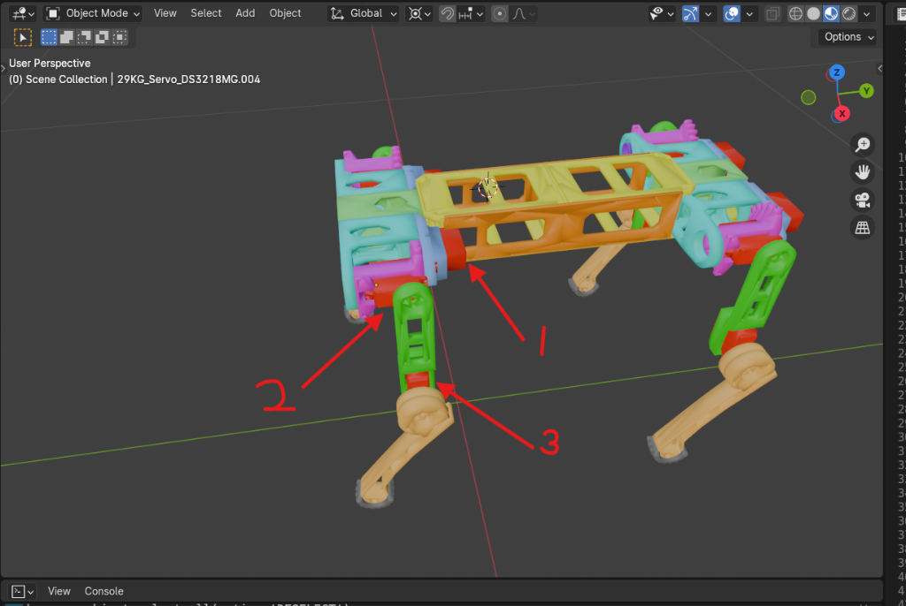
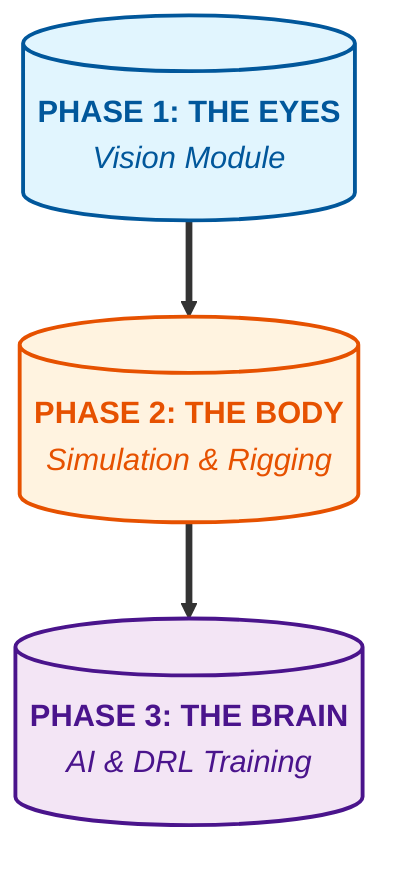
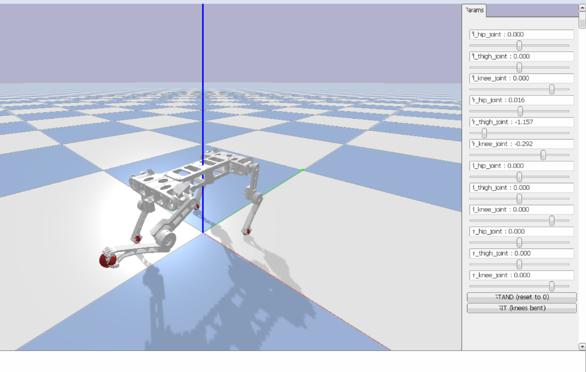

# <p align="center">🦾 VIGIL-RQ</p>
## <p align="center">**Vision-Guided Intelligent Locomotion for Robotic Quadrupeds**</p>

<p align="center">
  
  
  
  
</p>

<p align="center">
  
  <br>
  <i>The physical assembly structure with highlighted servo-link mappings.</i>
</p>

---

## 🌟 The Vision

**VIGIL-RQ** represents the synthesis of high-level human perception and low-level robotic precision. By leveraging **MediaPipe** for real-time operator tracking and **PyBullet** for high-fidelity physics simulation, this project provides a robust foundation for building autonomous quadruped robots that can "see" their operators and navigate complex environments.

### 🚀 Evolution Roadmap



---

## 🛠️ Technical Deep-Dive

### 1. 👁️ Vision Processing Pipeline
The perception engine runs at **30+ FPS**, converting raw pixels into actionable navigation vectors.

*   **Logic**: Tracks the **Nose landmark** centroid.
*   **Thresholding**:
    | Region | Normalized X | Command | Color Code |
    | :--- | :--- | :--- | :--- |
    | Left | `< 0.4` | `TURN_LEFT` | 🔴 |
    | Center | `0.4 - 0.6` | `MOVE_FORWARD` | 🟢 |
    | Right | `> 0.6` | `TURN_RIGHT` | 🔵 |

### 2. 🐕 Advanced Rigging & Simulation
The digital twin utilizes a **Link-Local Transformation Pipeline** to ensure physics stability.

<p align="center">
  
  <br>
  <i>PyBullet real-time simulation with 12-DOF joint control.</i>
</p>

#### **Mechanical Hierarchy**
| Link | Components | Axis of Rotation |
| :--- | :--- | :--- |
| **BASE** | Multi-chassis, Hip housings, Hip servo bodies | Fixed |
| **HIP** | Hip gear, Knee servo body, Thigh frame | **Y-Axis** (Splay) |
| **THIGH** | Upper leg components | **X-Axis** (Swing) |
| **CALF** | Lower leg, Foot, Servo horn | **X-Axis** (Knee) |

### 3. ⚙️ Robotic Control API (`motor_api.py`)
Our modular controller allows for seamless integration with high-level scripts.

```python
# Create the controller
ctrl = QuadrupedController(render=True)

# Smoothly transition to a pose
ctrl.stand()
ctrl.set_all_legs(hip=0, thigh=0.4, knee=-0.8)

# Read simulated IMU data
imu = ctrl.get_imu()
print(f"Robot Height: {imu['height']:.2f}m")
```

---

## 📊 Locomotion Presets

Our 12-DOF system comes with pre-calibrated poses that serve as the building blocks for gait development:

| Pose | Thigh Angle (avg) | Knee Angle (avg) | Status |
| :--- | :--- | :--- | :--- |
| **STAND** | `0.0` | `0.0` | ✅ Active |
| **SIT** | `0.5` | `-1.2` | ✅ Active |
| **REST** | `0.8` | `-1.8` | ✅ Active |
| **TROT** | Dynamic (Sine) | Dynamic (Sine) | 🚶 Working |

---

## 🔜 Future: The DRL Frontier
Phase 3 focuses on **Deep Reinforcement Learning** to achieve natural, adaptive locomotion on uneven terrain.

*   **Policy Algorithm**: PPO (Proximal Policy Optimization).
*   **Action Space**: Continuous target angles for 12 servos.
*   **Reward Function**: `Forward progression` + `Gait Stability` - `Energy usage`.

---

## ⚡ Setup & Launch

```bash
# 1. Clone & Install
git clone https://github.com/Major-Project-001/VIGIL-RQ.git
cd VIGIL-RQ
pip install -r requirements.txt

# 2. Manual Joint Test
python quadruped/scripts/joint_control.py

# 3. Running the Walk Demo
python quadruped/scripts/walk_demo.py
```

---
<p align="center">
  Developed with ❤️ for the Major Project in Robotics.
  <br>
  <b>VIGIL-RQ 🦾 2026</b>
</p>
