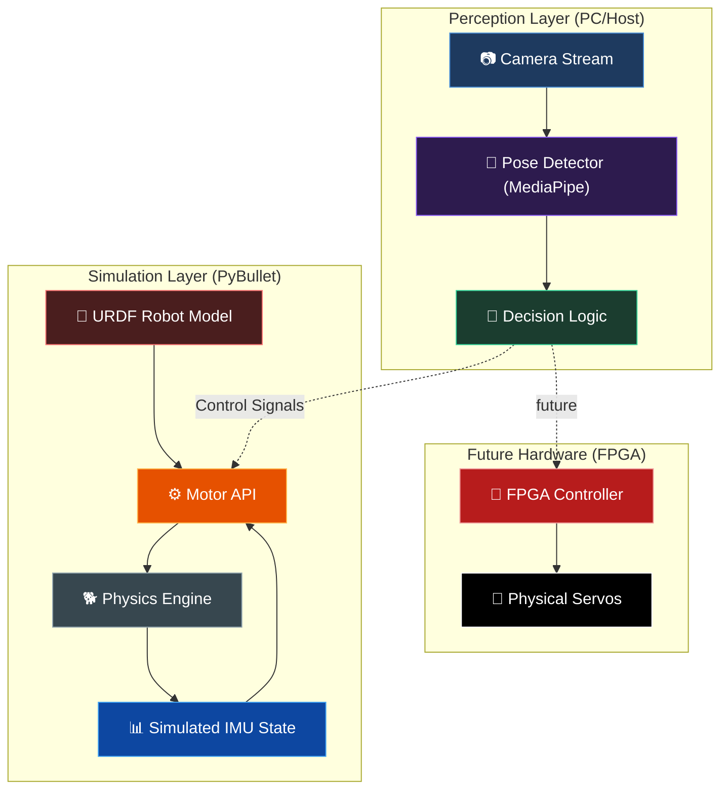

# 🦾 VIGIL-RQ
### **Vi**sion-**G**uided **I**ntelligent **L**ocomotion for **R**obotic **Q**uadrupeds

[](https://opensource.org/licenses/MIT)
[](https://www.python.org/)
[](https://pybullet.org/)
[](https://mediapipe.dev/)

VIGIL-RQ is a cutting-edge robotics platform integrating **Real-time Computer Vision**, **High-Fidelity Physics Simulation**, and **Modular Locomotion Intelligence**. Our mission is to bridge the gap between high-level perception and low-level robotic control.

---

## 🗺️ Project Roadmap: Past, Present & Future

```mermaid
timeline
    title VIGIL-RQ Evolution
    section Phase 1: The Eyes (Past)
        Vision Module : MediaPipe Integration
        Pose Detection : 33-Keypoint skeleton tracking
        Command Logic : Directional mapping (Left/Right/Center)
    section Phase 2: The Body (Present)
        3D Rigging : Blender to URDF Pipeline
        Physics Engine : PyBullet Integration with Link-Local Meshes
        Control API : Modular Motor Control System
        Locomotion : Initial Sine-wave Trot Gait
    section Phase 3: The Brain (Future)
        RL Integration : OpenAI Gym Environment wrapper
        AI Training : PPO/SAC Locomotion Policy
        Bridge : Sim-to-Real hardware transfer
        Hardware : FPGA-based Servo Controller Integration
```

---

## 🏗️ Core Pillars

### 1. 👁️ Vision Engine (`vision/`)
The perception layer that tracks human operators and environment cues.
*   **MediaPipe Pose**: High-precision tracking of 33 keypoints.
*   **Directional Intelligence**: Smoothly maps human movement to robot commands.
*   **Modular Design**: Easily swappable for YOLO or other detection frameworks.

### 2. 🌍 Simulation & Rigging (`quadruped/`)
A physics-true digital twin of the robot.
*   **Blender-to-URDF Pipeline**: Automatic export and assembly of 3D components.
*   **Link-Local Mesh Transformation**: Custom vertex-adjustment algorithm for stable, precise joint rotation.
*   **Collision Geometry**: Hyper-accurate collision primitives for real-world interaction testing.

### 3. ⚙️ Motor Intelligence (`scripts/`)
The software bridge that drives the physical/simulated servos.
*   **`motor_api.py`**: A clean, object-oriented API for joint and leg pose management.
*   **Simulated IMU**: Real-time feedback on base orientation and linear/angular velocity.
*   **Locomotion Demo**: Diagonal pair "Trot" gait for multi-DOF walking.

---

## 🔌 System Architecture



---

## ⚡ Quick Start

### 📦 Prerequisites
- Python 3.10+
- `pip install pybullet mediapipe opencv-python numpy`

### 🎮 Manual Joint Control
Check the rigging and joint limits:
```bash
python quadruped/scripts/joint_control.py
```

### 🚶 Walking Demo
See the robot trot in simulation:
```bash
python quadruped/scripts/walk_demo.py
```

### 📸 Vision Module
Run the human-tracking perception:
```bash
python main.py
```

---

## 🚀 The Future: Deep RL & Physical Deployment

Currently, we are moving towards **Phase 3**, where the simulation will be used to train a **Deep Reinforcement Learning** policy for robust walking across uneven terrain. By wrapping our `Motor API` in a **Gymnasium Environment**, we can leverage algorithms like PPO to teach the robot to walk better than any human-coded sine wave.

**Next Stop:** Sim-to-Real.

---
> Developed as part of a Major Project in Robotics & Vision. 🦾
