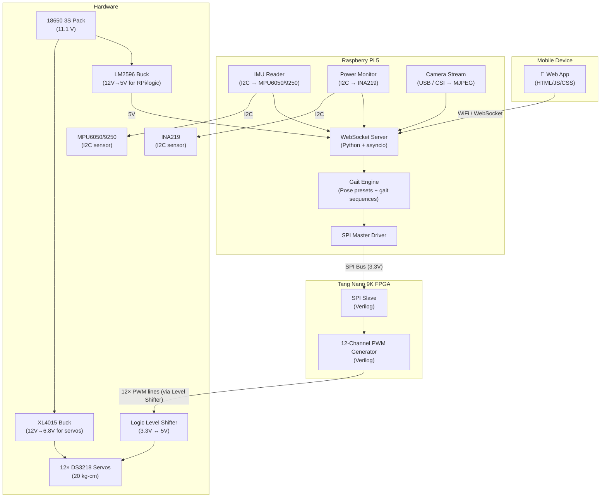

# 🦾 VIGIL-RQ — Remote Control System Implementation Plan

> **Manual remote control for the VIGIL-RQ quadruped via mobile app, powered by Raspberry Pi 5 + Tang Nano 9K FPGA**

---

## 📐 System Architecture Overview



---

## 🔩 Hardware Bill of Materials

| # | Component | Model / Spec | Qty | Role |
|---|-----------|-------------|-----|------|
| 1 | Servo | DS3218 (20 kg·cm) | 12 | Joint actuation (3 per leg × 4 legs) |
| 2 | FPGA Board | Tang Nano 9K (GW1NR-9) | 1 | 12-ch PWM generation |
| 3 | SBC | Raspberry Pi 5 (4 GB) | 1 | Central controller, WiFi AP, app server |
| 4 | Battery | 18650 Li-ion 3S (11.1 V) | 1 | Main power |
| 5 | BMS | 3S BMS (10–20 A) | 1 | Battery protection |
| 6 | Buck Converter (servos) | XL4015 (12V → 6.8 V) | 1 | Servo power rail |
| 7 | Buck Converter (logic) | LM2596 (12V → 5 V) | 1 | RPi + FPGA power |
| 8 | IMU | MPU6050 / MPU9250 | 1 | Body orientation sensing |
| 9 | Power Monitor | INA219 | 1 | Battery voltage/current monitoring |
| 10 | Camera | USB Logitech / RPi Camera v2 | 1 | FPV live feed |
| 11 | Logic Level Shifter | 4-ch bidirectional (3.3V ↔ 5V) | 3 | FPGA PWM (3.3V) → Servo (5V signal) |
| 12 | Schottky Diodes | 1N5822 | 4+ | Reverse polarity protection |
| 13 | Fuse Holder + Fuse | Inline blade (10–20 A) | 1 | Over-current protection |
| 14 | Power Terminal Block | Screw type | 1 | Power distribution |
| 15 | Heat Shrink | 1 cm, 2 cm | — | Wire insulation |

---

## ⚡ DS3218 Servo Specifications

| Parameter | Value |
|-----------|-------|
| PWM Frequency | 50 Hz (20 ms period) — standard; supports up to 330 Hz |
| Pulse Width Range | 500 µs – 2500 µs |
| Neutral Position | 1500 µs (center) |
| Dead Band Width | 3 µs |
| Signal Voltage | 3.3 V or 5 V logic (5V preferred for reliability) |
| Operating Voltage | 4.8 V – 7.4 V |
| Stall Torque | 20 kg·cm @ 6.8 V |
| Operating Current | ~500 mA idle, 2–3 A stall |

> [!IMPORTANT]
> At 6.8V, 12 servos can draw up to **36 A** simultaneously under stall. The XL4015 must be sized appropriately or paralleled. In practice, gaits rarely stall all servos simultaneously — typical draw is 6–10 A.

---

## 🏗️ Three-Tier Architecture

### Tier 1 — Tang Nano 9K FPGA (PWM Generation)

**Purpose:** Generate 12 independent, hardware-precise PWM signals at 50 Hz for the DS3218 servos.

**Verilog modules:**  
1. `spi_slave.v` — Receives servo angle commands from RPi over SPI
2. `pwm_channel.v` — Single-channel PWM generator (configurable pulse width)  
3. `pwm_controller.v` — Top-level: 12 PWM channels + SPI slave interface  
4. `top.v` — Pin assignments, clock divider, module instantiation

**SPI Protocol (RPi → FPGA):**
- Mode: SPI Mode 0 (CPOL=0, CPHA=0)
- Clock: 1 MHz
- Frame: `[1-byte channel_id (0-11)] [2-byte pulse_width_us (big-endian)]`
- Total: 3 bytes per servo update, 36 bytes for all 12

**PWM Timing (at 27 MHz FPGA clock):**
- Period: 20 ms = 540,000 clock cycles
- Min pulse (500 µs): 13,500 cycles
- Max pulse (2500 µs): 67,500 cycles
- Resolution: ~0.037 µs per tick → **excellent precision**

### Tier 2 — Raspberry Pi 5 (Controller & Server)

**Purpose:** Bridge between mobile app and FPGA. Runs gait engine, reads sensors, streams camera.

**Software stack:**
- Python 3.11+ with asyncio
- `websockets` — WebSocket server for mobile app
- `spidev` — SPI master to communicate with FPGA
- `smbus2` — I2C for IMU and INA219
- `picamera2` or OpenCV — Camera MJPEG streaming
- `Flask` or static file server — Serve the mobile web app

**Key responsibilities:**
1. Host WiFi access point (hostapd) or connect to local network
2. Serve the control web app on port 80
3. WebSocket server on port 8765 for real-time bidirectional control
4. Gait engine: convert high-level commands (walk, run, sit, stand, rest) into per-servo angle sequences
5. SPI master: send 12× servo pulse widths to FPGA at 50 Hz
6. I2C sensor polling: IMU orientation + INA219 battery telemetry
7. Camera: optional MJPEG stream on port 8080

### Tier 3 — Mobile Web App (Controller UI)

**Purpose:** Touch-friendly interface for manual robot control. Runs in any mobile browser.

**Features:**
- 5 preset buttons: **Walk**, **Run**, **Sit**, **Stand**, **Rest**
- Virtual joystick for directional control (forward, backward, turn left/right)
- Speed slider
- Live telemetry display: battery voltage, current, IMU roll/pitch/yaw
- Optional: camera FPV stream view
- Emergency STOP button

**Tech:** Single-page HTML + CSS + vanilla JS. WebSocket connection to RPi.

---

## 🦿 Gait Definitions (12 Joint Angles)

Each gait maps to target angles for all 12 joints: `{leg}_{joint}` where leg ∈ {FL, FR, RL, RR} and joint ∈ {hip, thigh, knee}.

| Preset | Description | Hip (all) | Thigh (all) | Knee (all) |
|--------|-------------|-----------|-------------|------------|
| **Stand** | Upright, legs straight | 0.0° | 0.0° | 0.0° |
| **Sit** | Rear legs bent, front straight | Front: 0° / Rear: 0° | Front: 0° / Rear: +28° | Front: 0° / Rear: −69° |
| **Rest** | All knees fully tucked in | 0.0° | +46° | −103° |
| **Walk** | Trot gait cycle @ 1.0 Hz | ±8.6° sway | ±23° swing | Dynamic lift |
| **Run** | Trot gait cycle @ 2.0 Hz | ±12° sway | ±30° swing | Dynamic lift (larger) |

> [!NOTE]
> Walk and Run are **dynamic gaits** — the angles change continuously over time via sine-wave interpolation. The gait engine on the RPi computes these in real-time and streams to the FPGA at 50 Hz.

---

## 🔌 Communication Protocols

### RPi ↔ FPGA: SPI Bus

| Signal | RPi 5 Pin | FPGA Pin | Notes |
|--------|-----------|----------|-------|
| SCLK | GPIO 11 (SPI0_SCLK) | Configurable | 1 MHz clock |
| MOSI | GPIO 10 (SPI0_MOSI) | Configurable | RPi → FPGA data |
| MISO | GPIO 9 (SPI0_MISO) | Configurable | FPGA → RPi (optional feedback) |
| CS | GPIO 8 (SPI0_CE0) | Configurable | Chip select (active low) |

> Both RPi 5 and Tang Nano 9K run at 3.3V logic — **no level shifter needed** for SPI.

### RPi ↔ Sensors: I2C Bus

| Device | Address | RPi Pins | Notes |
|--------|---------|----------|-------|
| MPU6050 / MPU9250 | 0x68 (or 0x69) | GPIO 2 (SDA), GPIO 3 (SCL) | 3.3V — direct connect |
| INA219 | 0x40 (default) | GPIO 2 (SDA), GPIO 3 (SCL) | Shared I2C bus |

### RPi ↔ App: WebSocket over WiFi

| Parameter | Value |
|-----------|-------|
| Protocol | WebSocket (ws://) |
| Port | 8765 |
| Data format | JSON |
| Update rate | 20 Hz (telemetry) |

**Command messages (App → RPi):**
```json
{"type": "command", "action": "walk", "speed": 1.0, "direction": 0.0}
{"type": "command", "action": "stand"}
{"type": "command", "action": "stop"}
{"type": "joystick", "x": 0.3, "y": 0.8}
```

**Telemetry messages (RPi → App):**
```json
{
  "type": "telemetry",
  "battery_v": 11.4,
  "battery_a": 3.2,
  "imu": {"roll": 1.2, "pitch": -0.5, "yaw": 45.0},
  "gait": "walk",
  "servos_active": true
}
```

---

## 🗂️ Project File Structure

```
d:\Desktop\kutta\
├── control/                          ← NEW: Remote control system
│   ├── fpga/                         ← Tang Nano 9K Verilog project
│   │   ├── src/
│   │   │   ├── top.v                 ← Top-level module
│   │   │   ├── spi_slave.v           ← SPI slave interface
│   │   │   ├── pwm_channel.v         ← Single PWM channel
│   │   │   └── pwm_controller.v      ← 12-ch PWM + SPI integration
│   │   ├── constraints/
│   │   │   └── tangnano9k.cst        ← Pin constraint file
│   │   └── README.md
│   │
│   ├── rpi/                          ← Raspberry Pi 5 Python server
│   │   ├── server.py                 ← Main entry point (asyncio event loop)
│   │   ├── websocket_handler.py      ← WebSocket server + message routing
│   │   ├── gait_engine.py            ← Gait presets + dynamic gait generator
│   │   ├── spi_driver.py             ← SPI master → FPGA communication
│   │   ├── imu_reader.py             ← MPU6050/9250 I2C driver
│   │   ├── power_monitor.py          ← INA219 I2C driver
│   │   ├── camera_stream.py          ← MJPEG camera streaming
│   │   ├── config.py                 ← All constants and tuning params
│   │   └── requirements.txt
│   │
│   ├── app/                          ← Mobile control web app
│   │   ├── index.html                ← Main page
│   │   ├── style.css                 ← UI styling
│   │   ├── app.js                    ← WebSocket + control logic
│   │   └── joystick.js               ← Virtual joystick widget
│   │
│   └── docs/
│       └── wiring_diagram.md         ← Mermaid wiring/connection diagram
│
├── quadruped/                        ← Existing simulation
│   └── ...
├── vision/                           ← Existing vision module
│   └── ...
└── ...
```

---

## ⚠️ Key Design Decisions

1. **FPGA for PWM, not microcontroller:** The Tang Nano 9K generates all 12 PWM channels in true parallel hardware — zero jitter, no software timing issues. This is critical for the DS3218's 3 µs dead band.

2. **No ESP8266 needed:** The Raspberry Pi 5 has built-in WiFi and can serve as both the WebSocket server and WiFi access point. The ESP8266 is unnecessary unless you want a dedicated lightweight WiFi bridge — but the RPi already handles this cleanly.

3. **Web app, not native app:** A browser-based app means zero installation on any phone. Works on Android, iOS, and desktop.

4. **SPI over UART:** SPI is faster (1 Mbps vs 115200 bps) and supports full-duplex. Updating 12 servos at 50 Hz requires only 1800 bytes/sec — well within SPI's capability.

5. **Level shifters for PWM only:** RPi ↔ FPGA SPI runs at 3.3V natively. Only the FPGA PWM output lines need 3.3V→5V level shifting to drive the DS3218 signal inputs reliably.

---

## 🔐 Safety Features

- **Emergency stop (E-STOP):** App button sets all servos to neutral (1500 µs) immediately
- **Watchdog timer:** If no command received for 2 seconds, auto-rest
- **Current monitoring:** INA219 alerts if draw exceeds safe threshold
- **Voltage cutoff:** Low-voltage warning at 9.6V (3.2V/cell), shutdown at 9.0V (3.0V/cell)
- **Fuse protection:** 15A inline blade fuse on main power rail
