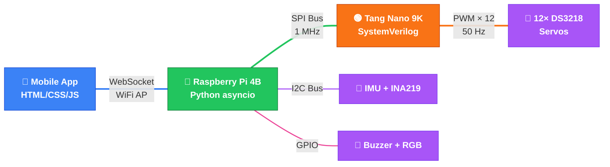

# 🐕 VIGIL-RQ — Remote Control System

> **Branch:** `control`
> **Robot:** VIGIL-RQ Quadruped (12-DOF, 4 legs × 3 joints)

---

## 🏗️ Architecture Overview



**Signal flow:** Mobile App → WebSocket → RPi Server → SPI → FPGA → PWM → Level Shifters → Servos

---

## 📂 Directory Structure

```
control/
├── app/                         # Mobile web app (served by RPi)
│   ├── index.html               # UI layout — joystick, telemetry, E-STOP
│   ├── style.css                # Dark mode, glassmorphism design
│   ├── joystick.js              # Canvas-based virtual joystick
│   └── app.js                   # WebSocket client, telemetry display
│
├── fpga/                        # FPGA firmware (Gowin EDA project)
│   ├── src/
│   │   ├── top.sv               # Top-level: clock, reset, pin mapping
│   │   ├── pwm_controller.sv    # 12-channel integration + watchdog
│   │   ├── pwm_channel.sv       # Single 50 Hz PWM generator
│   │   └── spi_slave.sv         # SPI Mode 0 receiver
│   ├── tb/
│   │   └── tb_pwm_controller.sv # Testbench
│   ├── constraints/
│   │   └── tangnano9k.cst       # Pin constraints
│   └── README.md                # FPGA build instructions
│
├── rpi/                         # Raspberry Pi server (Python)
│   ├── server.py                # Main asyncio orchestrator
│   ├── config.py                # Central configuration
│   ├── spi_driver.py            # SPI master → FPGA comms
│   ├── gait_engine.py           # Walk / trot / pose generation
│   ├── imu_reader.py            # MPU6050/9250 I2C driver
│   ├── power_monitor.py         # INA219 battery monitor
│   ├── alert_manager.py         # Buzzer + RGB LED manager
│   ├── websocket_handler.py     # WebSocket server
│   └── requirements.txt         # Python dependencies
│
├── docs/                        # Wiring & connection diagrams
│   ├── wiring_diagram.md        # 📋 INDEX — System overview + links
│   ├── wiring_power.md          # ⚡ Power distribution
│   ├── wiring_spi.md            # 🔵 SPI bus (RPi ↔ FPGA)
│   ├── wiring_i2c.md            # 🟣 I2C bus (RPi ↔ sensors)
│   ├── wiring_pwm.md            # 🟢 PWM outputs (FPGA → servos)
│   ├── wiring_gpio.md           # 🩷 GPIO alerts (buzzer + LED)
│   ├── wiring_servo_power.md    # 🟠 Servo power (6.8V per leg)
│   └── wiring_reference.md      # 📋 Pin tables + ground bus + checklist
│
└── README.md                    # ← You are here
```

---

## 📖 Wiring Documentation — Reading Order

The wiring docs are split into **separate files** to keep each Mermaid diagram small and renderable. Follow this order when building the robot:

### Phase 1: Power First (no logic connected)

| Step | File | What to Build | Verify |
|------|------|---------------|--------|
| 1 | [wiring_power.md](docs/wiring_power.md) | Battery → BMS → Fuse → Terminal Block → Buck converters | Multimeter: XL4015 = 6.8V, LM2596 = 5.0V |
| 2 | [wiring_reference.md](docs/wiring_reference.md) § Ground Bus | Star ground from terminal block | Continuity test all GND wires to one point |

### Phase 2: Controllers + Communication

| Step | File | What to Build | Verify |
|------|------|---------------|--------|
| 3 | [wiring_spi.md](docs/wiring_spi.md) | RPi ↔ FPGA SPI bus (3 wires + GND) | `spidev` loopback test |
| 4 | [wiring_i2c.md](docs/wiring_i2c.md) | RPi ↔ IMU + INA219 I2C bus | `i2cdetect -y 1` shows 0x68 + 0x40 |

### Phase 3: Servo Signal Path

| Step | File | What to Build | Verify |
|------|------|---------------|--------|
| 5 | [wiring_pwm.md](docs/wiring_pwm.md) | FPGA → Level Shifters → Servo signal wires | Oscilloscope: 50 Hz, 1-2ms pulses on HV side |
| 6 | [wiring_servo_power.md](docs/wiring_servo_power.md) | 6.8V power + GND to all 12 servos | Servos respond to PWM signals |

### Phase 4: Peripherals

| Step | File | What to Build | Verify |
|------|------|---------------|--------|
| 7 | [wiring_gpio.md](docs/wiring_gpio.md) | Buzzer + RGB LED with resistors | Run `alert_manager.py`, LED lights up |
| 8 | [wiring_reference.md](docs/wiring_reference.md) § INA219 Shunt | Shunt resistor on servo rail | Power monitor reads current draw |

### Phase 5: Final Check

| Step | File | What to Do |
|------|------|------------|
| 9 | [wiring_reference.md](docs/wiring_reference.md) § Assembly Checklist | Walk through every checkbox |
| 10 | [wiring_diagram.md](docs/wiring_diagram.md) | Verify against system overview diagram |

---

## 🚀 Quick Start

### 1. Flash the FPGA
```bash
# Use Gowin EDA → Synthesize → Program via USB-JTAG
# See fpga/README.md for full instructions
```

### 2. Configure RPi as WiFi AP
```bash
# Network: VIGIL-RQ (WPA2), password in config.py
sudo nmcli device wifi hotspot ifname wlan0 ssid VIGIL-RQ password <your-password>
```

### 3. Install dependencies & run
```bash
cd control/rpi
pip install -r requirements.txt
sudo python server.py
```

### 4. Connect from mobile
1. Join `VIGIL-RQ` WiFi on your phone
2. Open `http://192.168.4.1:8080` in browser
3. Use joystick + gait buttons to control

---

## ⚠️ Safety Notes

- **Always verify buck converter voltages** with a multimeter before connecting any load
- **Never power servos from RPi** — use the dedicated 6.8V XL4015 rail
- **500ms FPGA watchdog** — all servos go to neutral if SPI communication stops
- **10s RPi watchdog** — server auto-restarts if main loop hangs
- **Star ground topology** — prevents servo jitter and SPI bus errors
- **Run server with `sudo`** — required for GPIO, SPI, and I2C access

---

## 📦 Hardware Bill of Materials

| Component | Qty | Notes |
|-----------|-----|-------|
| Raspberry Pi 4B (4GB) | 1 | WiFi AP + main controller |
| Tang Nano 9K (GW1NR-9C) | 1 | PWM generation via FPGA |
| DS3218 20kg servo | 12 | 3 per leg × 4 legs |
| 18650 3S battery pack | 1 | 11.1V nominal |
| 3S BMS (10-20A) | 1 | Battery protection |
| XL4015 buck converter | 1 | Adjusted to 6.8V for servos |
| LM2596 buck converter | 1 | Adjusted to 5.0V for logic |
| 4-ch level shifter (3.3V↔5V) | 3 | FPGA PWM → servo signal |
| MPU6050/9250 IMU | 1 | Orientation sensing |
| INA219 power monitor | 1 | Battery current/voltage |
| 1N5822 Schottky diode | 2 | Reverse polarity protection |
| 15A blade fuse | 1 | Overcurrent protection |
| Active buzzer | 1 | Audio alerts |
| RGB LED (common cathode) | 1 | Visual status |
| 220Ω resistor | 3 | LED current limiting |
| 0.1Ω shunt resistor | 1 | INA219 current sense |
| Screw terminal block | 1 | Power distribution |

---

## 🔗 Dependencies

```
websockets>=11.0
spidev>=3.5
smbus2>=0.4
numpy>=1.21
RPi.GPIO>=0.7
```
