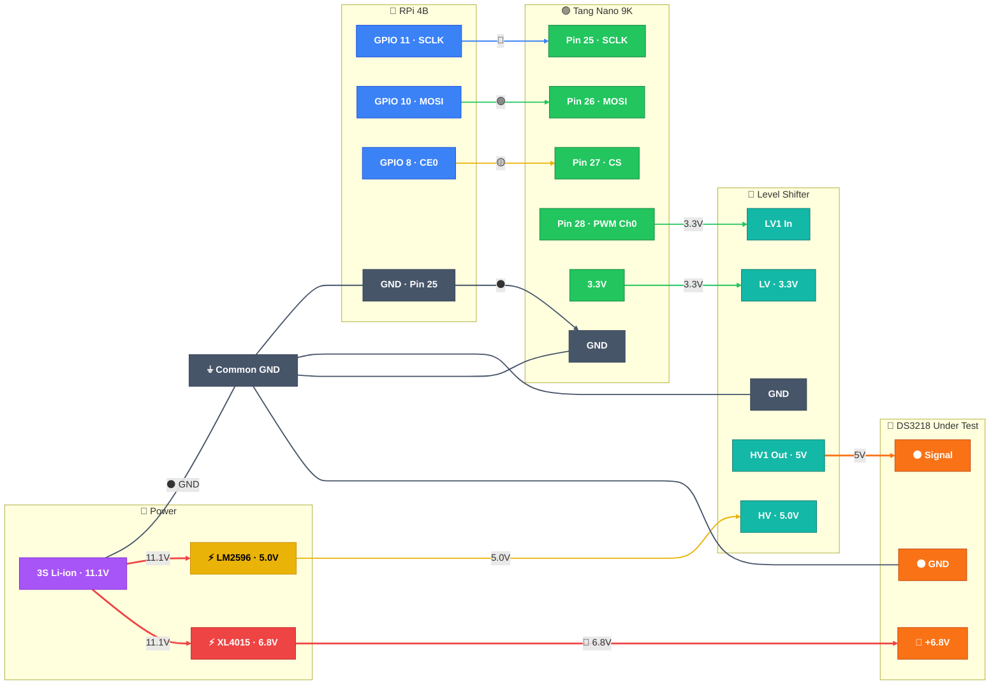

# 🎯 Servo Calibration — Setup & Usage Guide

> This guide walks you through calibrating each DS3218 servo to its exact mechanical center before assembling the robot. You'll test one bare servo at a time on a bench.

---

## Prerequisites

Before starting, make sure you've completed these two guides:

| # | Guide | Status |
|---|-------|--------|
| 1 | [Raspberry Pi Setup](rpi_setup_guide.md) | RPi boots, SSH works, Python deps installed |
| 2 | [FPGA Flash](fpga_flash_guide.md) | Tang Nano 9K programmed, LED[0] blinking |

---

## Hardware Setup (Bench Wiring)

You only need a **minimal** wiring setup for calibration — not the full robot:

### What You Need on the Bench

| Item | Notes |
|------|-------|
| Raspberry Pi 4B | Powered via its own USB-C PSU for now |
| Tang Nano 9K | Powered via USB-C from PC or RPi |
| 1× DS3218 servo | The one you're currently calibrating |
| 1× Level shifter (4-ch) | Only need 1 channel for testing |
| XL4015 buck converter | Adjusted to **6.8V** (see power guide) |
| 11.1V battery or bench PSU | Power source for the buck converter |
| 4× jumper wires (SPI) | SCLK, MOSI, CS, GND |
| 3× jumper wires (level shifter) | LV in, HV out, GND |
| 3× servo wires | Signal (orange), Power (red), GND (brown) |

### Wiring Diagram (Minimal)



### Step-by-Step Wiring

1. **Power off everything** — nothing plugged in yet

2. **Wire SPI (RPi → FPGA):**

   | RPi Pin | → | FPGA Pin | Wire |
   |---------|---|----------|------|
   | GPIO 11 (Pin 23) | → | Pin 25 | 🔵 Blue (SCLK) |
   | GPIO 10 (Pin 19) | → | Pin 26 | 🟢 Green (MOSI) |
   | GPIO 8 (Pin 24) | → | Pin 27 | 🟡 Yellow (CS) |
   | GND (Pin 25) | → | GND | ⚫ Black |

3. **Wire Level Shifter:**

   | Level Shifter Pin | → | Connect To |
   |-------------------|---|------------|
   | LV | → | FPGA 3.3V |
   | HV | → | 5V (from LM2596 or benchtop PSU) |
   | GND | → | Common GND |
   | LV1 (input) | → | FPGA Pin 28 (pwm_out[0]) |
   | HV1 (output) | → | Servo signal wire (🟠 orange) |

4. **Wire Servo:**

   | Servo Wire | → | Connect To |
   |------------|---|------------|
   | 🟠 Orange (signal) | → | Level shifter HV1 output |
   | 🔴 Red (power) | → | XL4015 buck output (+6.8V) |
   | ⚫ Brown (ground) | → | Common GND |

5. **Set up power:**
   - Connect battery (or bench PSU) to XL4015 input
   - **Verify XL4015 output = 6.8V with multimeter BEFORE connecting servo**
   - Connect common GND between: RPi, FPGA, Level Shifter, Buck converter, Servo

6. **Power on sequence:**
   1. Battery / bench PSU → ON (verify 6.8V)
   2. RPi → plug in USB-C power
   3. FPGA → plug in USB-C (if not powered from LM2596 yet)
   4. Wait for RPi to boot (~30s)

> [!CAUTION]
> **Always verify the 6.8V rail with a multimeter before connecting the servo.** A wrong voltage will permanently damage the servo.

---

## Running the Calibration Server

### SSH into the RPi:
```bash
ssh pi@vigilrq.local
# Or: ssh pi@<rpi-ip-address>
```

### Start the calibration server:
```bash
cd ~/VIGIL-RQ/control/calibration
sudo python3 calib_server.py
```

You should see:
```
============================================================
  🎯 VIGIL-RQ Servo Calibration Tool
============================================================
[SPI] Opened SPI0.0 @ 1.0 MHz
[CALIB] All servos set to neutral (1500 µs)
[HTTP] Serving calibration UI on http://0.0.0.0:8080
[WS] WebSocket server on ws://0.0.0.0:8765

  Open in browser:  http://<rpi-ip>:8080
  Or on same machine: http://localhost:8080
```

### Open the UI:

**If RPi is on your home WiFi:**
- On your phone/laptop, open: `http://vigilrq.local:8080`
- Or: `http://<rpi-ip>:8080`

**If RPi is in hotspot mode:**
- Connect your phone to `VIGIL-RQ` WiFi
- Open: `http://10.42.0.1:8080`

You should see the calibration interface with the slider at 0°.

---

## Calibration Procedure — Per Servo

Repeat this for **each of your 12 servos**, one at a time:

### Step 1: Select Channel

- Use the dropdown or **▲/▼ arrow keys** to pick the channel
- For bench calibration, always use **Channel 0** (the servo is connected to FPGA Pin 28)
- The channel name tells you which joint this servo will become (e.g., "FL Hip")

### Step 2: Verify Neutral

1. Click **"Center This"** (or press **Space**) → servo goes to 1500µs (0°)
2. The servo should move to its mechanical center
3. **Look at the output shaft** — note its position

### Step 3: Find True Center

The goal is to find the exact angle where the servo horn is in the **ideal mounting position**:

1. **Slowly** move the slider left/right (or use **←/→ arrow keys**)
   - Arrow keys move **0.5°** per press
   - **Shift + Arrow** moves **5°** per press
2. Watch the servo physically
3. Stop when the output shaft is at the **exact center position** you need
4. Note the angle and pulse width shown in the UI

### Step 4: Record the Offset

- The **"Offset"** field shows how far from 1500µs the servo needs to be
- For example: if true center is at +3.5° (1526µs), the offset is **+26µs**
- This means the servo's internal neutral is 26µs off from the standard 1500µs

### Step 5: Detach and Label

1. Once you've found the center, **mark the servo horn** at this position
2. If using a cross-style horn: align it as close to 0° as possible
3. **Label the servo** with its intended joint name (e.g., "FL Hip")
4. Disconnect the servo
5. Connect the next servo to the same level shifter output
6. Repeat from Step 2

> [!TIP]
> If the servo horn can't be perfectly aligned at 1500µs, that's normal. The offset you record compensates for this. The gait engine automatically applies these offsets.

---

## Saving Offsets

After calibrating all 12 servos:

1. Set each channel's slider to where you found that servo's true center
2. Click **"💾 Save Offsets"**
3. This creates a file `servo_offsets.json` in the calibration folder:

```json
{
  "fl_hip": 26,
  "fl_thigh": -12,
  "fl_knee": 0,
  "fr_hip": 8,
  ...
}
```

### Applying Offsets to the Main Robot Config

Open `control/rpi/config.py` on the RPi and update `SERVO_OFFSETS`:

```python
# Per-servo neutral offset (µs) — from calibration tool
SERVO_OFFSETS = {
    "fl_hip":   26,
    "fl_thigh": -12,
    "fl_knee":  0,
    "fr_hip":   8,
    "fr_thigh": -5,
    "fr_knee":  15,
    "rl_hip":   -3,
    "rl_thigh": 10,
    "rl_knee":  -8,
    "rr_hip":   0,
    "rr_thigh": 20,
    "rr_knee":  -14,
}
```

---

## Keyboard Shortcuts

| Key | Action |
|-----|--------|
| **← →** | Adjust angle ±0.5° |
| **Shift + ← →** | Adjust angle ±5° |
| **↑ ↓** | Previous / Next channel |
| **Space** or **0** | Center current servo |

---

## Troubleshooting

| Problem | Fix |
|---------|-----|
| UI shows "Disconnected" | Check RPi IP, ensure `calib_server.py` is running |
| Slider moves but servo doesn't | Check SPI wiring; is FPGA LED[1] blinking? |
| Servo doesn't move at all | Check 6.8V power to servo; check level shifter wiring |
| Servo jitters | Add GND wire between RPi and FPGA; check for ground loops |
| Server shows "spidev not available" | Run with `sudo`; check SPI is enabled in `raspi-config` |
| "Address already in use" error | Kill old process: `sudo fuser -k 8080/tcp 8765/tcp` |
| Servo makes grinding noise at extremes | Don't push past physical limits; stay within ±120° |

---

## What's Next?

After all 12 servos are calibrated and offsets are saved:

1. ✅ Start assembling: attach servo horns at their marked center positions
2. ✅ Mount servos into the chassis
3. ✅ Wire all 12 servos following [wiring_servo_power.md](../docs/wiring_servo_power.md)
4. ✅ Wire the full SPI + I2C + GPIO following [wiring_diagram.md](../docs/wiring_diagram.md)
5. ✅ Run the main server (`control/rpi/server.py`) for full robot control
