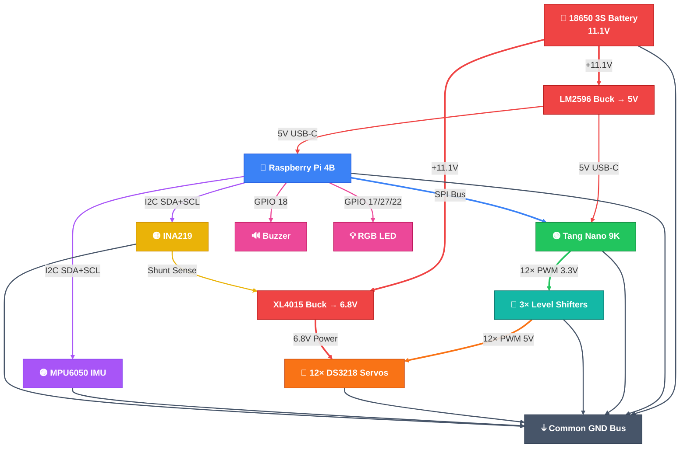
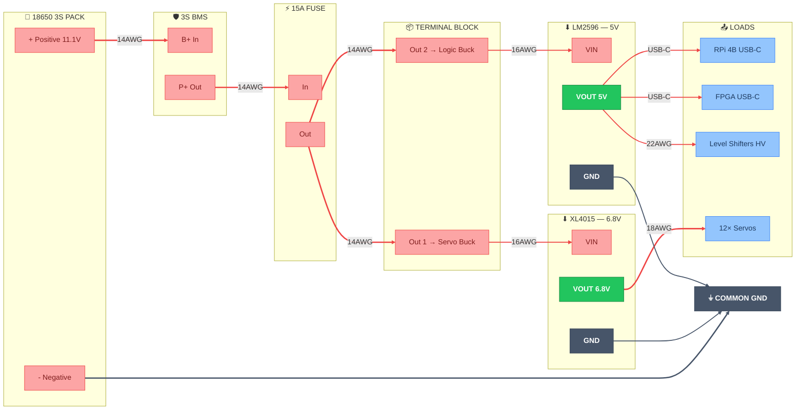
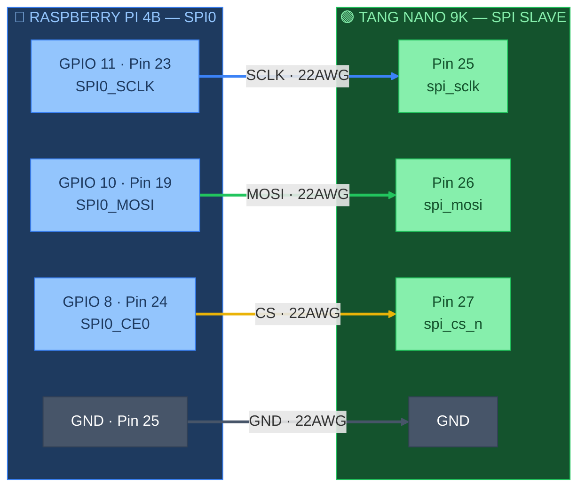
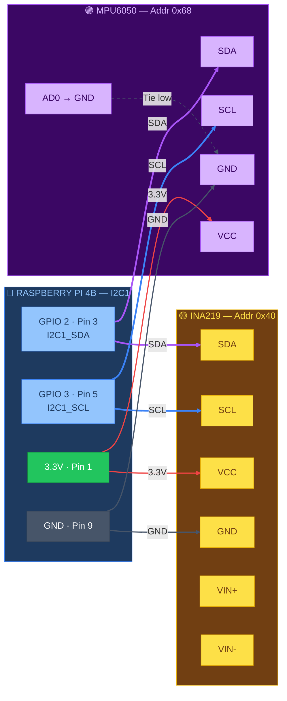
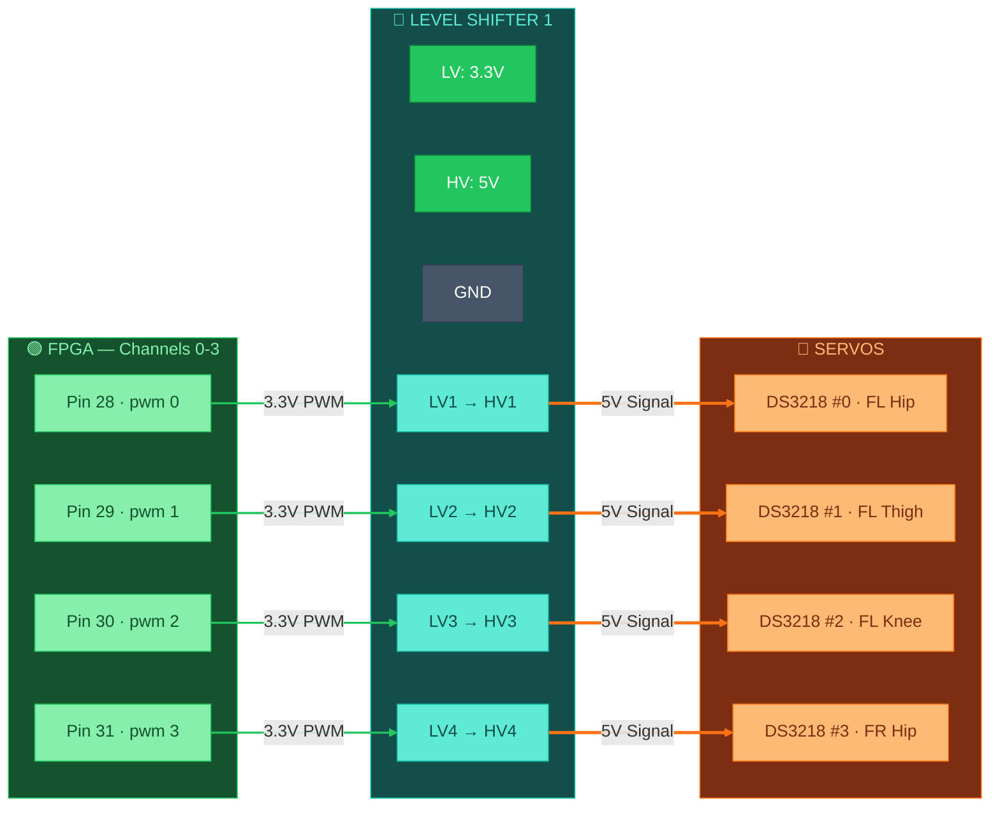
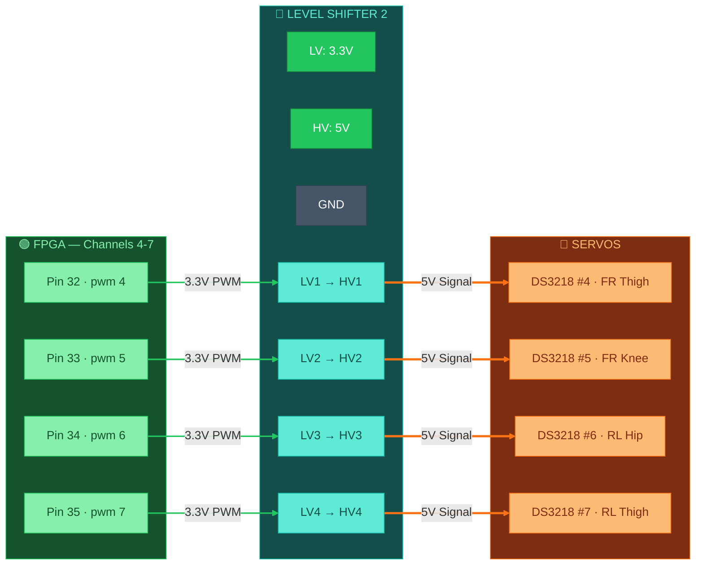
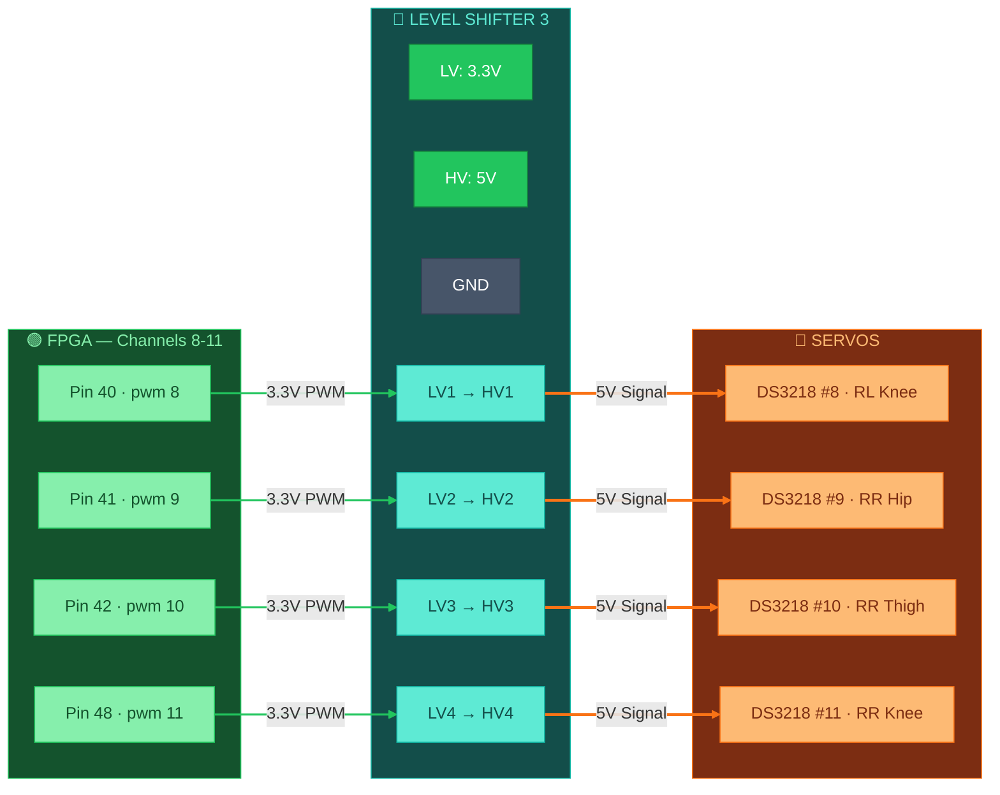
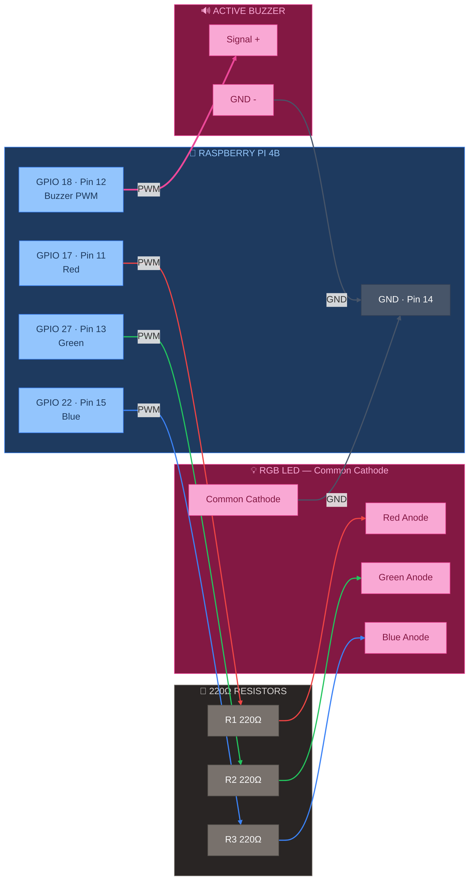

# 🔌 VIGIL-RQ — Complete Wiring & Connection Diagram

> Pin-level wiring reference for every electronic connection on the VIGIL-RQ quadruped robot.
> All connection lines are colour-coded by signal type.

### 🎨 Wire Colour Legend

| Colour | Meaning | Hex |
|--------|---------|-----|
| 🔴 Red | VCC / Power positive | `#ef4444` |
| ⚫ Dark Grey | GND | `#475569` |
| 🔵 Blue | SPI clock / I2C SCL | `#3b82f6` |
| 🟢 Green | SPI MOSI / PWM signals | `#22c55e` |
| 🟡 Yellow | SPI CS / Chip Select | `#eab308` |
| 🟣 Purple | I2C SDA | `#a855f7` |
| 🟠 Orange | Servo signal (5V PWM) | `#f97316` |
| 🩷 Pink | Alert GPIO | `#ec4899` |
| ⬜ Teal | Level-shifted signal | `#14b8a6` |

---

## 1. Full System Overview

---

## 2. Power Distribution — Pin-Level Detail

---

## 3. SPI Bus — Raspberry Pi ↔ Tang Nano 9K

> [!IMPORTANT]
> Both RPi SPI0 and Tang Nano 9K run at **3.3V logic** — no level shifter needed on the SPI bus. SPI Mode 0 (CPOL=0, CPHA=0), Clock: 1 MHz, Frame: 3 bytes per servo command.

---

## 4. I2C Bus — Raspberry Pi ↔ IMU + INA219

> [!NOTE]
> **I2C pull-ups:** RPi 4B has built-in 1.8kΩ pull-ups. Most breakout boards add their own. If using bare ICs, add **4.7kΩ pull-ups to 3.3V** on SDA and SCL.

---

## 5. PWM — FPGA → Level Shifter 1 → Front Left + FR Hip

## 6. PWM — FPGA → Level Shifter 2 → FR Thigh/Knee + RL Hip/Thigh

## 7. PWM — FPGA → Level Shifter 3 → RL Knee + RR Leg

---

## 8. GPIO — Buzzer + RGB LED

---

## 9. Servo Power — 6.8V Rail to All 12 DS3218 Servos

```mermaid
graph LR
    classDef rail fill:#ef4444,stroke:#b91c1c,color:#fff,font-weight:bold
    classDef railGnd fill:#475569,stroke:#334155,color:#fff,font-weight:bold
    classDef servoPin fill:#fdba74,stroke:#f97316,color:#7c2d12

    RAIL_P["+6.8V Rail<br/>XL4015 Output"]:::rail
    RAIL_G["GND Rail"]:::railGnd

    subgraph FL["🦿 FRONT LEFT"]
        FL0["FL Hip · Red wire"]:::servoPin
        FL1["FL Thigh · Red wire"]:::servoPin
        FL2["FL Knee · Red wire"]:::servoPin
        FL0G["FL Hip · Brown wire"]:::servoPin
        FL1G["FL Thigh · Brown wire"]:::servoPin
        FL2G["FL Knee · Brown wire"]:::servoPin
    end

    subgraph FR["🦿 FRONT RIGHT"]
        FR0["FR Hip · Red"]:::servoPin
        FR1["FR Thigh · Red"]:::servoPin
        FR2["FR Knee · Red"]:::servoPin
        FR0G["FR Hip · Brown"]:::servoPin
        FR1G["FR Thigh · Brown"]:::servoPin
        FR2G["FR Knee · Brown"]:::servoPin
    end

    subgraph RL["🦿 REAR LEFT"]
        RL0["RL Hip · Red"]:::servoPin
        RL1["RL Thigh · Red"]:::servoPin
        RL2["RL Knee · Red"]:::servoPin
        RL0G["RL Hip · Brown"]:::servoPin
        RL1G["RL Thigh · Brown"]:::servoPin
        RL2G["RL Knee · Brown"]:::servoPin
    end

    subgraph RR["🦿 REAR RIGHT"]
        RR0["RR Hip · Red"]:::servoPin
        RR1["RR Thigh · Red"]:::servoPin
        RR2["RR Knee · Red"]:::servoPin
        RR0G["RR Hip · Brown"]:::servoPin
        RR1G["RR Thigh · Brown"]:::servoPin
        RR2G["RR Knee · Brown"]:::servoPin
    end

    RAIL_P --> FL0 & FL1 & FL2
    RAIL_P --> FR0 & FR1 & FR2
    RAIL_P --> RL0 & RL1 & RL2
    RAIL_P --> RR0 & RR1 & RR2
    RAIL_G --> FL0G & FL1G & FL2G
    RAIL_G --> FR0G & FR1G & FR2G
    RAIL_G --> RL0G & RL1G & RL2G
    RAIL_G --> RR0G & RR1G & RR2G

    linkStyle 0,1,2,3,4,5,6,7,8,9,10,11 stroke:#ef4444,stroke-width:2px
    linkStyle 12,13,14,15,16,17,18,19,20,21,22,23 stroke:#475569,stroke-width:2px

    style FL fill:#7c2d12,stroke:#f97316,color:#fdba74
    style FR fill:#7c2d12,stroke:#f97316,color:#fdba74
    style RL fill:#7c2d12,stroke:#f97316,color:#fdba74
    style RR fill:#7c2d12,stroke:#f97316,color:#fdba74
```

---

## 10. INA219 — Shunt Resistor Placement

> [!TIP]
> The 0.1Ω shunt is wired **in series** on the positive servo rail. The INA219 measures voltage drop across it to calculate total servo current. Place it between the XL4015 output and the servo distribution terminal.

---

## 11. Common Ground — Star Topology

```mermaid
graph TB
    classDef gnd fill:#475569,stroke:#334155,color:#fff,font-weight:bold
    classDef rpiPin fill:#93c5fd,stroke:#3b82f6,color:#1e3a5f
    classDef fpgaPin fill:#86efac,stroke:#22c55e,color:#14532d
    classDef lsPin fill:#5eead4,stroke:#14b8a6,color:#134e4a
    classDef servoPin fill:#fdba74,stroke:#f97316,color:#7c2d12
    classDef imuPin fill:#d8b4fe,stroke:#a855f7,color:#3b0764
    classDef inaPin fill:#fde047,stroke:#eab308,color:#713f12
    classDef alertPin fill:#f9a8d4,stroke:#ec4899,color:#831843
    classDef powerPin fill:#fca5a5,stroke:#ef4444,color:#7f1d1d

    GND_HUB["⏚ COMMON GROUND<br/>STAR POINT<br/>Terminal Block"]:::gnd

    BAT_G["Battery -"]:::powerPin
    BUCKS_G["XL4015 GND"]:::powerPin
    BUCKL_G["LM2596 GND"]:::powerPin
    RPI_G["RPi 4B GND<br/>Pin 6/9/14/20/25"]:::rpiPin
    FPGA_G["Tang Nano 9K GND"]:::fpgaPin
    LS1_G["Level Shifter 1 GND"]:::lsPin
    LS2_G["Level Shifter 2 GND"]:::lsPin
    LS3_G["Level Shifter 3 GND"]:::lsPin
    SRV_G["12× Servo Brown Wire"]:::servoPin
    IMU_G["MPU6050 GND"]:::imuPin
    INA_G["INA219 GND"]:::inaPin
    BUZ_G["Buzzer GND"]:::alertPin
    RGB_G["RGB LED Cathode"]:::alertPin

    GND_HUB --- BAT_G
    GND_HUB --- BUCKS_G
    GND_HUB --- BUCKL_G
    GND_HUB --- RPI_G
    GND_HUB --- FPGA_G
    GND_HUB --- LS1_G
    GND_HUB --- LS2_G
    GND_HUB --- LS3_G
    GND_HUB --- SRV_G
    GND_HUB --- IMU_G
    GND_HUB --- INA_G
    GND_HUB --- BUZ_G
    GND_HUB --- RGB_G

    linkStyle 0 stroke:#475569,stroke-width:3px
    linkStyle 1 stroke:#475569,stroke-width:3px
    linkStyle 2 stroke:#475569,stroke-width:3px
    linkStyle 3 stroke:#475569,stroke-width:3px
    linkStyle 4 stroke:#475569,stroke-width:3px
    linkStyle 5 stroke:#475569,stroke-width:2px
    linkStyle 6 stroke:#475569,stroke-width:2px
    linkStyle 7 stroke:#475569,stroke-width:2px
    linkStyle 8 stroke:#475569,stroke-width:3px
    linkStyle 9 stroke:#475569,stroke-width:2px
    linkStyle 10 stroke:#475569,stroke-width:2px
    linkStyle 11 stroke:#475569,stroke-width:2px
    linkStyle 12 stroke:#475569,stroke-width:2px
```

> [!CAUTION]
> **Ground loops cause servo jitter and SPI errors.** Use a **star ground topology** — all GND wires converge at a single point on the terminal block, not daisy-chained. Use **14 AWG** for main ground, **16 AWG** for buck GNDs, **22 AWG** for signal GNDs.

---

## 12. Complete Pin Reference Tables

### Raspberry Pi 4B — All Used GPIO Pins

| BCM GPIO | Physical Pin | Function | Wire Colour | Connects To | Gauge |
|----------|-------------|----------|-------------|-------------|-------|
| GPIO 2 | 3 | I2C1 SDA | 🟣 Purple | IMU SDA + INA219 SDA | 22 AWG |
| GPIO 3 | 5 | I2C1 SCL | 🔵 Blue | IMU SCL + INA219 SCL | 22 AWG |
| GPIO 8 | 24 | SPI0 CE0 | 🟡 Yellow | FPGA Pin 27 (CS) | 22 AWG |
| GPIO 10 | 19 | SPI0 MOSI | 🟢 Green | FPGA Pin 26 (MOSI) | 22 AWG |
| GPIO 11 | 23 | SPI0 SCLK | 🔵 Blue | FPGA Pin 25 (SCLK) | 22 AWG |
| GPIO 17 | 11 | RGB Red | 🔴 Red | 220Ω → LED Red | 24 AWG |
| GPIO 18 | 12 | Buzzer PWM | 🟠 Orange | Active buzzer + | 24 AWG |
| GPIO 22 | 15 | RGB Blue | 🔵 Blue | 220Ω → LED Blue | 24 AWG |
| GPIO 27 | 13 | RGB Green | 🟢 Green | 220Ω → LED Green | 24 AWG |
| 3.3V | 1, 17 | Power out | 🔴 Red | IMU/INA VCC, LS LV | 22 AWG |
| 5V | 2, 4 | Power in | 🔴 Red | From LM2596 USB-C | — |
| GND | 6,9,14,20,25 | Ground | ⚫ Black | Common ground bus | 16 AWG |

### Tang Nano 9K — All Used Pins

| FPGA Pin | Signal | Dir | Connects To | Wire Colour |
|----------|--------|-----|-------------|-------------|
| 52 | clk_27m | In | On-board oscillator | — (internal) |
| 3 | btn_rst_n | In | On-board S1 button | — (internal) |
| 25 | spi_sclk | In | RPi GPIO 11 | 🔵 Blue |
| 26 | spi_mosi | In | RPi GPIO 10 | 🟢 Green |
| 27 | spi_cs_n | In | RPi GPIO 8 | 🟡 Yellow |
| 28 | pwm_out[0] | Out | LS1 LV1 → FL Hip | 🟢 Green |
| 29 | pwm_out[1] | Out | LS1 LV2 → FL Thigh | 🟢 Green |
| 30 | pwm_out[2] | Out | LS1 LV3 → FL Knee | 🟢 Green |
| 31 | pwm_out[3] | Out | LS1 LV4 → FR Hip | 🟢 Green |
| 32 | pwm_out[4] | Out | LS2 LV1 → FR Thigh | 🟢 Green |
| 33 | pwm_out[5] | Out | LS2 LV2 → FR Knee | 🟢 Green |
| 34 | pwm_out[6] | Out | LS2 LV3 → RL Hip | 🟢 Green |
| 35 | pwm_out[7] | Out | LS2 LV4 → RL Thigh | 🟢 Green |
| 40 | pwm_out[8] | Out | LS3 LV1 → RL Knee | 🟢 Green |
| 41 | pwm_out[9] | Out | LS3 LV2 → RR Hip | 🟢 Green |
| 42 | pwm_out[10] | Out | LS3 LV3 → RR Thigh | 🟢 Green |
| 48 | pwm_out[11] | Out | LS3 LV4 → RR Knee | 🟢 Green |
| 10–16 | led[0:5] | Out | On-board LEDs | — (internal) |

---

## 🔧 Assembly Checklist

- [ ] Solder battery tabs to 18650 3S pack
- [ ] Connect battery → BMS → fuse → terminal block (🔴 14 AWG)
- [ ] Mount 1N5822 diodes on terminal block outputs
- [ ] Wire XL4015 buck — **adjust trimpot to 6.8V before connecting servos!**
- [ ] Wire LM2596 buck — **adjust trimpot to 5.0V before connecting RPi!**
- [ ] Connect all GND wires to star ground point (⚫ 14–16 AWG)
- [ ] Wire 3× level shifters: LV=3.3V, HV=5V
- [ ] Connect 12× FPGA PWM → level shifter LV inputs (🟢 22 AWG)
- [ ] Connect 12× level shifter HV → servo signal wires (🟠 22 AWG)
- [ ] Connect 12× servo red wire to 6.8V rail (🔴 18 AWG pairs)
- [ ] Connect 12× servo brown wire to GND bus (⚫ 18 AWG)
- [ ] Wire SPI: GPIO 8/10/11 → FPGA 25/26/27 (🔵🟢🟡 22 AWG, keep short!)
- [ ] Wire I2C: GPIO 2/3 → IMU + INA219 SDA/SCL (🟣🔵 22 AWG)
- [ ] Place INA219 shunt in series on +6.8V servo rail
- [ ] Wire buzzer: GPIO 18 → buzzer +, buzzer - → GND (🟠 24 AWG)
- [ ] Wire RGB: GPIO 17/27/22 → 220Ω → R/G/B, cathode → GND (24 AWG)
- [ ] Apply heat shrink (1cm, 2cm) to ALL solder joints
- [ ] **Verify all voltages with multimeter BEFORE powering on RPi/FPGA**
