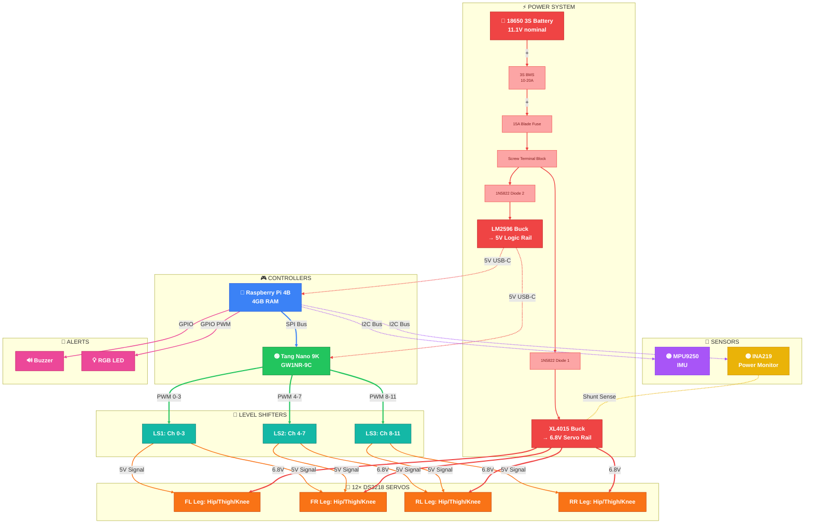

# 🔌 VIGIL-RQ — Complete Wiring & Connection Diagram

> Pin-level wiring reference for every electronic connection on the VIGIL-RQ quadruped robot.
> All nodes are color-coded by module, all connection lines are color-coded by signal type.

---

## 📁 Wiring Documentation Index

| # | Section | File | Diagrams |
|---|---------|------|----------|
| 1 | **System Overview** | This file | Full system block diagram |
| 2 | **Power Distribution** | [wiring_power.md](wiring_power.md) | Battery → BMS → Fuse → Bucks |
| 3 | **SPI Bus** | [wiring_spi.md](wiring_spi.md) | RPi ↔ FPGA pin-level + frame format |
| 4 | **I2C Bus** | [wiring_i2c.md](wiring_i2c.md) | RPi ↔ IMU + INA219 shared bus |
| 5 | **PWM Outputs** | [wiring_pwm.md](wiring_pwm.md) | FPGA → 3 Level Shifters → 12 Servos |
| 6 | **GPIO Alerts** | [wiring_gpio.md](wiring_gpio.md) | Buzzer + RGB LED + colour codes |
| 7 | **Servo Power** | [wiring_servo_power.md](wiring_servo_power.md) | 6.8V rail to all 12 DS3218 (per leg) |
| 8-10 | **Reference** | [wiring_reference.md](wiring_reference.md) | INA219 shunt, GND bus, pin tables, checklist |

---

### 🎨 Wire Colour Legend

| Line Colour | Meaning | Used On |
|-------------|---------|---------|
| 🔴 Red `━━` | VCC / Power positive | Battery, buck outputs, 3.3V, 5V rails |
| ⚫ Grey `━━` | GND | All ground connections |
| 🔵 Blue `━━` | SPI SCLK / I2C SCL | Clock signals |
| 🟢 Green `━━` | SPI MOSI / PWM 3.3V | Data & PWM from FPGA |
| 🟡 Yellow `━━` | SPI CS / Sense | Chip select, INA219 shunt |
| 🟣 Purple `━━` | I2C SDA | Data bus |
| 🟠 Orange `━━` | Servo signal 5V | Post-level-shift PWM to servos |
| 🩷 Pink `━━` | Alert GPIO | Buzzer, RGB LED |
| ⬜ Grey dashed `╌╌` | Config / tie | Address pin ties |

### 🎨 Module Colour Legend

| Module | Block | Pin (lighter) |
|--------|-------|---------------|
| Raspberry Pi 4B | `#3b82f6` 🟦 | `#93c5fd` |
| Tang Nano 9K FPGA | `#22c55e` 🟩 | `#86efac` |
| Level Shifters | `#14b8a6` 🟦 teal | `#5eead4` |
| DS3218 Servos | `#f97316` 🟧 | `#fdba74` |
| MPU9250 IMU | `#a855f7` 🟪 | `#d8b4fe` |
| INA219 Power | `#eab308` 🟨 | `#fde047` |
| Battery & Bucks | `#ef4444` 🟥 | `#fca5a5` |
| Buzzer & RGB LED | `#ec4899` 🩷 | `#f9a8d4` |
| GND / Bus | `#475569` ⬛ | `#94a3b8` |

---

## 1. Full System Overview

