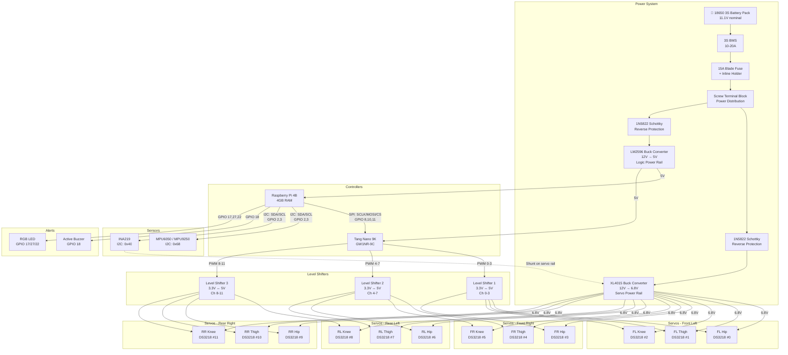
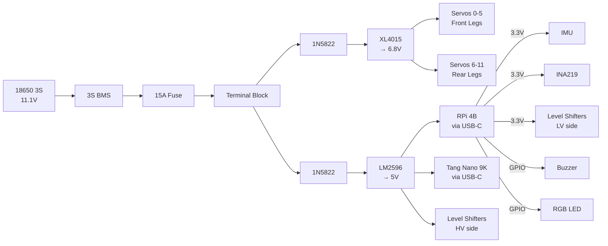

# 🔌 VIGIL-RQ — Wiring & Connection Diagram

> Complete wiring reference for all electronic components of the VIGIL-RQ quadruped robot.

---

## 📐 System Wiring Overview



---

## 📌 Pin-Level Connection Reference

### Raspberry Pi 4B GPIO Pinout

```
                    RPi 4B GPIO Header (BCM numbering)
                    ┌─────────────────────────────────┐
                    │  3V3  (1) (2)  5V               │
         I2C SDA ── │  GP2  (3) (4)  5V               │
         I2C SCL ── │  GP3  (5) (6)  GND              │
                    │  GP4  (7) (8)  GP14              │
                    │  GND  (9) (10) GP15              │
     SPI SCLK ───── │  GP11(11)(12)  GP18 ──── Buzzer  │
                    │  GP27(13)(14)  GND              │ ── RGB Green
                    │  GP22(15)(16)  GP23              │ ── RGB Blue
                    │  3V3 (17)(18)  GP24              │
     SPI MOSI ───── │  GP10(19)(20)  GND              │
     SPI MISO ───── │  GP9 (21)(22)  GP25              │
     SPI SCLK ───── │  GP11(23)(24)  GP8  ──── SPI CS  │
                    │  GND (25)(26)  GP7               │
                    │  GP0 (27)(28)  GP1               │
                    │  GP5 (29)(30)  GND              │
                    │  GP6 (31)(32)  GP12              │
                    │  GP13(33)(34)  GND              │
     RGB Red ────── │  GP17(35)(36)  GP16              │
                    │  GP26(37)(38)  GP20              │
                    │  GND (39)(40)  GP21              │
                    └─────────────────────────────────┘
```

| RPi GPIO (BCM) | Physical Pin | Function | Connects To |
|----------------|-------------|----------|-------------|
| GPIO 2 | 3 | I2C SDA | MPU6050 SDA, INA219 SDA |
| GPIO 3 | 5 | I2C SCL | MPU6050 SCL, INA219 SCL |
| GPIO 8 | 24 | SPI0 CE0 | FPGA Pin 27 (SPI CS) |
| GPIO 10 | 19 | SPI0 MOSI | FPGA Pin 26 (SPI MOSI) |
| GPIO 11 | 23 | SPI0 SCLK | FPGA Pin 25 (SPI SCLK) |
| GPIO 17 | 11 | RGB LED Red | Red pin (via 220Ω resistor) |
| GPIO 18 | 12 | Buzzer PWM | Active buzzer signal |
| GPIO 22 | 15 | RGB LED Blue | Blue pin (via 220Ω resistor) |
| GPIO 27 | 13 | RGB LED Green | Green pin (via 220Ω resistor) |

### Tang Nano 9K FPGA Pinout

| FPGA Pin | Signal | Connects To |
|----------|--------|-------------|
| 52 | clk_27m | On-board oscillator (internal) |
| 3 | btn_rst_n | On-board S1 button (internal) |
| 25 | spi_sclk | RPi GPIO 11 (SPI SCLK) |
| 26 | spi_mosi | RPi GPIO 10 (SPI MOSI) |
| 27 | spi_cs_n | RPi GPIO 8 (SPI CE0) |
| 28 | pwm_out[0] | Level Shifter 1 Ch A (FL Hip) |
| 29 | pwm_out[1] | Level Shifter 1 Ch B (FL Thigh) |
| 30 | pwm_out[2] | Level Shifter 1 Ch C (FL Knee) |
| 31 | pwm_out[3] | Level Shifter 1 Ch D (FR Hip) |
| 32 | pwm_out[4] | Level Shifter 2 Ch A (FR Thigh) |
| 33 | pwm_out[5] | Level Shifter 2 Ch B (FR Knee) |
| 34 | pwm_out[6] | Level Shifter 2 Ch C (RL Hip) |
| 35 | pwm_out[7] | Level Shifter 2 Ch D (RL Thigh) |
| 40 | pwm_out[8] | Level Shifter 3 Ch A (RL Knee) |
| 41 | pwm_out[9] | Level Shifter 3 Ch B (RR Hip) |
| 42 | pwm_out[10] | Level Shifter 3 Ch C (RR Thigh) |
| 48 | pwm_out[11] | Level Shifter 3 Ch D (RR Knee) |
| 10–16 | led[0:5] | On-board LEDs (heartbeat + SPI activity) |

### Level Shifter Wiring (×3 units)

Each 4-channel bidirectional level shifter module:

| Level Shifter Pin | Connection |
|-------------------|------------|
| LV (Low Voltage) | 3.3V from FPGA or RPi |
| HV (High Voltage) | 5V from LM2596 buck output |
| GND | Common ground |
| LV1–LV4 | FPGA PWM output pins (3.3V) |
| HV1–HV4 | DS3218 servo signal wires (5V) |

### DS3218 Servo Wiring (×12 servos)

Each servo has 3 wires:

| Wire Colour | Connection |
|-------------|------------|
| Red | 6.8V from XL4015 buck converter (via terminal block) |
| Brown/Black | GND (common ground) |
| Orange/White | Signal from level shifter HV output (5V PWM) |

### INA219 Wiring

| INA219 Pin | Connection |
|------------|------------|
| VCC | 3.3V from RPi |
| GND | Common ground |
| SDA | RPi GPIO 2 (shared I2C bus) |
| SCL | RPi GPIO 3 (shared I2C bus) |
| VIN+ | Servo power rail positive (after XL4015) |
| VIN- | To servo distribution (through 0.1Ω shunt) |

### MPU6050/9250 Wiring

| IMU Pin | Connection |
|---------|------------|
| VCC | 3.3V from RPi |
| GND | Common ground |
| SDA | RPi GPIO 2 (shared I2C bus) |
| SCL | RPi GPIO 3 (shared I2C bus) |
| AD0 | GND (address = 0x68) or 3.3V (address = 0x69) |
| INT | Not connected (polling mode) |

---

## ⚡ Power Distribution Diagram



---

## 🔧 Assembly Notes

> [!IMPORTANT]
> **Common ground is critical.** All components (RPi, FPGA, level shifters, servos, sensors) MUST share a common GND rail. Failure to do so will cause SPI/I2C communication errors and servo jitter.

> [!WARNING]
> **Never power servos from the RPi.** The DS3218 can draw 2-3A each under load. Always use the dedicated XL4015 buck converter on a separate power rail.

> [!TIP]
> **Wire gauge recommendations:**
> - Battery → BMS → Fuse → Terminal block: **14 AWG** (handles 15A+)
> - Terminal block → Buck converters: **16 AWG**
> - Buck converter → Servo power: **18 AWG** (per servo pair)
> - Signal wires (SPI, I2C, PWM): **22-24 AWG**
> - Use heat shrink tubing (1cm, 2cm) on all solder joints

> [!NOTE]
> **I2C pull-up resistors:** The RPi 4B has built-in 1.8kΩ pull-ups on SDA/SCL. Most MPU6050/INA219 breakout boards also have pull-ups. If using bare chips, add 4.7kΩ pull-ups to 3.3V.
