# 🔌 VIGIL-RQ — Complete Wiring & Connection Diagram

> Pin-level wiring reference for every electronic connection on the VIGIL-RQ quadruped robot.
> All nodes are color-coded by module, all connection lines are color-coded by signal type.

### 🎨 Wire Colour Legend

| Line Colour | Meaning | Used On |
|-------------|---------|---------|
| 🔴 Red `━━` | VCC / Power positive | Battery, buck outputs, 3.3V, 5V rails |
| ⚫ Grey `━━` | GND | All ground connections |
| 🔵 Blue `━━` | SPI SCLK / I2C SCL | Clock signals |
| 🟢 Green `━━` | SPI MOSI / PWM 3.3V | Data & PWM from FPGA |
| 🟡 Yellow `━━` | SPI CS / Sense | Chip select, INA219 shunt |
| 🟣 Purple `━━` | I2C SDA | Data bus |
| 🟠 Orange `━━` | Servo signal 5V | Post-level-shift PWM to servos |
| 🩷 Pink `━━` | Alert GPIO | Buzzer, RGB LED |
| ⬜ Grey dashed `╌╌` | Config / tie | Address pin ties |

### 🎨 Module Colour Legend

| Module | Block | Pin (lighter) |
|--------|-------|---------------|
| Raspberry Pi 4B | `#3b82f6` 🟦 | `#93c5fd` |
| Tang Nano 9K FPGA | `#22c55e` 🟩 | `#86efac` |
| Level Shifters | `#14b8a6` 🟦 teal | `#5eead4` |
| DS3218 Servos | `#f97316` 🟧 | `#fdba74` |
| MPU6050 IMU | `#a855f7` 🟪 | `#d8b4fe` |
| INA219 Power | `#eab308` 🟨 | `#fde047` |
| Battery & Bucks | `#ef4444` 🟥 | `#fca5a5` |
| Buzzer & RGB LED | `#ec4899` 🩷 | `#f9a8d4` |
| GND / Bus | `#475569` ⬛ | `#94a3b8` |

---

## 1. Full System Overview

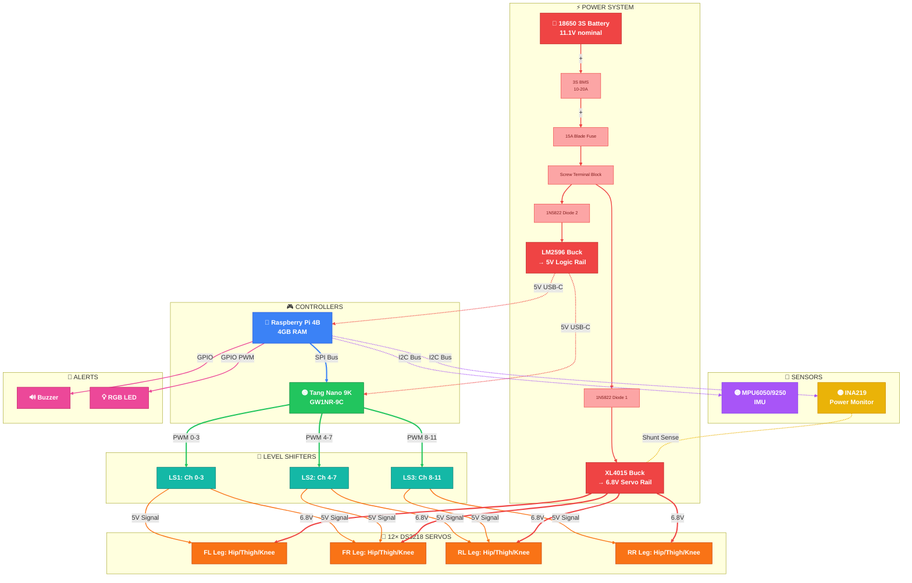

---

## 2. Power Distribution — Pin-Level Detail

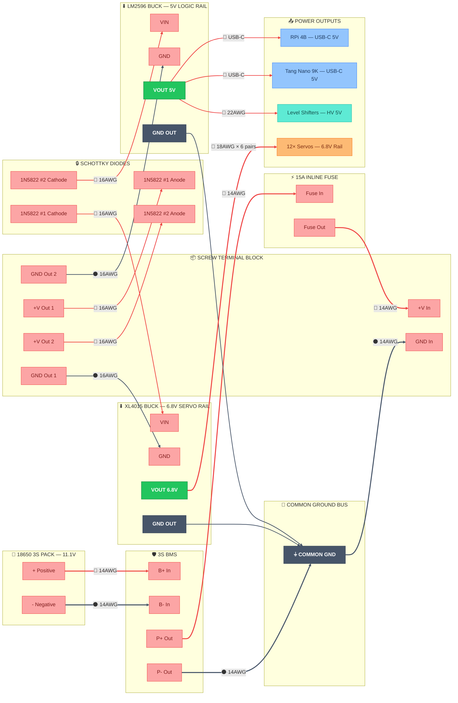

---

## 3. SPI Bus — Raspberry Pi ↔ Tang Nano 9K (Pin-Level)

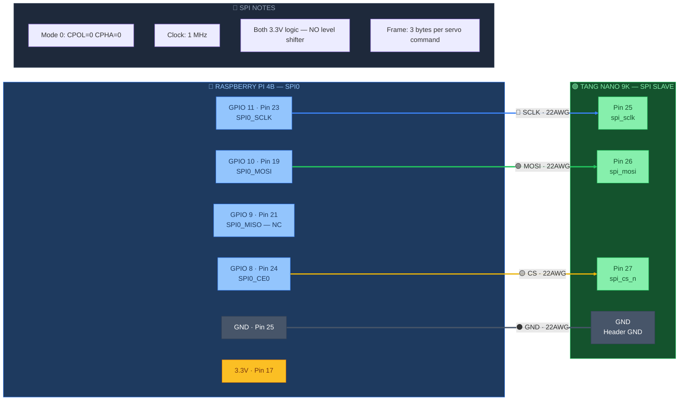

> [!IMPORTANT]
> Both RPi 4B SPI0 and FPGA GPIO run at **3.3V** — **no level shifter is required** on the SPI bus. SPI MISO (GPIO 9) is reserved but not connected as the FPGA is receive-only.

---

## 4. I2C Bus — Raspberry Pi ↔ IMU + INA219 (Pin-Level)

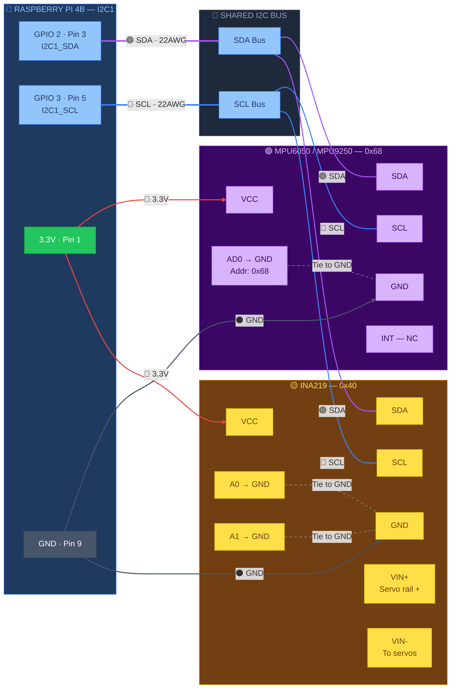

> [!NOTE]
> **I2C pull-ups:** The RPi 4B has built-in 1.8kΩ pull-ups on SDA/SCL. Most breakout boards add their own. If using bare ICs, add **4.7kΩ pull-ups to 3.3V** on both SDA and SCL.

---

## 5. PWM Outputs — FPGA → Level Shifters → Servos

### 5.1 All 12 Channels — Overview

```mermaid
graph LR
    classDef fpgaPin fill:#86efac,stroke:#22c55e,color:#14532d
    classDef lsPin fill:#5eead4,stroke:#14b8a6,color:#134e4a
    classDef servoPin fill:#fdba74,stroke:#f97316,color:#7c2d12
    classDef vcc fill:#22c55e,stroke:#15803d,color:#fff
    classDef gnd fill:#475569,stroke:#334155,color:#fff

    subgraph FPGA_PWM["🟢 TANG NANO 9K — PWM OUTPUTS"]
        F0["Pin 28<br/>pwm_out 0"]:::fpgaPin
        F1["Pin 29<br/>pwm_out 1"]:::fpgaPin
        F2["Pin 30<br/>pwm_out 2"]:::fpgaPin
        F3["Pin 31<br/>pwm_out 3"]:::fpgaPin
        F4["Pin 32<br/>pwm_out 4"]:::fpgaPin
        F5["Pin 33<br/>pwm_out 5"]:::fpgaPin
        F6["Pin 34<br/>pwm_out 6"]:::fpgaPin
        F7["Pin 35<br/>pwm_out 7"]:::fpgaPin
        F8["Pin 40<br/>pwm_out 8"]:::fpgaPin
        F9["Pin 41<br/>pwm_out 9"]:::fpgaPin
        F10["Pin 42<br/>pwm_out 10"]:::fpgaPin
        F11["Pin 48<br/>pwm_out 11"]:::fpgaPin
        F_3V3["3.3V"]:::vcc
        F_GND["GND"]:::gnd
    end

    subgraph LS1["🔀 LEVEL SHIFTER 1"]
        LS1_LV["LV: 3.3V"]:::lsPin
        LS1_HV["HV: 5V"]:::lsPin
        LS1_GND["GND"]:::gnd
        LS1_A1["LV1 → HV1"]:::lsPin
        LS1_A2["LV2 → HV2"]:::lsPin
        LS1_A3["LV3 → HV3"]:::lsPin
        LS1_A4["LV4 → HV4"]:::lsPin
    end

    subgraph LS2["🔀 LEVEL SHIFTER 2"]
        LS2_LV["LV: 3.3V"]:::lsPin
        LS2_HV["HV: 5V"]:::lsPin
        LS2_GND["GND"]:::gnd
        LS2_A1["LV1 → HV1"]:::lsPin
        LS2_A2["LV2 → HV2"]:::lsPin
        LS2_A3["LV3 → HV3"]:::lsPin
        LS2_A4["LV4 → HV4"]:::lsPin
    end

    subgraph LS3["🔀 LEVEL SHIFTER 3"]
        LS3_LV["LV: 3.3V"]:::lsPin
        LS3_HV["HV: 5V"]:::lsPin
        LS3_GND["GND"]:::gnd
        LS3_A1["LV1 → HV1"]:::lsPin
        LS3_A2["LV2 → HV2"]:::lsPin
        LS3_A3["LV3 → HV3"]:::lsPin
        LS3_A4["LV4 → HV4"]:::lsPin
    end

    subgraph FL_LEG["🦿 FRONT LEFT LEG"]
        FL_H["DS3218 #0<br/>FL Hip · Signal"]:::servoPin
        FL_T["DS3218 #1<br/>FL Thigh · Signal"]:::servoPin
        FL_K["DS3218 #2<br/>FL Knee · Signal"]:::servoPin
    end

    subgraph FR_LEG["🦿 FRONT RIGHT LEG"]
        FR_H["DS3218 #3<br/>FR Hip · Signal"]:::servoPin
        FR_T["DS3218 #4<br/>FR Thigh · Signal"]:::servoPin
        FR_K["DS3218 #5<br/>FR Knee · Signal"]:::servoPin
    end

    subgraph RL_LEG["🦿 REAR LEFT LEG"]
        RL_H["DS3218 #6<br/>RL Hip · Signal"]:::servoPin
        RL_T["DS3218 #7<br/>RL Thigh · Signal"]:::servoPin
        RL_K["DS3218 #8<br/>RL Knee · Signal"]:::servoPin
    end

    subgraph RR_LEG["🦿 REAR RIGHT LEG"]
        RR_H["DS3218 #9<br/>RR Hip · Signal"]:::servoPin
        RR_T["DS3218 #10<br/>RR Thigh · Signal"]:::servoPin
        RR_K["DS3218 #11<br/>RR Knee · Signal"]:::servoPin
    end

    %% FPGA → LS1 Ch 0-3 (links 0-3)
    F0 -->|"Ch0 3.3V"| LS1_A1
    F1 -->|"Ch1 3.3V"| LS1_A2
    F2 -->|"Ch2 3.3V"| LS1_A3
    F3 -->|"Ch3 3.3V"| LS1_A4

    %% FPGA → LS2 Ch 4-7 (links 4-7)
    F4 -->|"Ch4 3.3V"| LS2_A1
    F5 -->|"Ch5 3.3V"| LS2_A2
    F6 -->|"Ch6 3.3V"| LS2_A3
    F7 -->|"Ch7 3.3V"| LS2_A4

    %% FPGA → LS3 Ch 8-11 (links 8-11)
    F8 -->|"Ch8 3.3V"| LS3_A1
    F9 -->|"Ch9 3.3V"| LS3_A2
    F10 -->|"Ch10 3.3V"| LS3_A3
    F11 -->|"Ch11 3.3V"| LS3_A4

    %% LS1 → Servos 5V (links 12-15)
    LS1_A1 ==>|"5V Signal"| FL_H
    LS1_A2 ==>|"5V Signal"| FL_T
    LS1_A3 ==>|"5V Signal"| FL_K
    LS1_A4 ==>|"5V Signal"| FR_H

    %% LS2 → Servos 5V (links 16-19)
    LS2_A1 ==>|"5V Signal"| FR_T
    LS2_A2 ==>|"5V Signal"| FR_K
    LS2_A3 ==>|"5V Signal"| RL_H
    LS2_A4 ==>|"5V Signal"| RL_T

    %% LS3 → Servos 5V (links 20-23)
    LS3_A1 ==>|"5V Signal"| RL_K
    LS3_A2 ==>|"5V Signal"| RR_H
    LS3_A3 ==>|"5V Signal"| RR_T
    LS3_A4 ==>|"5V Signal"| RR_K

    %% Level shifter LV power (links 24-26)
    F_3V3 -.->|"LV Ref"| LS1_LV
    F_3V3 -.->|"LV Ref"| LS2_LV
    F_3V3 -.->|"LV Ref"| LS3_LV

    linkStyle 0,1,2,3,4,5,6,7,8,9,10,11 stroke:#22c55e,stroke-width:2px
    linkStyle 12,13,14,15,16,17,18,19,20,21,22,23 stroke:#f97316,stroke-width:3px
    linkStyle 24,25,26 stroke:#ef4444,stroke-width:1px

    style FPGA_PWM fill:#14532d,stroke:#22c55e,color:#86efac
    style LS1 fill:#134e4a,stroke:#14b8a6,color:#5eead4
    style LS2 fill:#134e4a,stroke:#14b8a6,color:#5eead4
    style LS3 fill:#134e4a,stroke:#14b8a6,color:#5eead4
    style FL_LEG fill:#7c2d12,stroke:#f97316,color:#fdba74
    style FR_LEG fill:#7c2d12,stroke:#f97316,color:#fdba74
    style RL_LEG fill:#7c2d12,stroke:#f97316,color:#fdba74
    style RR_LEG fill:#7c2d12,stroke:#f97316,color:#fdba74
```

### 5.2 Level Shifter 1 → Front Left + FR Hip

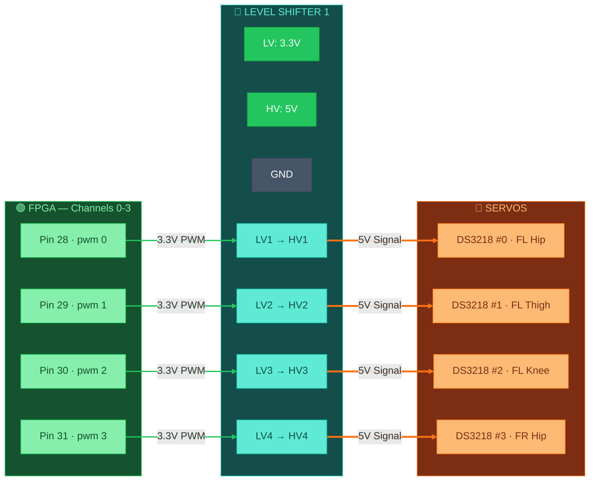

### 5.3 Level Shifter 2 → FR Thigh/Knee + RL Hip/Thigh

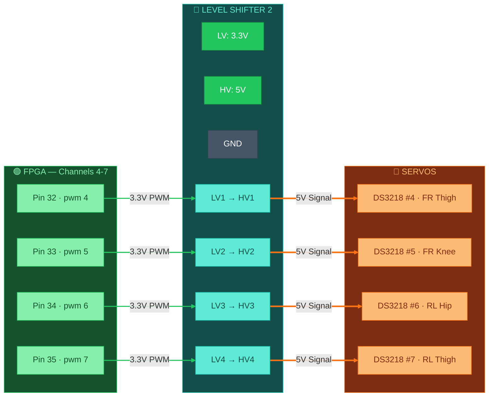

### 5.4 Level Shifter 3 → RL Knee + RR Leg

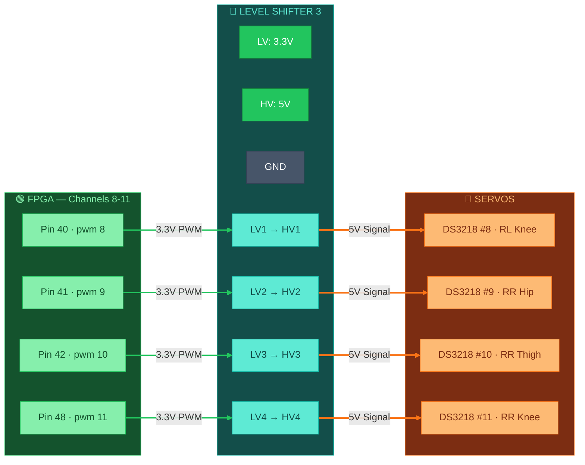

---

## 6. GPIO — Buzzer + RGB LED (Pin-Level)

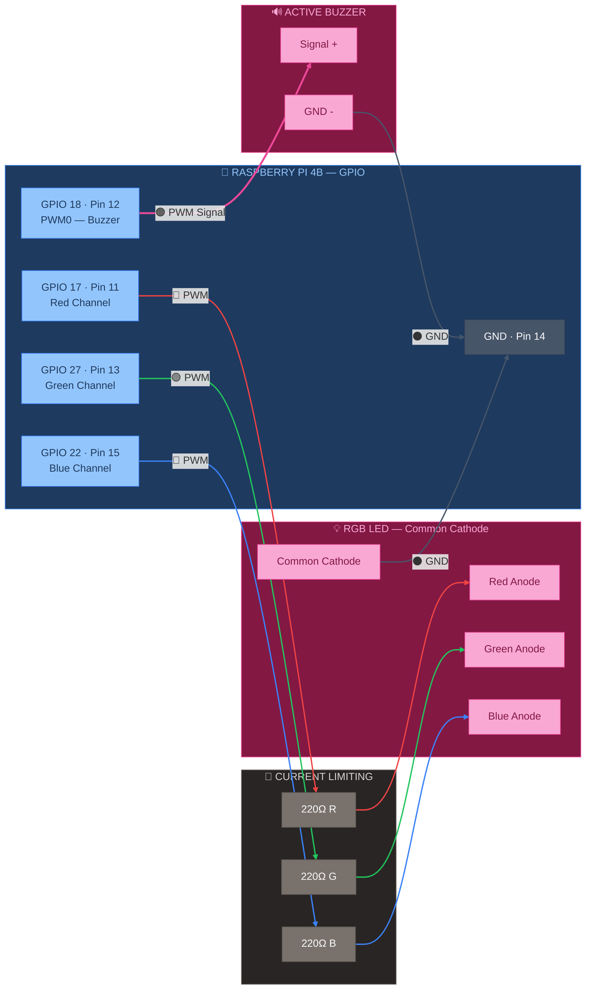

---

## 7. Servo Power Wiring — All 12 DS3218 (3 Wires Each)

### 7.1 Front Left Leg — Power + GND

```mermaid
graph TB
    classDef servoPin fill:#fdba74,stroke:#f97316,color:#7c2d12
    classDef power fill:#ef4444,stroke:#b91c1c,color:#fff,font-weight:bold
    classDef gnd fill:#475569,stroke:#334155,color:#fff,font-weight:bold

    subgraph RAIL_FL["⚡ XL4015 → 6.8V"]
        RP1["+6.8V Rail"]:::power
        RG1["GND Rail"]:::gnd
    end

    subgraph FL_PWR["🦿 FRONT LEFT — DS3218 #0 / #1 / #2"]
        FLH_P["FL Hip: 🔴 Red → +6.8V"]:::servoPin
        FLH_G["FL Hip: ⚫ Brown → GND"]:::servoPin
        FLH_S["FL Hip: 🟠 Orange → LS1 HV1"]:::servoPin
        FLT_P["FL Thigh: 🔴 Red → +6.8V"]:::servoPin
        FLT_G["FL Thigh: ⚫ Brown → GND"]:::servoPin
        FLT_S["FL Thigh: 🟠 Orange → LS1 HV2"]:::servoPin
        FLK_P["FL Knee: 🔴 Red → +6.8V"]:::servoPin
        FLK_G["FL Knee: ⚫ Brown → GND"]:::servoPin
        FLK_S["FL Knee: 🟠 Orange → LS1 HV3"]:::servoPin
    end

    %% Power (links 0-2)
    RP1 ==> FLH_P
    RP1 ==> FLT_P
    RP1 ==> FLK_P

    %% GND (links 3-5)
    RG1 ==> FLH_G
    RG1 ==> FLT_G
    RG1 ==> FLK_G

    linkStyle 0,1,2 stroke:#ef4444,stroke-width:2px
    linkStyle 3,4,5 stroke:#475569,stroke-width:2px

    style RAIL_FL fill:#7f1d1d,stroke:#ef4444,color:#fca5a5
    style FL_PWR fill:#7c2d12,stroke:#f97316,color:#fdba74
```

### 7.2 Front Right Leg — Power + GND

```mermaid
graph TB
    classDef servoPin fill:#fdba74,stroke:#f97316,color:#7c2d12
    classDef power fill:#ef4444,stroke:#b91c1c,color:#fff,font-weight:bold
    classDef gnd fill:#475569,stroke:#334155,color:#fff,font-weight:bold

    subgraph RAIL_FR["⚡ XL4015 → 6.8V"]
        RP2["+6.8V Rail"]:::power
        RG2["GND Rail"]:::gnd
    end

    subgraph FR_PWR["🦿 FRONT RIGHT — DS3218 #3 / #4 / #5"]
        FRH_P["FR Hip: 🔴 Red → +6.8V"]:::servoPin
        FRH_G["FR Hip: ⚫ Brown → GND"]:::servoPin
        FRH_S["FR Hip: 🟠 Orange → LS1 HV4"]:::servoPin
        FRT_P["FR Thigh: 🔴 Red → +6.8V"]:::servoPin
        FRT_G["FR Thigh: ⚫ Brown → GND"]:::servoPin
        FRT_S["FR Thigh: 🟠 Orange → LS2 HV1"]:::servoPin
        FRK_P["FR Knee: 🔴 Red → +6.8V"]:::servoPin
        FRK_G["FR Knee: ⚫ Brown → GND"]:::servoPin
        FRK_S["FR Knee: 🟠 Orange → LS2 HV2"]:::servoPin
    end

    %% Power (links 0-2)
    RP2 ==> FRH_P
    RP2 ==> FRT_P
    RP2 ==> FRK_P

    %% GND (links 3-5)
    RG2 ==> FRH_G
    RG2 ==> FRT_G
    RG2 ==> FRK_G

    linkStyle 0,1,2 stroke:#ef4444,stroke-width:2px
    linkStyle 3,4,5 stroke:#475569,stroke-width:2px

    style RAIL_FR fill:#7f1d1d,stroke:#ef4444,color:#fca5a5
    style FR_PWR fill:#7c2d12,stroke:#f97316,color:#fdba74
```

### 7.3 Rear Left Leg — Power + GND

```mermaid
graph TB
    classDef servoPin fill:#fdba74,stroke:#f97316,color:#7c2d12
    classDef power fill:#ef4444,stroke:#b91c1c,color:#fff,font-weight:bold
    classDef gnd fill:#475569,stroke:#334155,color:#fff,font-weight:bold

    subgraph RAIL_RL["⚡ XL4015 → 6.8V"]
        RP3["+6.8V Rail"]:::power
        RG3["GND Rail"]:::gnd
    end

    subgraph RL_PWR["🦿 REAR LEFT — DS3218 #6 / #7 / #8"]
        RLH_P["RL Hip: 🔴 Red → +6.8V"]:::servoPin
        RLH_G["RL Hip: ⚫ Brown → GND"]:::servoPin
        RLH_S["RL Hip: 🟠 Orange → LS2 HV3"]:::servoPin
        RLT_P["RL Thigh: 🔴 Red → +6.8V"]:::servoPin
        RLT_G["RL Thigh: ⚫ Brown → GND"]:::servoPin
        RLT_S["RL Thigh: 🟠 Orange → LS2 HV4"]:::servoPin
        RLK_P["RL Knee: 🔴 Red → +6.8V"]:::servoPin
        RLK_G["RL Knee: ⚫ Brown → GND"]:::servoPin
        RLK_S["RL Knee: 🟠 Orange → LS3 HV1"]:::servoPin
    end

    %% Power (links 0-2)
    RP3 ==> RLH_P
    RP3 ==> RLT_P
    RP3 ==> RLK_P

    %% GND (links 3-5)
    RG3 ==> RLH_G
    RG3 ==> RLT_G
    RG3 ==> RLK_G

    linkStyle 0,1,2 stroke:#ef4444,stroke-width:2px
    linkStyle 3,4,5 stroke:#475569,stroke-width:2px

    style RAIL_RL fill:#7f1d1d,stroke:#ef4444,color:#fca5a5
    style RL_PWR fill:#7c2d12,stroke:#f97316,color:#fdba74
```

### 7.4 Rear Right Leg — Power + GND

```mermaid
graph TB
    classDef servoPin fill:#fdba74,stroke:#f97316,color:#7c2d12
    classDef power fill:#ef4444,stroke:#b91c1c,color:#fff,font-weight:bold
    classDef gnd fill:#475569,stroke:#334155,color:#fff,font-weight:bold

    subgraph RAIL_RR["⚡ XL4015 → 6.8V"]
        RP4["+6.8V Rail"]:::power
        RG4["GND Rail"]:::gnd
    end

    subgraph RR_PWR["🦿 REAR RIGHT — DS3218 #9 / #10 / #11"]
        RRH_P["RR Hip: 🔴 Red → +6.8V"]:::servoPin
        RRH_G["RR Hip: ⚫ Brown → GND"]:::servoPin
        RRH_S["RR Hip: 🟠 Orange → LS3 HV2"]:::servoPin
        RRT_P["RR Thigh: 🔴 Red → +6.8V"]:::servoPin
        RRT_G["RR Thigh: ⚫ Brown → GND"]:::servoPin
        RRT_S["RR Thigh: 🟠 Orange → LS3 HV3"]:::servoPin
        RRK_P["RR Knee: 🔴 Red → +6.8V"]:::servoPin
        RRK_G["RR Knee: ⚫ Brown → GND"]:::servoPin
        RRK_S["RR Knee: 🟠 Orange → LS3 HV4"]:::servoPin
    end

    %% Power (links 0-2)
    RP4 ==> RRH_P
    RP4 ==> RRT_P
    RP4 ==> RRK_P

    %% GND (links 3-5)
    RG4 ==> RRH_G
    RG4 ==> RRT_G
    RG4 ==> RRK_G

    linkStyle 0,1,2 stroke:#ef4444,stroke-width:2px
    linkStyle 3,4,5 stroke:#475569,stroke-width:2px

    style RAIL_RR fill:#7f1d1d,stroke:#ef4444,color:#fca5a5
    style RR_PWR fill:#7c2d12,stroke:#f97316,color:#fdba74
```

---

## 8. INA219 Power Sensing — Shunt Placement

```mermaid
graph LR
    classDef power fill:#ef4444,stroke:#b91c1c,color:#fff,font-weight:bold
    classDef inaPin fill:#fde047,stroke:#eab308,color:#713f12
    classDef servo fill:#f97316,stroke:#c2410c,color:#fff,font-weight:bold

    subgraph XL4015["⬇ XL4015 BUCK OUTPUT"]
        BUCK_OUT["+6.8V Output"]:::power
    end

    subgraph INA_SENSE["🟡 INA219 SHUNT PLACEMENT"]
        INA_VINP["VIN+<br/>From buck output"]:::inaPin
        SHUNT["0.1Ω Shunt Resistor<br/>Current sense"]:::inaPin
        INA_VINN["VIN-<br/>To servo distribution"]:::inaPin
    end

    subgraph DIST["📦 SERVO DISTRIBUTION"]
        SERVO_DIST["Servo Power<br/>Terminal Block"]:::servo
    end

    %% Shunt path (links 0-3)
    BUCK_OUT ==>|"🔴 +6.8V"| INA_VINP
    INA_VINP -->|"Through"| SHUNT
    SHUNT -->|"Through"| INA_VINN
    INA_VINN ==>|"🔴 +6.8V to servos"| SERVO_DIST

    linkStyle 0 stroke:#ef4444,stroke-width:3px
    linkStyle 1 stroke:#eab308,stroke-width:3px
    linkStyle 2 stroke:#eab308,stroke-width:3px
    linkStyle 3 stroke:#ef4444,stroke-width:3px

    style XL4015 fill:#7f1d1d,stroke:#ef4444,color:#fca5a5
    style INA_SENSE fill:#713f12,stroke:#eab308,color:#fde047
    style DIST fill:#7c2d12,stroke:#f97316,color:#fdba74
```

> [!TIP]
> The INA219 measures current by sensing the voltage drop across the 0.1Ω shunt resistor placed **in series** on the positive servo power rail. This monitors total current draw of all 12 servos simultaneously.

---

## 9. Common Ground Bus — Star Topology

```mermaid
graph TB
    classDef gnd fill:#475569,stroke:#334155,color:#fff,font-weight:bold
    classDef rpiPin fill:#93c5fd,stroke:#3b82f6,color:#1e3a5f
    classDef fpgaPin fill:#86efac,stroke:#22c55e,color:#14532d
    classDef lsPin fill:#5eead4,stroke:#14b8a6,color:#134e4a
    classDef servoPin fill:#fdba74,stroke:#f97316,color:#7c2d12
    classDef imuPin fill:#d8b4fe,stroke:#a855f7,color:#3b0764
    classDef inaPin fill:#fde047,stroke:#eab308,color:#713f12
    classDef alertPin fill:#f9a8d4,stroke:#ec4899,color:#831843
    classDef powerPin fill:#fca5a5,stroke:#ef4444,color:#7f1d1d

    GND_STAR["⏚ COMMON GROUND<br/>Star Topology<br/>at Terminal Block"]:::gnd

    BAT_G["Battery -"]:::powerPin
    BUCKS_G["XL4015 GND"]:::powerPin
    BUCKL_G["LM2596 GND"]:::powerPin
    RPI_G["RPi 4B GND<br/>Pin 6/9/14/20/25/30/34/39"]:::rpiPin
    FPGA_G["Tang Nano 9K GND<br/>Header GND"]:::fpgaPin
    LS1_G["Level Shifter 1 GND"]:::lsPin
    LS2_G["Level Shifter 2 GND"]:::lsPin
    LS3_G["Level Shifter 3 GND"]:::lsPin
    IMU_G["MPU6050 GND"]:::imuPin
    INA_G["INA219 GND"]:::inaPin
    BUZ_G["Buzzer GND"]:::alertPin
    RGB_G["RGB LED Cathode"]:::alertPin
    SERVO_G["12× Servo GND<br/>Brown wires"]:::servoPin

    %% Star connections (links 0-12)
    GND_STAR --- BAT_G
    GND_STAR --- BUCKS_G
    GND_STAR --- BUCKL_G
    GND_STAR --- RPI_G
    GND_STAR --- FPGA_G
    GND_STAR --- LS1_G
    GND_STAR --- LS2_G
    GND_STAR --- LS3_G
    GND_STAR --- IMU_G
    GND_STAR --- INA_G
    GND_STAR --- BUZ_G
    GND_STAR --- RGB_G
    GND_STAR --- SERVO_G

    linkStyle 0,1,2 stroke:#475569,stroke-width:3px
    linkStyle 3 stroke:#3b82f6,stroke-width:2px
    linkStyle 4 stroke:#22c55e,stroke-width:2px
    linkStyle 5,6,7 stroke:#14b8a6,stroke-width:2px
    linkStyle 8 stroke:#a855f7,stroke-width:2px
    linkStyle 9 stroke:#eab308,stroke-width:2px
    linkStyle 10,11 stroke:#ec4899,stroke-width:2px
    linkStyle 12 stroke:#f97316,stroke-width:3px

    style GND_STAR fill:#1e293b,stroke:#94a3b8,color:#e2e8f0,stroke-width:3px
```

> [!CAUTION]
> **Ground loops cause servo jitter and SPI errors.** Use a **star ground topology** — all ground wires should connect to a single common point on the terminal block, not daisy-chained through components. Use **14–16 AWG** for the main ground bus wire.

---

## 10. Complete Pin Reference Tables

### Raspberry Pi 4B — All Used GPIO Pins

| BCM GPIO | Physical Pin | Function | Wire Colour | Connects To | Wire Gauge |
|----------|-------------|----------|-------------|-------------|------------|
| GPIO 2 | 3 | I2C1 SDA | 🟣 Purple | IMU SDA + INA219 SDA | 22 AWG |
| GPIO 3 | 5 | I2C1 SCL | 🔵 Blue | IMU SCL + INA219 SCL | 22 AWG |
| GPIO 8 | 24 | SPI0 CE0 | 🟡 Yellow | FPGA Pin 27 (CS) | 22 AWG |
| GPIO 9 | 21 | SPI0 MISO | 🟢 Green | FPGA (reserved, NC) | — |
| GPIO 10 | 19 | SPI0 MOSI | 🟢 Green | FPGA Pin 26 (MOSI) | 22 AWG |
| GPIO 11 | 23 | SPI0 SCLK | 🔵 Blue | FPGA Pin 25 (SCLK) | 22 AWG |
| GPIO 17 | 11 | RGB Red | 🔴 Red | 220Ω → LED Red anode | 24 AWG |
| GPIO 18 | 12 | Buzzer PWM | 🟠 Orange | Active buzzer + pin | 24 AWG |
| GPIO 22 | 15 | RGB Blue | 🔵 Blue | 220Ω → LED Blue anode | 24 AWG |
| GPIO 27 | 13 | RGB Green | 🟢 Green | 220Ω → LED Green anode | 24 AWG |
| 3.3V | 1, 17 | Power out | 🔴 Red | IMU VCC, INA219 VCC, LS LV | 22 AWG |
| 5V | 2, 4 | Power in | 🔴 Red | From LM2596 via USB-C | — |
| GND | 6,9,14,20,25 | Ground | ⚫ Black | Common ground bus | 16 AWG |

### Tang Nano 9K — All Used Pins

| FPGA Pin | Signal Name | Direction | Connects To |
|----------|-------------|-----------|-------------|
| 52 | clk_27m | Input | On-board oscillator (internal) |
| 3 | btn_rst_n | Input | On-board S1 button (internal) |
| 25 | spi_sclk | Input | RPi GPIO 11 |
| 26 | spi_mosi | Input | RPi GPIO 10 |
| 27 | spi_cs_n | Input | RPi GPIO 8 |
| 28 | pwm_out[0] | Output | LS1 LV1 (FL Hip) |
| 29 | pwm_out[1] | Output | LS1 LV2 (FL Thigh) |
| 30 | pwm_out[2] | Output | LS1 LV3 (FL Knee) |
| 31 | pwm_out[3] | Output | LS1 LV4 (FR Hip) |
| 32 | pwm_out[4] | Output | LS2 LV1 (FR Thigh) |
| 33 | pwm_out[5] | Output | LS2 LV2 (FR Knee) |
| 34 | pwm_out[6] | Output | LS2 LV3 (RL Hip) |
| 35 | pwm_out[7] | Output | LS2 LV4 (RL Thigh) |
| 40 | pwm_out[8] | Output | LS3 LV1 (RL Knee) |
| 41 | pwm_out[9] | Output | LS3 LV2 (RR Hip) |
| 42 | pwm_out[10] | Output | LS3 LV3 (RR Thigh) |
| 48 | pwm_out[11] | Output | LS3 LV4 (RR Knee) |
| 10–16 | led[0:5] | Output | On-board LEDs (heartbeat + SPI) |

---

## 🔧 Assembly Checklist

- [ ] Solder battery tabs to 18650 3S pack
- [ ] Connect battery → BMS → fuse → terminal block (🔴 14 AWG)
- [ ] Mount 1N5822 diodes on terminal block outputs
- [ ] Wire XL4015 buck — **adjust trimpot to 6.8V before connecting servos!**
- [ ] Wire LM2596 buck — **adjust trimpot to 5.0V before connecting RPi!**
- [ ] Connect all ⚫ GND wires to star ground point on terminal block (14–16 AWG)
- [ ] Wire 3× level shifters: LV=3.3V from FPGA, HV=5V from LM2596
- [ ] Connect 12× FPGA PWM pins → level shifter LV inputs (🟢 22 AWG)
- [ ] Connect 12× level shifter HV outputs → servo signal wires (🟠 22 AWG)
- [ ] Connect 12× servo power 🔴 red wire to XL4015 6.8V rail (18 AWG pairs)
- [ ] Connect 12× servo ⚫ brown wire to common ground bus
- [ ] Wire SPI: GPIO 8/10/11 → FPGA 25/26/27 (🔵🟢🟡 22 AWG, keep short!)
- [ ] Wire I2C: GPIO 2/3 → IMU + INA219 SDA/SCL (🟣🔵 22 AWG)
- [ ] Place INA219 shunt resistor in series on +6.8V servo rail
- [ ] Wire buzzer: GPIO 18 → buzzer + pin, buzzer − → GND (🟠 24 AWG)
- [ ] Wire RGB LED: GPIO 17/27/22 → 220Ω → R/G/B anodes, cathode → GND (24 AWG)
- [ ] Apply heat shrink (1cm, 2cm) to **ALL** solder joints
- [ ] **Verify all voltages with multimeter BEFORE powering on RPi/FPGA**
