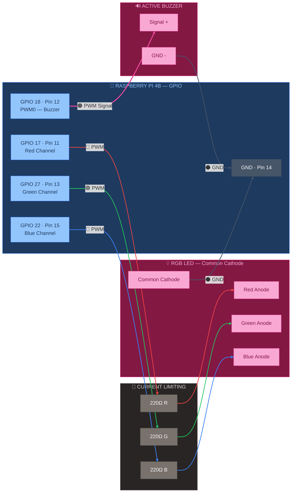

# 🩷 GPIO — Buzzer + RGB LED

> Part of [VIGIL-RQ Wiring Documentation](wiring_diagram.md)

---

---

## Alert GPIO Pin Mapping

| RPi GPIO | Pin | Function | Component | Wire Colour | Wire Gauge |
|----------|-----|----------|-----------|-------------|------------|
| GPIO 18 | 12 | PWM0 | Buzzer signal (+) | 🟠 Orange | 24 AWG |
| GPIO 17 | 11 | SW PWM | 220Ω → Red anode | 🔴 Red | 24 AWG |
| GPIO 27 | 13 | SW PWM | 220Ω → Green anode | 🟢 Green | 24 AWG |
| GPIO 22 | 15 | SW PWM | 220Ω → Blue anode | 🔵 Blue | 24 AWG |
| GND | 14 | Ground | Buzzer GND + LED cathode | ⚫ Black | 24 AWG |

## RGB LED Colour Codes

| Colour | Red | Green | Blue | Meaning |
|--------|-----|-------|------|---------|
| 🟢 Green | OFF | ON | OFF | System OK, connected |
| 🔵 Blue | OFF | OFF | ON | Starting up / connecting |
| 🟡 Yellow | ON | ON | OFF | Low battery warning |
| 🔴 Red | ON | OFF | OFF | Critical error / E-STOP |
| 🟣 Purple | ON | OFF | ON | IMU error |
| ⬜ White | ON | ON | ON | Watchdog triggered |

> [!NOTE]
> The buzzer uses hardware PWM (GPIO 18 = PWM0) for tone generation. The RGB LED uses software PWM for colour mixing. All 220Ω resistors limit current to ~15mA per channel at 3.3V.
