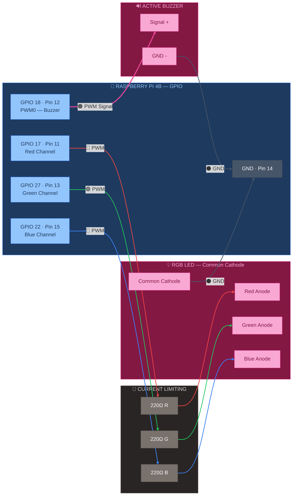

# 🩷 GPIO — Buzzer + RGB LED

> Part of [VIGIL-RQ Wiring Documentation](wiring_diagram.md)

---



---

## Alert GPIO Pin Mapping

| RPi GPIO | Pin | Function | Component | Wire Colour | Wire Gauge |
|----------|-----|----------|-----------|-------------|------------|
| GPIO 18 | 12 | PWM0 | Buzzer signal (+) | 🟠 Orange | 24 AWG |
| GPIO 17 | 11 | SW PWM | 220Ω → Red anode | 🔴 Red | 24 AWG |
| GPIO 27 | 13 | SW PWM | 220Ω → Green anode | 🟢 Green | 24 AWG |
| GPIO 22 | 15 | SW PWM | 220Ω → Blue anode | 🔵 Blue | 24 AWG |
| GND | 14 | Ground | Buzzer GND + LED cathode | ⚫ Black | 24 AWG |

## RGB LED Colour Codes

| Colour | Red | Green | Blue | Meaning |
|--------|-----|-------|------|---------|
| 🟢 Green | OFF | ON | OFF | System OK, connected |
| 🔵 Blue | OFF | OFF | ON | Starting up / connecting |
| 🟡 Yellow | ON | ON | OFF | Low battery warning |
| 🔴 Red | ON | OFF | OFF | Critical error / E-STOP |
| 🟣 Purple | ON | OFF | ON | IMU error |
| ⬜ White | ON | ON | ON | Watchdog triggered |

> [!NOTE]
> The buzzer uses hardware PWM (GPIO 18 = PWM0) for tone generation. The RGB LED uses software PWM for colour mixing. All 220Ω resistors limit current to ~15mA per channel at 3.3V.

---

## Buzzer Tone Patterns

The `alert_manager.py` uses different beep patterns for different alerts:

| Alert | Pattern | Duration | Meaning |
|-------|---------|----------|---------|
| Boot | 2 short beeps | 100ms on, 100ms off × 2 | System starting |
| Connected | 1 long beep | 500ms on | Mobile app connected |
| Low battery | 3 short beeps | 200ms on, 200ms off × 3 | Voltage < 10.0V |
| E-STOP | Continuous tone | Held until reset | Emergency stop active |
| Watchdog | 5 rapid beeps | 50ms on, 50ms off × 5 | Communication lost |
| IMU fault | 2 long beeps | 300ms on, 300ms off × 2 | IMU not responding |

> [!TIP]
> The active buzzer produces a **fixed frequency tone** (~2.7 kHz) when voltage is applied. The RPi PWM controls the on/off pattern, not the pitch. If you want variable pitch, use a **passive buzzer** and drive it with different PWM frequencies.

---

## LED Current Calculations

```
V_supply = 3.3V (RPi GPIO output)
V_forward (typical LED) = 1.8V (Red), 2.1V (Green), 2.8V (Blue)
R = 220Ω

I_red   = (3.3 - 1.8) / 220 = 6.8 mA   ✅ within 16mA GPIO limit
I_green = (3.3 - 2.1) / 220 = 5.5 mA   ✅
I_blue  = (3.3 - 2.8) / 220 = 2.3 mA   ✅
I_total = 14.6 mA (white, all on)       ✅ within GPIO limit
```

| Resistor Value | Red mA | Green mA | Blue mA | Brightness |
|----------------|--------|----------|---------|------------|
| 100Ω | 15.0 | 12.0 | 5.0 | Bright (near GPIO limit) |
| **220Ω** | **6.8** | **5.5** | **2.3** | **Medium (recommended)** |
| 330Ω | 4.5 | 3.6 | 1.5 | Dim |
| 470Ω | 3.2 | 2.6 | 1.1 | Very dim |

---

## Component Selection

### Active Buzzer
- Voltage: 3.3–5V (works with RPi 3.3V GPIO directly)
- Current: ~25 mA (within GPIO limit of 16mA → **use a transistor if buzzer draws >16mA**)
- If using a transistor: 2N2222 NPN, base → 1kΩ → GPIO 18, collector → buzzer(-), emitter → GND

### RGB LED (Common Cathode)
- Type: **Common cathode** (cathode = shared GND, anodes are R/G/B)
- Forward voltages vary by colour (see calculations above)
- Use **diffused** lens for better colour mixing

> [!WARNING]
> If using a **common anode** RGB LED, the wiring is reversed: anode to 3.3V, GPIOs drive LOW to turn on. You'll also need to invert the logic in `alert_manager.py`.

---

## Physical Mounting Tips

1. **Mount LED visible from outside** the chassis — drill a 5mm hole or use a panel-mount LED
2. **Mount buzzer facing outward** through a sound hole in the chassis
3. **Keep wires short** (10-15cm) — these are low-speed signals, but tidy wiring matters
4. **Use heat shrink** on resistor legs to prevent shorts against the metal chassis
5. **Test before mounting** — verify all 6 colours work before sealing the chassis

