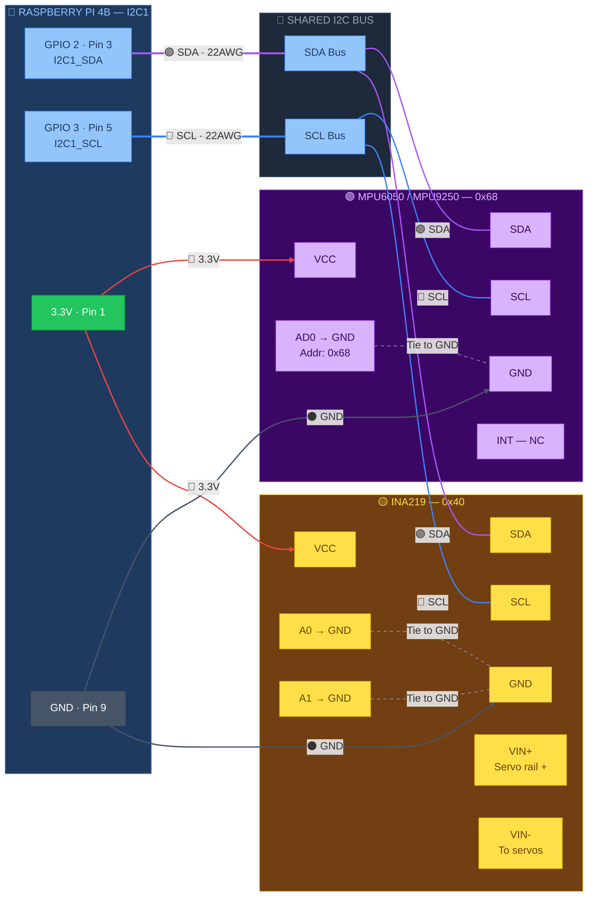

# 🟣 I2C Bus — Raspberry Pi ↔ IMU + INA219

> Part of [VIGIL-RQ Wiring Documentation](wiring_diagram.md)

---



---

## I2C Device Addresses

| Device | Address | Config | Pins Tied |
|--------|---------|--------|-----------|
| MPU6050/9250 | `0x68` | AD0 → GND | AD0 to GND |
| INA219 | `0x40` | A0,A1 → GND | A0, A1 both to GND |

## I2C Pin Mapping

| RPi GPIO | RPi Pin | Signal | Wire Colour | Connects To |
|----------|---------|--------|-------------|-------------|
| GPIO 2 | 3 | SDA | 🟣 Purple | IMU SDA + INA219 SDA (shared bus) |
| GPIO 3 | 5 | SCL | 🔵 Blue | IMU SCL + INA219 SCL (shared bus) |
| 3.3V | 1 | VCC | 🔴 Red | IMU VCC + INA219 VCC |
| GND | 9 | Ground | ⚫ Black | IMU GND + INA219 GND |

> [!NOTE]
> **I2C pull-ups:** The RPi 4B has built-in 1.8kΩ pull-ups on SDA/SCL. Most breakout boards add their own. If using bare ICs, add **4.7kΩ pull-ups to 3.3V** on both SDA and SCL.

> [!TIP]
> Run `i2cdetect -y 1` on the RPi to verify both devices are detected at addresses `0x68` (IMU) and `0x40` (INA219) before running the server.

---

## IMU Mounting Orientation

The MPU6050/9250 must be mounted with the correct axis alignment for the gait engine to work properly:

```
    FRONT of robot
         ↑
         +X axis
         |
  +Y ←───┼──→ -Y
  (Left)  |   (Right)
         +Z axis (UP from board)
```

| IMU Axis | Robot Direction | Notes |
|----------|-----------------|-------|
| +X | Forward | Towards the head |
| +Y | Left | Towards FL/RL legs |
| +Z | Up | Away from the ground |
| Gyro X | Roll | Body tilt left/right |
| Gyro Y | Pitch | Body tilt forward/back |
| Gyro Z | Yaw | Body rotation |

> [!IMPORTANT]
> Mount the IMU **flat on the body center plate**, aligned with the long axis of the robot. Secure with double-sided foam tape to dampen servo vibration. Do **not** mount near servos or power wires.

---

## INA219 Shunt Wiring Detail

The INA219 has **two separate circuits** — I2C communication and high-side current sensing:

| Pin | Function | Connects To |
|-----|----------|-------------|
| VCC | Logic power (3.3V) | RPi Pin 1 (3.3V) |
| GND | Logic ground | Common GND bus |
| SDA | I2C data | Shared SDA bus |
| SCL | I2C clock | Shared SCL bus |
| VIN+ | High-side sense (+) | XL4015 output (+6.8V) |
| VIN- | High-side sense (-) | Servo distribution terminal |
| A0 | Address bit 0 | Tie to GND → address 0x40 |
| A1 | Address bit 1 | Tie to GND → address 0x40 |

> [!WARNING]
> **VIN+ and VIN- carry the full servo current** (up to 30A peak). Use **18 AWG wires** and ensure the 0.1Ω shunt resistor is rated for at least **3W**. The default TI shunt on breakout boards handles ~3.2A max — replace it with a **0.01Ω 5W shunt** if you need to measure higher currents.

---

## I2C Troubleshooting

| Symptom | Cause | Fix |
|---------|-------|-----|
| `i2cdetect` shows nothing | Wrong bus or I2C not enabled | `sudo raspi-config` → Interface → enable I2C |
| Address 0x68 missing | AD0 not tied to GND | Solder/jumper AD0 → GND |
| Address 0x40 missing | A0/A1 floating | Tie A0 and A1 to GND |
| Garbage readings from IMU | Servo vibration coupling | Mount IMU on foam tape, away from servos |
| INA219 reads 0 current | Shunt not in series | Verify VIN+ comes from buck, VIN- goes to servos |
| I2C hangs / freezes | Bus collision or bad pull-ups | Check for shorted SDA/SCL; add 4.7kΩ pull-ups |

### Quick I2C Verification

```bash
# Enable I2C (one-time)
sudo raspi-config nonint do_i2c 0

# Scan for devices
sudo i2cdetect -y 1

# Expected output:
#      0  1  2  3  4  5  6  7  8  9  a  b  c  d  e  f
# 00:          -- -- -- -- -- -- -- -- -- -- -- -- --
# 30:  -- -- -- -- -- -- -- -- -- -- -- -- -- -- -- --
# 40:  40 -- -- -- -- -- -- -- -- -- -- -- -- -- -- --
# 50:  -- -- -- -- -- -- -- -- -- -- -- -- -- -- -- --
# 60:  -- -- -- -- -- -- -- -- 68 -- -- -- -- -- -- --

# Read IMU WHO_AM_I register
sudo i2cget -y 1 0x68 0x75
# Should return 0x68 (MPU6050) or 0x71 (MPU9250)
```

