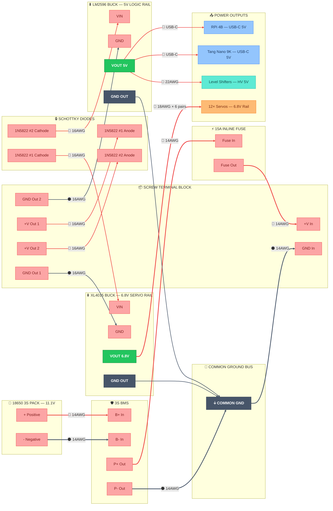

# ⚡ Power Distribution — Pin-Level Detail

> Part of [VIGIL-RQ Wiring Documentation](wiring_diagram.md)

---

---

## Power Rail Summary

| Rail | Source | Voltage | Current | Wire Gauge | Feeds |
|------|--------|---------|---------|------------|-------|
| Servo | XL4015 | 6.8V | ~15A peak | 18 AWG | 12× DS3218 servos |
| Logic | LM2596 | 5.0V | ~2A | USB-C | RPi 4B, Tang Nano 9K |
| LV Ref | FPGA 3.3V | 3.3V | <50mA | 22 AWG | 3× level shifters (LV side) |
| I2C | RPi 3.3V | 3.3V | <20mA | 22 AWG | IMU, INA219 |

> [!WARNING]
> **Always adjust buck converter trimpots with a multimeter BEFORE connecting any load.** Set XL4015 to 6.8V and LM2596 to 5.0V. Incorrect voltage will destroy the RPi or servos.

---

## 18650 Battery Pack Specifications

| Parameter | Value |
|-----------|-------|
| Chemistry | Li-ion (18650 cells) |
| Configuration | 3S1P (3 cells in series) |
| Nominal voltage | 11.1V (3.7V × 3) |
| Fully charged | 12.6V (4.2V × 3) |
| Low cutoff | 9.0V (3.0V × 3) — BMS disconnects |
| Capacity (typical) | 2500–3500 mAh per cell |
| Max continuous discharge | Depends on cell rating (use 10A+ cells) |

> [!TIP]
> Use high-drain cells like **Samsung 25R** (20A) or **Sony VTC6** (15A) for reliable servo power. Standard laptop-pull 18650s may sag under load and trip the BMS.

---

## Capacitor Recommendations

Add decoupling capacitors to stabilize voltage under servo load transients:

| Location | Capacitor | Purpose |
|----------|-----------|---------|
| XL4015 output | **1000µF 10V electrolytic** | Smooths 6.8V servo rail under surge |
| LM2596 output | **470µF 10V electrolytic** | Stabilizes 5V logic rail |
| Each level shifter VCC | **100nF ceramic** | Decouples high-frequency noise |
| RPi 3.3V rail | **100nF ceramic** | Stabilizes I2C/SPI reference |

> [!NOTE]
> Place the 1000µF cap **as close as possible** to the servo power distribution point (terminal block output). Long leads add inductance and reduce effectiveness.

---

## Buck Converter Setup Procedure

### XL4015 (Servo Rail — 6.8V)

1. **Disconnect all servos** from the output
2. Connect battery → BMS → fuse → terminal → diode → XL4015 VIN
3. Turn the **trimpot clockwise** slowly while measuring VOUT with multimeter
4. Stop when VOUT reads **6.8V ± 0.1V**
5. Verify it holds steady for 30 seconds
6. Only then connect servo power wires

### LM2596 (Logic Rail — 5.0V)

1. **Disconnect RPi and FPGA** USB-C cables
2. Connect battery → BMS → fuse → terminal → diode → LM2596 VIN
3. Turn the **trimpot** while measuring VOUT
4. Stop when VOUT reads **5.0V ± 0.05V**
5. RPi 4B tolerates 4.75V–5.25V; stay centered
6. Only then connect USB-C power cables

---

## Total System Current Budget

| Subsystem | Voltage | Idle | Typical | Peak |
|-----------|---------|------|---------|------|
| 12× DS3218 servos | 6.8V | 1.8A | 6A | 30A |
| Raspberry Pi 4B | 5.0V | 0.6A | 1.0A | 1.2A |
| Tang Nano 9K | 5.0V | 0.05A | 0.1A | 0.15A |
| 3× Level shifters | 5.0V/3.3V | <0.01A | <0.01A | <0.02A |
| IMU + INA219 | 3.3V | <0.01A | <0.01A | <0.01A |
| Buzzer + RGB LED | 3.3V | 0A | 0.03A | 0.05A |
| **Total from battery** | **11.1V** | **~1.5A** | **~4.5A** | **~18A** |

> [!IMPORTANT]
> At typical walking load (~4.5A from battery), a 3000mAh pack gives roughly **40 minutes** of operation. Monitor via the INA219 and set low-battery alert at **10.0V** (in `config.py`).

