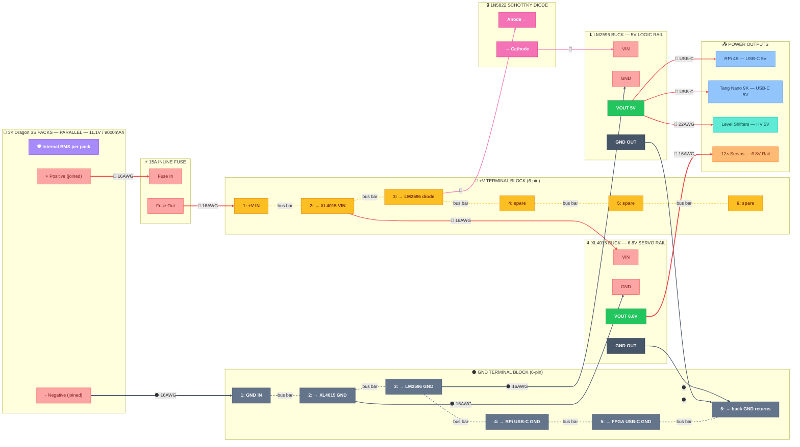
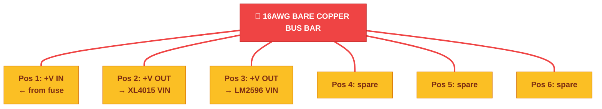
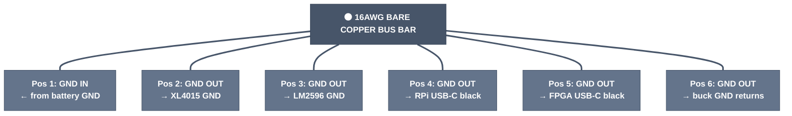

# ⚡ Power Distribution — Pin-Level Detail

> Part of [VIGIL-RQ Wiring Documentation](wiring_diagram.md)

---



---

## Screw Terminal Block Wiring (2× 6-pin)

Use two separate 6-pin terminal blocks — one for **+V distribution**, one for **GND distribution**.

### How to Make a Bus Bar

Each position on a screw terminal is **electrically isolated by default**. To make all positions share the same voltage, create a **bus bar**:

1. Cut a ~10 cm piece of **16 AWG wire**
2. Strip the **entire insulation** off — you want bare copper
3. Bend it so it runs under all 6 screw positions
4. Tighten each screw down onto the bare wire
5. Now all 6 positions are connected — you can add/remove wires from any position freely

Do this for **both** terminal blocks.

### +V Block Layout



### GND Block Layout



> [!TIP]
> Two wires fit in one terminal position. If a position needs two connections (e.g. GND pos 6 gets both buck converter GND returns), insert both stripped wire ends side-by-side and tighten. Tug-test both wires after.

---

## Power Rail Summary

| Rail | Source | Voltage | Current | Wire Gauge | Feeds |
|------|--------|---------|---------|------------|-------|
| Servo | XL4015 | 6.8V | ~15A peak | 16 AWG | 12× DS3218 servos |
| Logic | LM2596 | 5.0V | ~2A | USB-C | RPi 4B, Tang Nano 9K |
| LV Ref | FPGA 3.3V | 3.3V | <50mA | 22 AWG | 3× level shifters (LV side) |
| I2C | RPi 3.3V | 3.3V | <20mA | 22 AWG | IMU, INA219 |

> [!WARNING]
> **Always adjust buck converter trimpots with a multimeter BEFORE connecting any load.** Set XL4015 to 6.8V and LM2596 to 5.0V. Incorrect voltage will destroy the RPi or servos.

---

## 18650 Battery Pack Specifications

Using **3× Dragon 3S 3000mAh packs wired in parallel**. Each pack has an **internal BMS** — no external BMS board needed.

| Parameter | Value |
|-----------|-------|
| Chemistry | Li-ion (18650 cells) |
| Configuration per pack | 3S1P (3 cells in series) |
| Internal BMS per pack | ✅ Over-discharge, over-charge, short circuit |
| Packs in parallel | 3 |
| Effective configuration | 3S3P |
| Nominal voltage | 11.1V (3.7V × 3) |
| Fully charged | 12.6V (4.2V × 3) |
| Low cutoff | 9.0V (3.0V × 3) — internal BMS disconnects |
| Combined capacity | 9000mAh (3 × 3000mAh) |
| Max continuous discharge | ~15A (3 × ~5A per pack) |

> [!CAUTION]
> **Before connecting packs in parallel:** Charge all 3 packs fully and verify they are within **0.1V** of each other using a multimeter. Connecting packs at different voltages causes a dangerous current surge between them.

---

## Capacitor Recommendations

Add decoupling capacitors to stabilize voltage under servo load transients:

| Location | Capacitor | Purpose |
|----------|-----------|---------|
| XL4015 output | **1000µF 10V electrolytic** | Smooths 6.8V servo rail under surge |
| LM2596 output | **470µF 10V electrolytic** | Stabilizes 5V logic rail |
| Each level shifter VCC | **100nF ceramic** | Decouples high-frequency noise |
| RPi 3.3V rail | **100nF ceramic** | Stabilizes I2C/SPI reference |

> [!NOTE]
> Place the 1000µF cap **as close as possible** to the servo power distribution point (terminal block output). Long leads add inductance and reduce effectiveness.

---

## Buck Converter Setup Procedure

### XL4015 (Servo Rail — 6.8V)

1. **Disconnect all servos** from the output
2. Connect battery → BMS → fuse → terminal → diode → XL4015 VIN
3. Turn the **trimpot clockwise** slowly while measuring VOUT with multimeter
4. Stop when VOUT reads **6.8V ± 0.1V**
5. Verify it holds steady for 30 seconds
6. Only then connect servo power wires

### LM2596 (Logic Rail — 5.0V)

1. **Disconnect RPi and FPGA** USB-C cables
2. Connect battery → BMS → fuse → terminal → diode → LM2596 VIN
3. Turn the **trimpot** while measuring VOUT
4. Stop when VOUT reads **5.0V ± 0.05V**
5. RPi 4B tolerates 4.75V–5.25V; stay centered
6. Only then connect USB-C power cables

---

## Making USB-C Power Cables (LM2596 → RPi & FPGA)

The LM2596's 5V output powers the RPi and Tang Nano 9K via USB-C. You'll make two simple cables by cutting cheap USB-C charging cables.

### What You Need

| Item | Qty | Notes |
|------|-----|-------|
| USB-C charging cable | 2 | Cheap ones are fine — you only need the power wires |
| Wire strippers | 1 | For exposing the internal wires |
| Soldering iron + solder | 1 | For secure connections |
| Heat shrink tubing | — | To insulate exposed joints |
| Multimeter | 1 | To verify voltage before plugging in |

### Step-by-Step

1. **Cut the cable** — keep the **USB-C end** (the end that plugs into the Pi / FPGA), discard the other end
2. **Strip the outer jacket** — expose ~3 cm of the internal wires
3. **Identify the power wires:**

   | Wire Color | Purpose | Connect To |
   |-----------|---------|------------|
   | 🔴 **Red** | +5V | LM2596 **VOUT** |
   | ⚫ **Black** | GND | Common **GND bus** |
   | 🟢 Green / 🔵 Blue / ⚪ White | Data (D+, D-) | **Cut short & insulate** — not needed |

4. **Solder or crimp** the red and black wires:
   - Both cables' **red wires** → LM2596 **VOUT** terminal
   - Both cables' **black wires** → **common GND bus**
5. **Heat shrink** all exposed joints
6. **Verify before plugging in:**
   - Set multimeter to DC voltage
   - Touch probes to the USB-C connector's power pins (or just the red/black wires)
   - Confirm **5.0V ± 0.05V**
7. **Plug in** — USB-C into RPi, second USB-C into Tang Nano 9K

### Final Wiring

```
LM2596 VOUT (+5V) ──┬── 🔴 red wire ── USB-C ──→ 🍓 RPi 4B
                     └── 🔴 red wire ── USB-C ──→ 🟢 Tang Nano 9K

LM2596 GND OUT ─────┬── ⚫ black wire ─── (from RPi cable)    ──→ ⏚ Common GND
                     └── ⚫ black wire ─── (from FPGA cable)   ──→ ⏚ Common GND
```

> [!TIP]
> **Why USB-C instead of GPIO header pins?** Powering via USB-C uses the Pi's built-in protection circuitry (polyfuse + ESD diode). Feeding 5V directly to GPIO pins 2/4 works but bypasses this protection — a wiring mistake could fry the Pi.

> [!WARNING]
> Some ultra-cheap USB-C cables have non-standard wire colors. If in doubt, use a multimeter in continuity mode: touch one probe to the **metal shell** of the USB-C plug (that's GND) and check which internal wire beeps.

---

## Total System Current Budget

| Subsystem | Voltage | Idle | Typical | Peak |
|-----------|---------|------|---------|------|
| 12× DS3218 servos | 6.8V | 1.8A | 6A | 30A |
| Raspberry Pi 4B | 5.0V | 0.6A | 1.0A | 1.2A |
| Tang Nano 9K | 5.0V | 0.05A | 0.1A | 0.15A |
| 3× Level shifters | 5.0V/3.3V | <0.01A | <0.01A | <0.02A |
| IMU + INA219 | 3.3V | <0.01A | <0.01A | <0.01A |
| Buzzer + RGB LED | 3.3V | 0A | 0.03A | 0.05A |
| **Total from battery** | **11.1V** | **~1.5A** | **~4.5A** | **~18A** |

> [!IMPORTANT]
> At typical walking load (~4.5A from battery), a 3000mAh pack gives roughly **40 minutes** of operation. Monitor via the INA219 and set low-battery alert at **10.0V** (in `config.py`).

