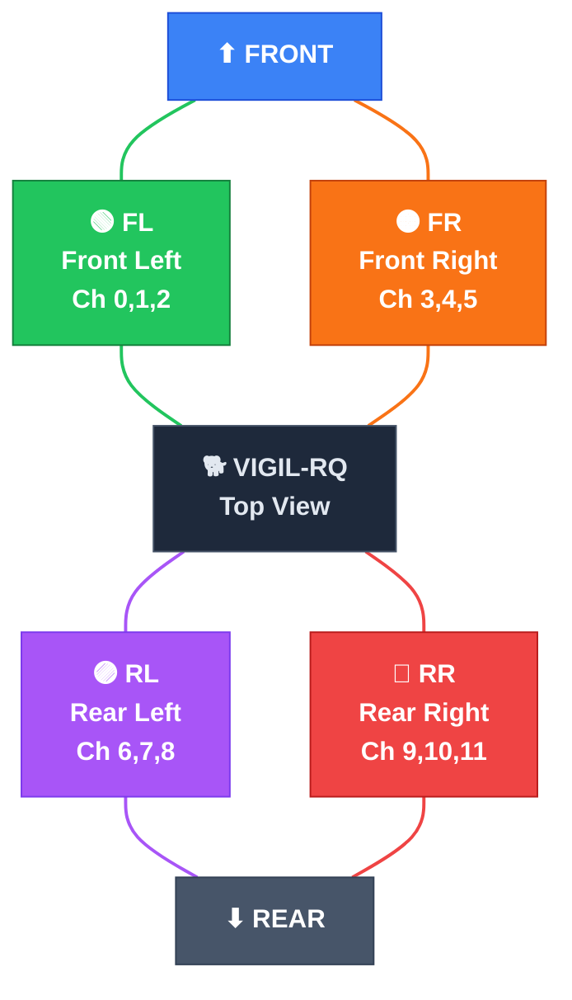
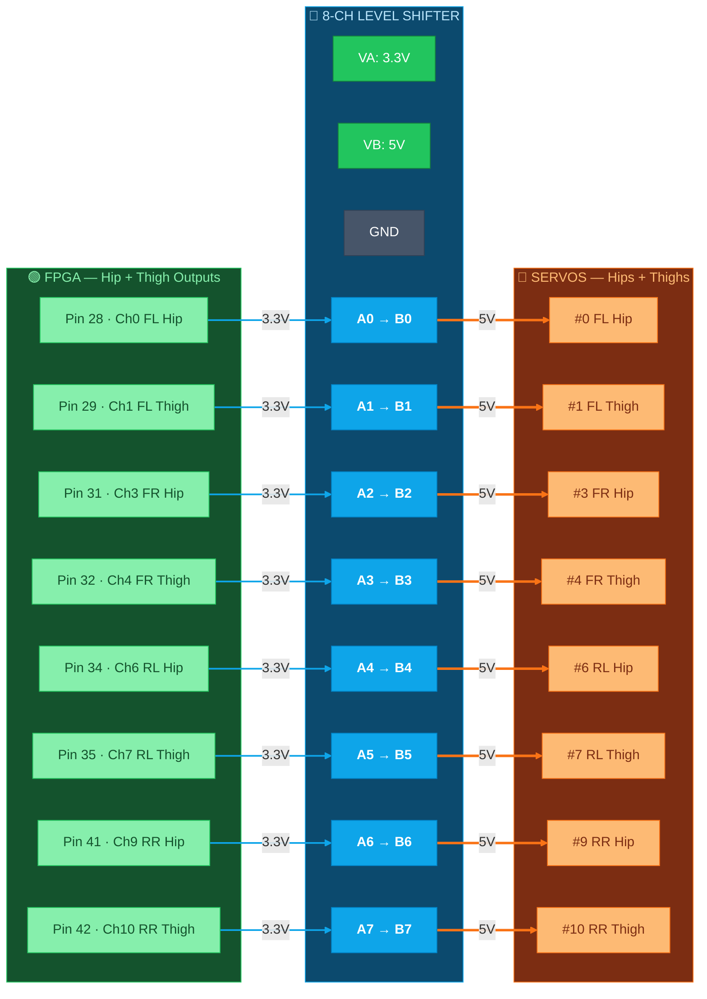
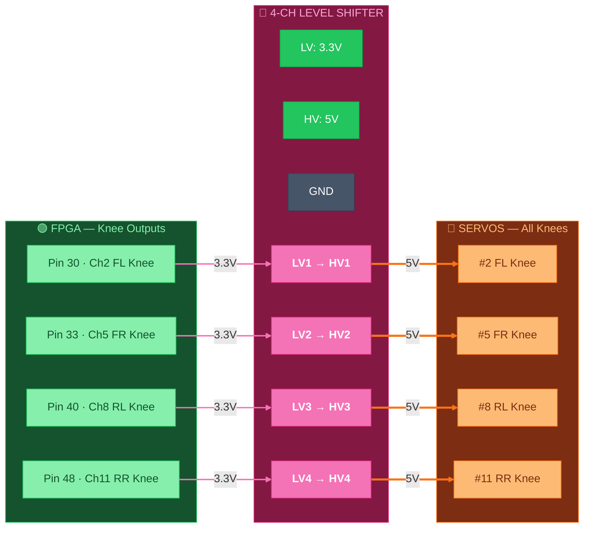

# 🟢 PWM Outputs — FPGA → Level Shifters → Servos

> Part of [VIGIL-RQ Wiring Documentation](wiring_diagram.md)

---

## Leg Orientation — Top View

Use this diagram to identify which leg is **FR, FL, RL, RR** when looking down at the robot from above:

### Joint Naming Convention (per leg)

Each leg has **3 joints**, numbered from body outward:

| Joint | Position | Range of Motion | Neutral (µs) |
|-------|----------|-----------------|---------------|
| **Hip** | Shoulder pivot (left/right swing) | ±30° | 1500 |
| **Thigh** | Upper leg (forward/back) | ±60° | 1500 |
| **Knee** | Lower leg (bend) | ±90° | 1500 |

### DS3218 PWM Specifications

| Parameter | Value |
|-----------|-------|
| PWM Frequency | 50 Hz (20 ms period) |
| Minimum pulse | 500 µs (full CW) |
| Neutral pulse | 1500 µs (center position) |
| Maximum pulse | 2500 µs (full CCW) |
| Operating voltage | 6.0–7.4V (we use 6.8V) |
| Stall torque @ 6.8V | ~20 kg·cm |
| Signal logic | 5V (via level shifter from 3.3V FPGA) |

---

## Level Shifter Layout

Using **1× 8-channel** (hips + thighs) and **1× 4-channel** (all knees):

| Level Shifter | Channels | Joints | Servos |
|--------------|----------|--------|--------|
| **LS1 — 8-channel** | 0,1,3,4,6,7,9,10 | All hips + thighs | 8 servos |
| **LS2 — 4-channel** | 2,5,8,11 | All knees | 4 servos |

---

## All 12 Channels — Overview

```mermaid
graph LR
    classDef fpgaPin fill:#86efac,stroke:#22c55e,color:#14532d
    classDef lsPin fill:#5eead4,stroke:#14b8a6,color:#134e4a
    classDef servoPin fill:#fdba74,stroke:#f97316,color:#7c2d12
    classDef vcc fill:#22c55e,stroke:#15803d,color:#fff
    classDef gnd fill:#475569,stroke:#334155,color:#fff
    classDef ls8 fill:#0ea5e9,stroke:#0284c7,color:#fff,font-weight:bold
    classDef ls4 fill:#f472b6,stroke:#db2777,color:#fff,font-weight:bold

    subgraph FPGA_PWM["🟢 TANG NANO 9K — PWM OUTPUTS"]
        F0["Pin 28<br/>pwm 0"]:::fpgaPin
        F1["Pin 29<br/>pwm 1"]:::fpgaPin
        F2["Pin 30<br/>pwm 2"]:::fpgaPin
        F3["Pin 31<br/>pwm 3"]:::fpgaPin
        F4["Pin 32<br/>pwm 4"]:::fpgaPin
        F5["Pin 33<br/>pwm 5"]:::fpgaPin
        F6["Pin 34<br/>pwm 6"]:::fpgaPin
        F7["Pin 35<br/>pwm 7"]:::fpgaPin
        F8["Pin 40<br/>pwm 8"]:::fpgaPin
        F9["Pin 41<br/>pwm 9"]:::fpgaPin
        F10["Pin 42<br/>pwm 10"]:::fpgaPin
        F11["Pin 48<br/>pwm 11"]:::fpgaPin
        F_3V3["3.3V"]:::vcc
        F_GND["GND"]:::gnd
    end

    subgraph LS1["🔀 8-CH LEVEL SHIFTER — Hips + Thighs"]
        LS1_LV["VA: 3.3V"]:::ls8
        LS1_HV["VB: 5V"]:::ls8
        LS1_GND["GND"]:::gnd
        LS1_1["A0 → B0"]:::ls8
        LS1_2["A1 → B1"]:::ls8
        LS1_3["A2 → B2"]:::ls8
        LS1_4["A3 → B3"]:::ls8
        LS1_5["A4 → B4"]:::ls8
        LS1_6["A5 → B5"]:::ls8
        LS1_7["A6 → B6"]:::ls8
        LS1_8["A7 → B7"]:::ls8
    end

    subgraph LS2["🔀 4-CH LEVEL SHIFTER — All Knees"]
        LS2_LV["LV: 3.3V"]:::ls4
        LS2_HV["HV: 5V"]:::ls4
        LS2_GND["GND"]:::gnd
        LS2_1["LV1 → HV1"]:::ls4
        LS2_2["LV2 → HV2"]:::ls4
        LS2_3["LV3 → HV3"]:::ls4
        LS2_4["LV4 → HV4"]:::ls4
    end

    subgraph FL_LEG["🦿 FRONT LEFT"]
        FL_H["#0 FL Hip"]:::servoPin
        FL_T["#1 FL Thigh"]:::servoPin
        FL_K["#2 FL Knee"]:::servoPin
    end

    subgraph FR_LEG["🦿 FRONT RIGHT"]
        FR_H["#3 FR Hip"]:::servoPin
        FR_T["#4 FR Thigh"]:::servoPin
        FR_K["#5 FR Knee"]:::servoPin
    end

    subgraph RL_LEG["🦿 REAR LEFT"]
        RL_H["#6 RL Hip"]:::servoPin
        RL_T["#7 RL Thigh"]:::servoPin
        RL_K["#8 RL Knee"]:::servoPin
    end

    subgraph RR_LEG["🦿 REAR RIGHT"]
        RR_H["#9 RR Hip"]:::servoPin
        RR_T["#10 RR Thigh"]:::servoPin
        RR_K["#11 RR Knee"]:::servoPin
    end

    %% FPGA → 8-ch LS1 (hips + thighs) — links 0-7
    F0 -->|"Ch0"| LS1_1
    F1 -->|"Ch1"| LS1_2
    F3 -->|"Ch3"| LS1_3
    F4 -->|"Ch4"| LS1_4
    F6 -->|"Ch6"| LS1_5
    F7 -->|"Ch7"| LS1_6
    F9 -->|"Ch9"| LS1_7
    F10 -->|"Ch10"| LS1_8

    %% FPGA → 4-ch LS2 (knees) — links 8-11
    F2 -->|"Ch2"| LS2_1
    F5 -->|"Ch5"| LS2_2
    F8 -->|"Ch8"| LS2_3
    F11 -->|"Ch11"| LS2_4

    %% LS1 → Servos (hips + thighs) — links 12-19
    LS1_1 ==>|"5V"| FL_H
    LS1_2 ==>|"5V"| FL_T
    LS1_3 ==>|"5V"| FR_H
    LS1_4 ==>|"5V"| FR_T
    LS1_5 ==>|"5V"| RL_H
    LS1_6 ==>|"5V"| RL_T
    LS1_7 ==>|"5V"| RR_H
    LS1_8 ==>|"5V"| RR_T

    %% LS2 → Servos (knees) — links 20-23
    LS2_1 ==>|"5V"| FL_K
    LS2_2 ==>|"5V"| FR_K
    LS2_3 ==>|"5V"| RL_K
    LS2_4 ==>|"5V"| RR_K

    %% LV power — links 24-25
    F_3V3 -.->|"VA Ref"| LS1_LV
    F_3V3 -.->|"LV Ref"| LS2_LV

    %% GND — links 26-27
    F_GND ---|"⚫ GND"| LS1_GND
    F_GND ---|"⚫ GND"| LS2_GND

    linkStyle 0,1,2,3,4,5,6,7 stroke:#0ea5e9,stroke-width:2px
    linkStyle 8,9,10,11 stroke:#f472b6,stroke-width:2px
    linkStyle 12,13,14,15,16,17,18,19 stroke:#f97316,stroke-width:3px
    linkStyle 20,21,22,23 stroke:#f97316,stroke-width:3px
    linkStyle 24,25 stroke:#ef4444,stroke-width:1px
    linkStyle 26,27 stroke:#475569,stroke-width:2px

    style FPGA_PWM fill:#14532d,stroke:#22c55e,color:#86efac
    style LS1 fill:#0c4a6e,stroke:#0ea5e9,color:#bae6fd
    style LS2 fill:#831843,stroke:#db2777,color:#f9a8d4
    style FL_LEG fill:#7c2d12,stroke:#f97316,color:#fdba74
    style FR_LEG fill:#7c2d12,stroke:#f97316,color:#fdba74
    style RL_LEG fill:#7c2d12,stroke:#f97316,color:#fdba74
    style RR_LEG fill:#7c2d12,stroke:#f97316,color:#fdba74
```

---

## 8-Channel Level Shifter — Hips + Thighs (LS1)

---

## 4-Channel Level Shifter — All Knees (LS2)

---

## Channel-to-Servo Mapping Table

| Channel | FPGA Pin | Level Shifter | LS Channel | Servo | Joint |
|---------|----------|---------------|------------|-------|-------|
| 0 | 28 | LS1 (8-ch) | A0→B0 | DS3218 #0 | FL Hip |
| 1 | 29 | LS1 (8-ch) | A1→B1 | DS3218 #1 | FL Thigh |
| 2 | 30 | LS2 (4-ch) | LV1→HV1 | DS3218 #2 | FL Knee |
| 3 | 31 | LS1 (8-ch) | A2→B2 | DS3218 #3 | FR Hip |
| 4 | 32 | LS1 (8-ch) | A3→B3 | DS3218 #4 | FR Thigh |
| 5 | 33 | LS2 (4-ch) | LV2→HV2 | DS3218 #5 | FR Knee |
| 6 | 34 | LS1 (8-ch) | A4→B4 | DS3218 #6 | RL Hip |
| 7 | 35 | LS1 (8-ch) | A5→B5 | DS3218 #7 | RL Thigh |
| 8 | 40 | LS2 (4-ch) | LV3→HV3 | DS3218 #8 | RL Knee |
| 9 | 41 | LS1 (8-ch) | A6→B6 | DS3218 #9 | RR Hip |
| 10 | 42 | LS1 (8-ch) | A7→B7 | DS3218 #10 | RR Thigh |
| 11 | 48 | LS2 (4-ch) | LV4→HV4 | DS3218 #11 | RR Knee |

## Level Shifter Power Connections

| Level Shifter | LV Pin | HV Pin | GND |
|---------------|--------|--------|-----|
| LS1 (8-ch) | **VA** = 3.3V from FPGA | **VB** = 5V from LM2596 | Common GND |
| LS2 (4-ch) | **LV** = 3.3V from FPGA | **HV** = 5V from LM2596 | Common GND |
