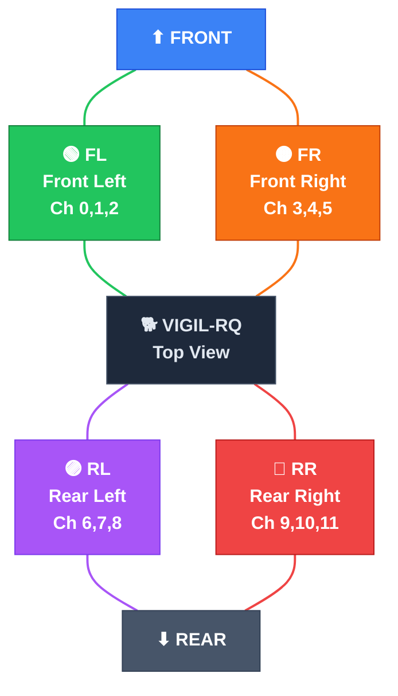
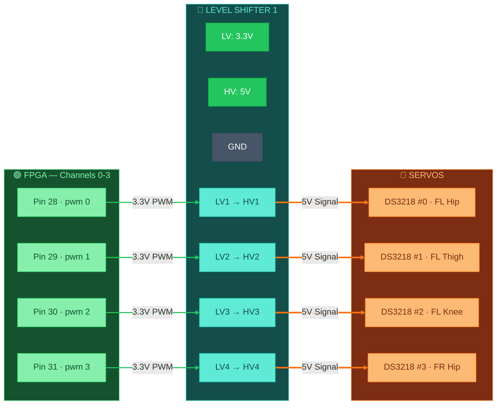
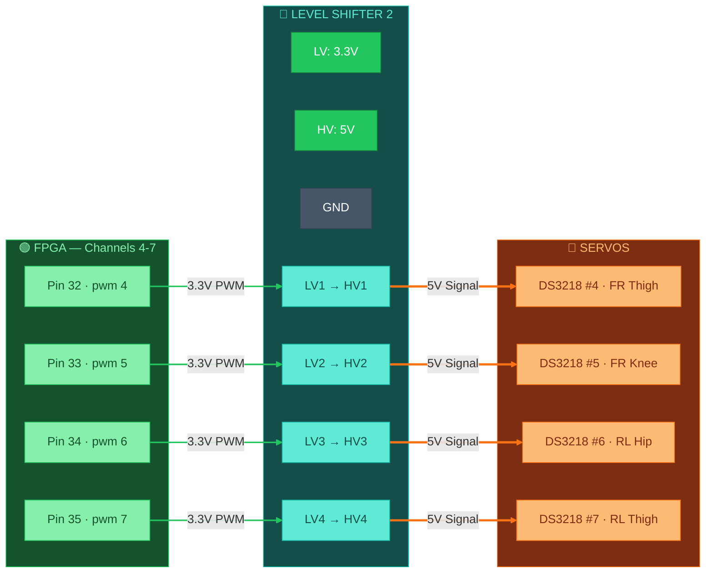
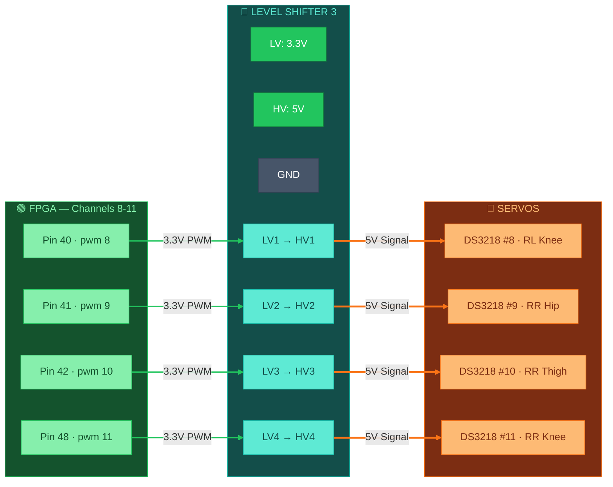

# 🟢 PWM Outputs — FPGA → Level Shifters → Servos

> Part of [VIGIL-RQ Wiring Documentation](wiring_diagram.md)

---

## Leg Orientation — Top View

Use this diagram to identify which leg is **FR, FL, RL, RR** when looking down at the robot from above:

### Joint Naming Convention (per leg)

Each leg has **3 joints**, numbered from body outward:

| Joint | Position | Range of Motion | Neutral (µs) |
|-------|----------|-----------------|---------------|
| **Hip** | Shoulder pivot (left/right swing) | ±30° | 1500 |
| **Thigh** | Upper leg (forward/back) | ±60° | 1500 |
| **Knee** | Lower leg (bend) | ±90° | 1500 |

### DS3218 PWM Specifications

| Parameter | Value |
|-----------|-------|
| PWM Frequency | 50 Hz (20 ms period) |
| Minimum pulse | 500 µs (full CW) |
| Neutral pulse | 1500 µs (center position) |
| Maximum pulse | 2500 µs (full CCW) |
| Operating voltage | 6.0–7.4V (we use 6.8V) |
| Stall torque @ 6.8V | ~20 kg·cm |
| Signal logic | 5V (via level shifter from 3.3V FPGA) |

---

## All 12 Channels — Overview

```mermaid
graph LR
    classDef fpgaPin fill:#86efac,stroke:#22c55e,color:#14532d
    classDef lsPin fill:#5eead4,stroke:#14b8a6,color:#134e4a
    classDef servoPin fill:#fdba74,stroke:#f97316,color:#7c2d12
    classDef vcc fill:#22c55e,stroke:#15803d,color:#fff
    classDef gnd fill:#475569,stroke:#334155,color:#fff

    subgraph FPGA_PWM["🟢 TANG NANO 9K — PWM OUTPUTS"]
        F0["Pin 28<br/>pwm_out 0"]:::fpgaPin
        F1["Pin 29<br/>pwm_out 1"]:::fpgaPin
        F2["Pin 30<br/>pwm_out 2"]:::fpgaPin
        F3["Pin 31<br/>pwm_out 3"]:::fpgaPin
        F4["Pin 32<br/>pwm_out 4"]:::fpgaPin
        F5["Pin 33<br/>pwm_out 5"]:::fpgaPin
        F6["Pin 34<br/>pwm_out 6"]:::fpgaPin
        F7["Pin 35<br/>pwm_out 7"]:::fpgaPin
        F8["Pin 40<br/>pwm_out 8"]:::fpgaPin
        F9["Pin 41<br/>pwm_out 9"]:::fpgaPin
        F10["Pin 42<br/>pwm_out 10"]:::fpgaPin
        F11["Pin 48<br/>pwm_out 11"]:::fpgaPin
        F_3V3["3.3V"]:::vcc
        F_GND["GND"]:::gnd
    end

    subgraph LS1["🔀 LEVEL SHIFTER 1"]
        LS1_LV["LV: 3.3V"]:::lsPin
        LS1_HV["HV: 5V"]:::lsPin
        LS1_GND["GND"]:::gnd
        LS1_A1["LV1 → HV1"]:::lsPin
        LS1_A2["LV2 → HV2"]:::lsPin
        LS1_A3["LV3 → HV3"]:::lsPin
        LS1_A4["LV4 → HV4"]:::lsPin
    end

    subgraph LS2["🔀 LEVEL SHIFTER 2"]
        LS2_LV["LV: 3.3V"]:::lsPin
        LS2_HV["HV: 5V"]:::lsPin
        LS2_GND["GND"]:::gnd
        LS2_A1["LV1 → HV1"]:::lsPin
        LS2_A2["LV2 → HV2"]:::lsPin
        LS2_A3["LV3 → HV3"]:::lsPin
        LS2_A4["LV4 → HV4"]:::lsPin
    end

    subgraph LS3["🔀 LEVEL SHIFTER 3"]
        LS3_LV["LV: 3.3V"]:::lsPin
        LS3_HV["HV: 5V"]:::lsPin
        LS3_GND["GND"]:::gnd
        LS3_A1["LV1 → HV1"]:::lsPin
        LS3_A2["LV2 → HV2"]:::lsPin
        LS3_A3["LV3 → HV3"]:::lsPin
        LS3_A4["LV4 → HV4"]:::lsPin
    end

    subgraph FL_LEG["🦿 FRONT LEFT LEG"]
        FL_H["DS3218 #0<br/>FL Hip · Signal"]:::servoPin
        FL_T["DS3218 #1<br/>FL Thigh · Signal"]:::servoPin
        FL_K["DS3218 #2<br/>FL Knee · Signal"]:::servoPin
    end

    subgraph FR_LEG["🦿 FRONT RIGHT LEG"]
        FR_H["DS3218 #3<br/>FR Hip · Signal"]:::servoPin
        FR_T["DS3218 #4<br/>FR Thigh · Signal"]:::servoPin
        FR_K["DS3218 #5<br/>FR Knee · Signal"]:::servoPin
    end

    subgraph RL_LEG["🦿 REAR LEFT LEG"]
        RL_H["DS3218 #6<br/>RL Hip · Signal"]:::servoPin
        RL_T["DS3218 #7<br/>RL Thigh · Signal"]:::servoPin
        RL_K["DS3218 #8<br/>RL Knee · Signal"]:::servoPin
    end

    subgraph RR_LEG["🦿 REAR RIGHT LEG"]
        RR_H["DS3218 #9<br/>RR Hip · Signal"]:::servoPin
        RR_T["DS3218 #10<br/>RR Thigh · Signal"]:::servoPin
        RR_K["DS3218 #11<br/>RR Knee · Signal"]:::servoPin
    end

    %% FPGA → LS1 Ch 0-3 (links 0-3)
    F0 -->|"Ch0 3.3V"| LS1_A1
    F1 -->|"Ch1 3.3V"| LS1_A2
    F2 -->|"Ch2 3.3V"| LS1_A3
    F3 -->|"Ch3 3.3V"| LS1_A4

    %% FPGA → LS2 Ch 4-7 (links 4-7)
    F4 -->|"Ch4 3.3V"| LS2_A1
    F5 -->|"Ch5 3.3V"| LS2_A2
    F6 -->|"Ch6 3.3V"| LS2_A3
    F7 -->|"Ch7 3.3V"| LS2_A4

    %% FPGA → LS3 Ch 8-11 (links 8-11)
    F8 -->|"Ch8 3.3V"| LS3_A1
    F9 -->|"Ch9 3.3V"| LS3_A2
    F10 -->|"Ch10 3.3V"| LS3_A3
    F11 -->|"Ch11 3.3V"| LS3_A4

    %% LS1 → Servos 5V (links 12-15)
    LS1_A1 ==>|"5V Signal"| FL_H
    LS1_A2 ==>|"5V Signal"| FL_T
    LS1_A3 ==>|"5V Signal"| FL_K
    LS1_A4 ==>|"5V Signal"| FR_H

    %% LS2 → Servos 5V (links 16-19)
    LS2_A1 ==>|"5V Signal"| FR_T
    LS2_A2 ==>|"5V Signal"| FR_K
    LS2_A3 ==>|"5V Signal"| RL_H
    LS2_A4 ==>|"5V Signal"| RL_T

    %% LS3 → Servos 5V (links 20-23)
    LS3_A1 ==>|"5V Signal"| RL_K
    LS3_A2 ==>|"5V Signal"| RR_H
    LS3_A3 ==>|"5V Signal"| RR_T
    LS3_A4 ==>|"5V Signal"| RR_K

    %% Level shifter LV power (links 24-26)
    F_3V3 -.->|"LV Ref"| LS1_LV
    F_3V3 -.->|"LV Ref"| LS2_LV
    F_3V3 -.->|"LV Ref"| LS3_LV

    %% Ground connections (links 27-30)
    F_GND ---|"⚫ GND"| LS1_GND
    F_GND ---|"⚫ GND"| LS2_GND
    F_GND ---|"⚫ GND"| LS3_GND

    linkStyle 0,1,2,3,4,5,6,7,8,9,10,11 stroke:#22c55e,stroke-width:2px
    linkStyle 12,13,14,15,16,17,18,19,20,21,22,23 stroke:#f97316,stroke-width:3px
    linkStyle 24,25,26 stroke:#ef4444,stroke-width:1px
    linkStyle 27,28,29 stroke:#475569,stroke-width:2px

    style FPGA_PWM fill:#14532d,stroke:#22c55e,color:#86efac
    style LS1 fill:#134e4a,stroke:#14b8a6,color:#5eead4
    style LS2 fill:#134e4a,stroke:#14b8a6,color:#5eead4
    style LS3 fill:#134e4a,stroke:#14b8a6,color:#5eead4
    style FL_LEG fill:#7c2d12,stroke:#f97316,color:#fdba74
    style FR_LEG fill:#7c2d12,stroke:#f97316,color:#fdba74
    style RL_LEG fill:#7c2d12,stroke:#f97316,color:#fdba74
    style RR_LEG fill:#7c2d12,stroke:#f97316,color:#fdba74
```

---

## Level Shifter 1 — Channels 0-3 (FL + FR Hip)

---

## Level Shifter 2 — Channels 4-7 (FR Thigh/Knee + RL Hip/Thigh)

---

## Level Shifter 3 — Channels 8-11 (RL Knee + RR Leg)

---

## Channel-to-Servo Mapping Table

| Channel | FPGA Pin | Level Shifter | LS Channel | Servo | Joint |
|---------|----------|---------------|------------|-------|-------|
| 0 | 28 | LS1 | LV1→HV1 | DS3218 #0 | FL Hip |
| 1 | 29 | LS1 | LV2→HV2 | DS3218 #1 | FL Thigh |
| 2 | 30 | LS1 | LV3→HV3 | DS3218 #2 | FL Knee |
| 3 | 31 | LS1 | LV4→HV4 | DS3218 #3 | FR Hip |
| 4 | 32 | LS2 | LV1→HV1 | DS3218 #4 | FR Thigh |
| 5 | 33 | LS2 | LV2→HV2 | DS3218 #5 | FR Knee |
| 6 | 34 | LS2 | LV3→HV3 | DS3218 #6 | RL Hip |
| 7 | 35 | LS2 | LV4→HV4 | DS3218 #7 | RL Thigh |
| 8 | 40 | LS3 | LV1→HV1 | DS3218 #8 | RL Knee |
| 9 | 41 | LS3 | LV2→HV2 | DS3218 #9 | RR Hip |
| 10 | 42 | LS3 | LV3→HV3 | DS3218 #10 | RR Thigh |
| 11 | 48 | LS3 | LV4→HV4 | DS3218 #11 | RR Knee |

## Level Shifter Power Connections

| Level Shifter | LV Pin | HV Pin | GND |
|---------------|--------|--------|-----|
| LS1 | 3.3V from FPGA | 5V from LM2596 | Common GND |
| LS2 | 3.3V from FPGA | 5V from LM2596 | Common GND |
| LS3 | 3.3V from FPGA | 5V from LM2596 | Common GND |
