# 🟡 INA219 Shunt + ⏚ Ground Bus + 📋 Pin Reference

> Part of [VIGIL-RQ Wiring Documentation](wiring_diagram.md)

---

## INA219 Power Sensing — Shunt Placement


> [!TIP]
> The INA219 measures current by sensing the voltage drop across the 0.1Ω shunt resistor placed **in series** on the positive servo power rail. This monitors total current draw of all 12 servos simultaneously.

---

## Common Ground Bus — Star Topology

```mermaid
graph TB
    classDef gnd fill:#475569,stroke:#334155,color:#fff,font-weight:bold
    classDef rpiPin fill:#93c5fd,stroke:#3b82f6,color:#1e3a5f
    classDef fpgaPin fill:#86efac,stroke:#22c55e,color:#14532d
    classDef lsPin fill:#5eead4,stroke:#14b8a6,color:#134e4a
    classDef servoPin fill:#fdba74,stroke:#f97316,color:#7c2d12
    classDef imuPin fill:#d8b4fe,stroke:#a855f7,color:#3b0764
    classDef inaPin fill:#fde047,stroke:#eab308,color:#713f12
    classDef alertPin fill:#f9a8d4,stroke:#ec4899,color:#831843
    classDef powerPin fill:#fca5a5,stroke:#ef4444,color:#7f1d1d

    GND_STAR["⏚ COMMON GROUND<br/>Star Topology<br/>at Terminal Block"]:::gnd

    BAT_G["Battery -"]:::powerPin
    BUCKS_G["XL4015 GND"]:::powerPin
    BUCKL_G["LM2596 GND"]:::powerPin
    RPI_G["RPi 4B GND<br/>Pin 6/9/14/20/25/30/34/39"]:::rpiPin
    FPGA_G["Tang Nano 9K GND<br/>Header GND"]:::fpgaPin
    LS1_G["Level Shifter 1 GND"]:::lsPin
    LS2_G["Level Shifter 2 GND"]:::lsPin
    LS3_G["Level Shifter 3 GND"]:::lsPin
    IMU_G["MPU6050 GND"]:::imuPin
    INA_G["INA219 GND"]:::inaPin
    BUZ_G["Buzzer GND"]:::alertPin
    RGB_G["RGB LED Cathode"]:::alertPin
    SERVO_G["12× Servo GND<br/>Brown wires"]:::servoPin

    GND_STAR --- BAT_G
    GND_STAR --- BUCKS_G
    GND_STAR --- BUCKL_G
    GND_STAR --- RPI_G
    GND_STAR --- FPGA_G
    GND_STAR --- LS1_G
    GND_STAR --- LS2_G
    GND_STAR --- LS3_G
    GND_STAR --- IMU_G
    GND_STAR --- INA_G
    GND_STAR --- BUZ_G
    GND_STAR --- RGB_G
    GND_STAR --- SERVO_G

    linkStyle 0,1,2 stroke:#475569,stroke-width:3px
    linkStyle 3 stroke:#3b82f6,stroke-width:2px
    linkStyle 4 stroke:#22c55e,stroke-width:2px
    linkStyle 5,6,7 stroke:#14b8a6,stroke-width:2px
    linkStyle 8 stroke:#a855f7,stroke-width:2px
    linkStyle 9 stroke:#eab308,stroke-width:2px
    linkStyle 10,11 stroke:#ec4899,stroke-width:2px
    linkStyle 12 stroke:#f97316,stroke-width:3px

    style GND_STAR fill:#1e293b,stroke:#94a3b8,color:#e2e8f0,stroke-width:3px
```



> [!CAUTION]
> **Ground loops cause servo jitter and SPI errors.** Use a **star ground topology** — all ground wires connect to a single common point on the terminal block, not daisy-chained. Use **14–16 AWG** for the main ground bus wire.

---

## Raspberry Pi 4B — All Used GPIO Pins

| BCM GPIO | Physical Pin | Function | Wire Colour | Connects To | Wire Gauge |
|----------|-------------|----------|-------------|-------------|------------|
| GPIO 2 | 3 | I2C1 SDA | 🟣 Purple | IMU SDA + INA219 SDA | 22 AWG |
| GPIO 3 | 5 | I2C1 SCL | 🔵 Blue | IMU SCL + INA219 SCL | 22 AWG |
| GPIO 8 | 24 | SPI0 CE0 | 🟡 Yellow | FPGA Pin 27 (CS) | 22 AWG |
| GPIO 9 | 21 | SPI0 MISO | 🟢 Green | FPGA (reserved, NC) | — |
| GPIO 10 | 19 | SPI0 MOSI | 🟢 Green | FPGA Pin 26 (MOSI) | 22 AWG |
| GPIO 11 | 23 | SPI0 SCLK | 🔵 Blue | FPGA Pin 25 (SCLK) | 22 AWG |
| GPIO 17 | 11 | RGB Red | 🔴 Red | 220Ω → LED Red anode | 24 AWG |
| GPIO 18 | 12 | Buzzer PWM | 🟠 Orange | Active buzzer + pin | 24 AWG |
| GPIO 22 | 15 | RGB Blue | 🔵 Blue | 220Ω → LED Blue anode | 24 AWG |
| GPIO 27 | 13 | RGB Green | 🟢 Green | 220Ω → LED Green anode | 24 AWG |
| 3.3V | 1, 17 | Power out | 🔴 Red | IMU VCC, INA219 VCC, LS LV | 22 AWG |
| 5V | 2, 4 | Power in | 🔴 Red | From LM2596 via USB-C | — |
| GND | 6,9,14,20,25 | Ground | ⚫ Black | Common ground bus | 16 AWG |

## Tang Nano 9K — All Used Pins

| FPGA Pin | Signal Name | Direction | Connects To |
|----------|-------------|-----------|-------------|
| 52 | clk_27m | Input | On-board oscillator (internal) |
| 3 | btn_rst_n | Input | On-board S1 button (internal) |
| 25 | spi_sclk | Input | RPi GPIO 11 |
| 26 | spi_mosi | Input | RPi GPIO 10 |
| 27 | spi_cs_n | Input | RPi GPIO 8 |
| 28 | pwm_out[0] | Output | LS1 LV1 (FL Hip) |
| 29 | pwm_out[1] | Output | LS1 LV2 (FL Thigh) |
| 30 | pwm_out[2] | Output | LS1 LV3 (FL Knee) |
| 31 | pwm_out[3] | Output | LS1 LV4 (FR Hip) |
| 32 | pwm_out[4] | Output | LS2 LV1 (FR Thigh) |
| 33 | pwm_out[5] | Output | LS2 LV2 (FR Knee) |
| 34 | pwm_out[6] | Output | LS2 LV3 (RL Hip) |
| 35 | pwm_out[7] | Output | LS2 LV4 (RL Thigh) |
| 40 | pwm_out[8] | Output | LS3 LV1 (RL Knee) |
| 41 | pwm_out[9] | Output | LS3 LV2 (RR Hip) |
| 42 | pwm_out[10] | Output | LS3 LV3 (RR Thigh) |
| 48 | pwm_out[11] | Output | LS3 LV4 (RR Knee) |
| 10–16 | led[0:5] | Output | On-board LEDs (heartbeat + SPI) |

---

## 🔧 Assembly Checklist

- [ ] Solder battery tabs to 18650 3S pack
- [ ] Connect battery → BMS → fuse → terminal block (🔴 14 AWG)
- [ ] Mount 1N5822 diodes on terminal block outputs
- [ ] Wire XL4015 buck — **adjust trimpot to 6.8V before connecting servos!**
- [ ] Wire LM2596 buck — **adjust trimpot to 5.0V before connecting RPi!**
- [ ] Connect all ⚫ GND wires to star ground point on terminal block (14–16 AWG)
- [ ] Wire 3× level shifters: LV=3.3V from FPGA, HV=5V from LM2596
- [ ] Connect 12× FPGA PWM pins → level shifter LV inputs (🟢 22 AWG)
- [ ] Connect 12× level shifter HV outputs → servo signal wires (🟠 22 AWG)
- [ ] Connect 12× servo power 🔴 red wire to XL4015 6.8V rail (18 AWG pairs)
- [ ] Connect 12× servo ⚫ brown wire to common ground bus
- [ ] Wire SPI: GPIO 8/10/11 → FPGA 25/26/27 (🔵🟢🟡 22 AWG, keep short!)
- [ ] Wire I2C: GPIO 2/3 → IMU + INA219 SDA/SCL (🟣🔵 22 AWG)
- [ ] Place INA219 shunt resistor in series on +6.8V servo rail
- [ ] Wire buzzer: GPIO 18 → buzzer + pin, buzzer − → GND (🟠 24 AWG)
- [ ] Wire RGB LED: GPIO 17/27/22 → 220Ω → R/G/B anodes, cathode → GND (24 AWG)
- [ ] Apply heat shrink (1cm, 2cm) to **ALL** solder joints
- [ ] **Verify all voltages with multimeter BEFORE powering on RPi/FPGA**

---

## Wire Gauge Quick Reference

| AWG | Diameter | Max Current | Used For |
|-----|----------|-------------|----------|
| 14 AWG | 1.63mm | 15A | Battery → BMS → fuse → terminal |
| 16 AWG | 1.29mm | 10A | Terminal → buck converters, main GND bus |
| 18 AWG | 1.02mm | 5A | Buck output → servo power (per leg pair) |
| 22 AWG | 0.64mm | 0.9A | SPI, I2C, PWM signal, level shifter |
| 24 AWG | 0.51mm | 0.6A | Buzzer, RGB LED, low-current signals |

> [!NOTE]
> Use **stranded** wire for all connections inside the robot chassis — it's more flexible and survives vibration better than solid core. Use **silicone-insulated** wire if possible (heat resistant, flexible).

---

## Required Tools

| Tool | Purpose |
|------|---------|
| Digital multimeter | Measure voltage, continuity, current |
| Soldering iron (30-60W) | Solder all permanent connections |
| Wire strippers | Strip 14-24 AWG wire |
| Heat shrink tubing | Insulate solder joints (1mm, 2mm, 3mm) |
| Heat gun / lighter | Shrink tubing |
| Small Phillips screwdriver | Terminal block screws |
| Oscilloscope (optional) | Verify PWM signals, debug SPI |
| USB-C cables × 2 | Power RPi and FPGA from LM2596 |
| DuPont jumper wires | Prototyping (replace with solder for production) |

---

## System Debugging Flowchart

Use this when things don't work during assembly:

```
START: Nothing works
  │
  ├─ Check battery voltage → < 9V? → Charge/replace battery
  │
  ├─ Check fuse → Blown? → Replace (15A blade)
  │
  ├─ Measure XL4015 output → Not 6.8V? → Adjust trimpot
  │
  ├─ Measure LM2596 output → Not 5.0V? → Adjust trimpot
  │
  ├─ RPi boots? → No → Check USB-C power connection
  │                └─ Yes ↓
  │
  ├─ FPGA heartbeat LED blinks? → No → Re-flash bitstream
  │                                └─ Yes ↓
  │
  ├─ i2cdetect shows 0x68 + 0x40? → No → Check I2C wiring
  │                                  └─ Yes ↓
  │
  ├─ SPI test works? → No → Check SCLK/MOSI/CS wiring
  │                    └─ Yes ↓
  │
  ├─ Servos move? → No → Check level shifters + servo power
  │                 └─ Yes ↓
  │
  ├─ App connects? → No → Check WiFi AP + WebSocket
  │                  └─ Yes ↓
  │
  └─ ✅ SYSTEM OPERATIONAL
```

> [!TIP]
> Always debug **power first, then communication, then actuators**. Most issues are just bad connections or wrong voltage levels.

