# 🟠 Servo Power — 6.8V Rail to All 12 DS3218

> Part of [VIGIL-RQ Wiring Documentation](wiring_diagram.md)
>
> Signal wires (🟠 Orange) are documented in [PWM Outputs](wiring_pwm.md). This file covers **power** (🔴 Red) and **ground** (⚫ Brown) wires only.

---

## Front Left Leg — DS3218 #0 / #1 / #2

```mermaid
graph TB
    classDef servoPin fill:#fdba74,stroke:#f97316,color:#7c2d12
    classDef power fill:#ef4444,stroke:#b91c1c,color:#fff,font-weight:bold
    classDef gnd fill:#475569,stroke:#334155,color:#fff,font-weight:bold

    subgraph RAIL_FL["⚡ XL4015 6.8V"]
        RP1["+6.8V Rail"]:::power
        RG1["GND Rail"]:::gnd
    end

    subgraph FL_PWR["🦿 FRONT LEFT"]
        FLH_P["FL Hip: Red +6.8V"]:::servoPin
        FLH_G["FL Hip: Brown GND"]:::servoPin
        FLH_S["FL Hip: Orange LS1 HV1"]:::servoPin
        FLT_P["FL Thigh: Red +6.8V"]:::servoPin
        FLT_G["FL Thigh: Brown GND"]:::servoPin
        FLT_S["FL Thigh: Orange LS1 HV2"]:::servoPin
        FLK_P["FL Knee: Red +6.8V"]:::servoPin
        FLK_G["FL Knee: Brown GND"]:::servoPin
        FLK_S["FL Knee: Orange LS1 HV3"]:::servoPin
    end

    RP1 ==> FLH_P
    RP1 ==> FLT_P
    RP1 ==> FLK_P
    RG1 ==> FLH_G
    RG1 ==> FLT_G
    RG1 ==> FLK_G

    linkStyle 0,1,2 stroke:#ef4444,stroke-width:2px
    linkStyle 3,4,5 stroke:#475569,stroke-width:2px

    style RAIL_FL fill:#7f1d1d,stroke:#ef4444,color:#fca5a5
    style FL_PWR fill:#7c2d12,stroke:#f97316,color:#fdba74
```

---

## Front Right Leg — DS3218 #3 / #4 / #5

---

## Rear Left Leg — DS3218 #6 / #7 / #8

```mermaid
graph TB
    classDef servoPin fill:#fdba74,stroke:#f97316,color:#7c2d12
    classDef power fill:#ef4444,stroke:#b91c1c,color:#fff,font-weight:bold
    classDef gnd fill:#475569,stroke:#334155,color:#fff,font-weight:bold

    subgraph RAIL_RL["⚡ XL4015 6.8V"]
        RP3["+6.8V Rail"]:::power
        RG3["GND Rail"]:::gnd
    end

    subgraph RL_PWR["🦿 REAR LEFT"]
        RLH_P["RL Hip: Red +6.8V"]:::servoPin
        RLH_G["RL Hip: Brown GND"]:::servoPin
        RLH_S["RL Hip: Orange LS2 HV3"]:::servoPin
        RLT_P["RL Thigh: Red +6.8V"]:::servoPin
        RLT_G["RL Thigh: Brown GND"]:::servoPin
        RLT_S["RL Thigh: Orange LS2 HV4"]:::servoPin
        RLK_P["RL Knee: Red +6.8V"]:::servoPin
        RLK_G["RL Knee: Brown GND"]:::servoPin
        RLK_S["RL Knee: Orange LS3 HV1"]:::servoPin
    end

    RP3 ==> RLH_P
    RP3 ==> RLT_P
    RP3 ==> RLK_P
    RG3 ==> RLH_G
    RG3 ==> RLT_G
    RG3 ==> RLK_G

    linkStyle 0,1,2 stroke:#ef4444,stroke-width:2px
    linkStyle 3,4,5 stroke:#475569,stroke-width:2px

    style RAIL_RL fill:#7f1d1d,stroke:#ef4444,color:#fca5a5
    style RL_PWR fill:#7c2d12,stroke:#f97316,color:#fdba74
```

---

## Rear Right Leg — DS3218 #9 / #10 / #11

```mermaid
graph TB
    classDef servoPin fill:#fdba74,stroke:#f97316,color:#7c2d12
    classDef power fill:#ef4444,stroke:#b91c1c,color:#fff,font-weight:bold
    classDef gnd fill:#475569,stroke:#334155,color:#fff,font-weight:bold

    subgraph RAIL_RR["⚡ XL4015 6.8V"]
        RP4["+6.8V Rail"]:::power
        RG4["GND Rail"]:::gnd
    end

    subgraph RR_PWR["🦿 REAR RIGHT"]
        RRH_P["RR Hip: Red +6.8V"]:::servoPin
        RRH_G["RR Hip: Brown GND"]:::servoPin
        RRH_S["RR Hip: Orange LS3 HV2"]:::servoPin
        RRT_P["RR Thigh: Red +6.8V"]:::servoPin
        RRT_G["RR Thigh: Brown GND"]:::servoPin
        RRT_S["RR Thigh: Orange LS3 HV3"]:::servoPin
        RRK_P["RR Knee: Red +6.8V"]:::servoPin
        RRK_G["RR Knee: Brown GND"]:::servoPin
        RRK_S["RR Knee: Orange LS3 HV4"]:::servoPin
    end

    RP4 ==> RRH_P
    RP4 ==> RRT_P
    RP4 ==> RRK_P
    RG4 ==> RRH_G
    RG4 ==> RRT_G
    RG4 ==> RRK_G

    linkStyle 0,1,2 stroke:#ef4444,stroke-width:2px
    linkStyle 3,4,5 stroke:#475569,stroke-width:2px

    style RAIL_RR fill:#7f1d1d,stroke:#ef4444,color:#fca5a5
    style RR_PWR fill:#7c2d12,stroke:#f97316,color:#fdba74
```

---

## DS3218 Wire Color Reference

Each DS3218 servo has **3 wires**:

| Wire Colour | Function | Connects To | Gauge |
|-------------|----------|-------------|-------|
| 🔴 Red | Power (+) | XL4015 6.8V rail | 18 AWG (from rail) |
| ⚫ Brown | Ground (-) | Common GND bus | 18 AWG (from rail) |
| 🟠 Orange | Signal (PWM) | Level shifter HV output | 22 AWG |

> [!CAUTION]
> **Never power servos from the Raspberry Pi 5V pins.** The DS3218 can draw up to 2.5A stall current each. 12 servos × 2.5A = 30A peak. Only the XL4015 buck converter can supply this.
