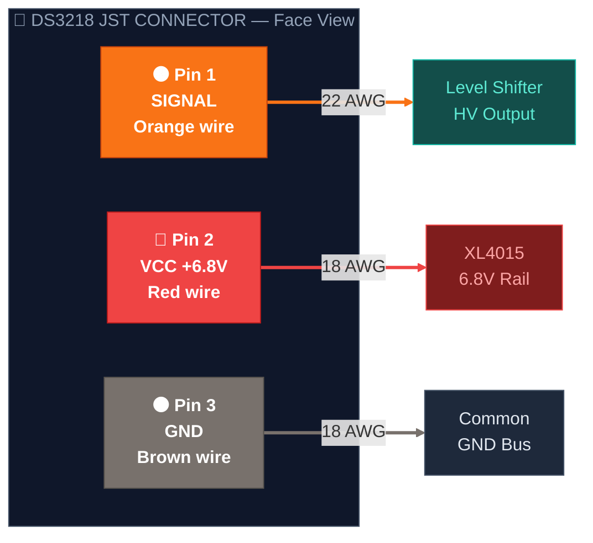

# 🟠 Servo Power — 6.8V Rail to All 12 DS3218

> Part of [VIGIL-RQ Wiring Documentation](wiring_diagram.md)

---

## DS3218 Connector Pinout

Each DS3218 servo has a **3-pin JST connector**. Wire order looking at the plug face:

| Wire | Colour | Function | Connects To | Gauge |
|------|--------|----------|-------------|-------|
| 1 (left) | 🟠 Orange | Signal (PWM) | Level shifter HV output | 22 AWG |
| 2 (center) | 🔴 Red | Power (+) | XL4015 6.8V rail | 18 AWG |
| 3 (right) | ⚫ Brown | Ground (-) | Common GND bus | 18 AWG |

> [!CAUTION]
> **Never power servos from the Raspberry Pi 5V pins.** The DS3218 can draw up to 2.5A stall current each. 12 servos × 2.5A = 30A peak. Only the XL4015 buck converter can supply this.

---

## Front Left Leg — DS3218 #0 / #1 / #2

---

## Front Right Leg — DS3218 #3 / #4 / #5

---

## Rear Left Leg — DS3218 #6 / #7 / #8

```mermaid
graph TD
    classDef red fill:#ef4444,stroke:#b91c1c,color:#fff,font-weight:bold
    classDef orange fill:#f97316,stroke:#c2410c,color:#fff,font-weight:bold
    classDef brown fill:#78716c,stroke:#57534e,color:#fff,font-weight:bold
    classDef rail fill:#7f1d1d,stroke:#ef4444,color:#fca5a5,font-weight:bold
    classDef ls fill:#134e4a,stroke:#14b8a6,color:#5eead4,font-weight:bold

    subgraph SOURCES_RL["⚡ POWER SOURCES"]
        RP3["+6.8V Rail"]:::rail
        RG3["GND Bus"]:::brown
        LS2_HV3["LS2 HV3"]:::ls
        LS2_HV4["LS2 HV4"]:::ls
        LS3_HV1["LS3 HV1"]:::ls
    end

    subgraph S6["DS3218 #6 — RL HIP"]
        S6_R["🔴 Red +6.8V"]:::red
        S6_O["🟠 Orange Signal"]:::orange
        S6_B["⚫ Brown GND"]:::brown
    end

    subgraph S7["DS3218 #7 — RL THIGH"]
        S7_R["🔴 Red +6.8V"]:::red
        S7_O["🟠 Orange Signal"]:::orange
        S7_B["⚫ Brown GND"]:::brown
    end

    subgraph S8["DS3218 #8 — RL KNEE"]
        S8_R["🔴 Red +6.8V"]:::red
        S8_O["🟠 Orange Signal"]:::orange
        S8_B["⚫ Brown GND"]:::brown
    end

    RP3 ==>|"18AWG"| S6_R
    RP3 ==>|"18AWG"| S7_R
    RP3 ==>|"18AWG"| S8_R
    LS2_HV3 -->|"22AWG"| S6_O
    LS2_HV4 -->|"22AWG"| S7_O
    LS3_HV1 -->|"22AWG"| S8_O
    RG3 ==>|"18AWG"| S6_B
    RG3 ==>|"18AWG"| S7_B
    RG3 ==>|"18AWG"| S8_B

    linkStyle 0,1,2 stroke:#ef4444,stroke-width:3px
    linkStyle 3,4,5 stroke:#f97316,stroke-width:2px
    linkStyle 6,7,8 stroke:#78716c,stroke-width:3px

    style SOURCES_RL fill:#1e293b,stroke:#475569,color:#e2e8f0
    style S6 fill:#7c2d12,stroke:#f97316,color:#fdba74
    style S7 fill:#7c2d12,stroke:#f97316,color:#fdba74
    style S8 fill:#7c2d12,stroke:#f97316,color:#fdba74
```

---

## Rear Right Leg — DS3218 #9 / #10 / #11

---

## Complete Servo Wiring Summary Table

| Servo # | Joint | 🔴 Red (+6.8V) | 🟠 Orange (Signal) | ⚫ Brown (GND) |
|---------|-------|----------------|---------------------|----------------|
| 0 | FL Hip | XL4015 rail | LS1 HV1 (from FPGA Pin 28) | GND bus |
| 1 | FL Thigh | XL4015 rail | LS1 HV2 (from FPGA Pin 29) | GND bus |
| 2 | FL Knee | XL4015 rail | LS1 HV3 (from FPGA Pin 30) | GND bus |
| 3 | FR Hip | XL4015 rail | LS1 HV4 (from FPGA Pin 31) | GND bus |
| 4 | FR Thigh | XL4015 rail | LS2 HV1 (from FPGA Pin 32) | GND bus |
| 5 | FR Knee | XL4015 rail | LS2 HV2 (from FPGA Pin 33) | GND bus |
| 6 | RL Hip | XL4015 rail | LS2 HV3 (from FPGA Pin 34) | GND bus |
| 7 | RL Thigh | XL4015 rail | LS2 HV4 (from FPGA Pin 35) | GND bus |
| 8 | RL Knee | XL4015 rail | LS3 HV1 (from FPGA Pin 40) | GND bus |
| 9 | RR Hip | XL4015 rail | LS3 HV2 (from FPGA Pin 41) | GND bus |
| 10 | RR Thigh | XL4015 rail | LS3 HV3 (from FPGA Pin 42) | GND bus |
| 11 | RR Knee | XL4015 rail | LS3 HV4 (from FPGA Pin 48) | GND bus |

## Current Budget

| Scenario | Per Servo | 12 Servos Total | Notes |
|----------|-----------|-----------------|-------|
| Idle (holding) | ~150 mA | ~1.8 A | No load, neutral position |
| Walking (typical) | ~500 mA | ~6 A | Normal gait operation |
| Heavy load | ~1.2 A | ~14 A | Climbing / rough terrain |
| Stall (worst case) | ~2.5 A | ~30 A | All servos locked — fuse trips |

> [!WARNING]
> Use **18 AWG wire pairs** from the XL4015 rail to each group of 3 servos (one pair per leg). Using thinner wire will cause voltage drop under load, leading to servo brown-out and twitching.
