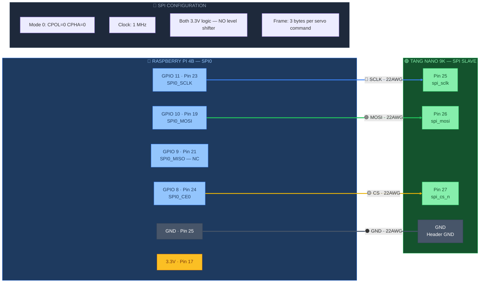

# 🔵 SPI Bus — Raspberry Pi ↔ Tang Nano 9K

> Part of [VIGIL-RQ Wiring Documentation](wiring_diagram.md)

---



---

## SPI Pin Mapping

| RPi GPIO | RPi Pin | Signal | FPGA Pin | Wire Colour | Notes |
|----------|---------|--------|----------|-------------|-------|
| GPIO 11 | 23 | SCLK | 25 | 🔵 Blue | Clock, 1 MHz |
| GPIO 10 | 19 | MOSI | 26 | 🟢 Green | Data RPi→FPGA |
| GPIO 9 | 21 | MISO | — | — | Reserved, not connected |
| GPIO 8 | 24 | CE0 (CS) | 27 | 🟡 Yellow | Active low chip select |
| GND | 25 | Ground | GND | ⚫ Black | Shared ground |

## SPI Frame Format

Each servo command is **3 bytes**:

| Byte | Content | Range |
|------|---------|-------|
| 0 | Channel ID | 0–11 |
| 1 | Pulse width MSB | High 8 bits of µs value |
| 2 | Pulse width LSB | Low 8 bits of µs value |

> [!IMPORTANT]
> Both RPi 4B SPI0 and Tang Nano 9K GPIO run at **3.3V** — **no level shifter needed** on the SPI bus. Keep SPI wires **short** (<15cm) to avoid noise. SPI MISO is reserved but not connected since the FPGA is receive-only.

> [!NOTE]
> The **Notes** box in the diagram is intentionally disconnected — it's a reference info panel, not a wired component.

---

## SPI Timing — Mode 0 (CPOL=0, CPHA=0)

```
         ┌─ CS asserted                                           CS released ─┐
         │                                                                      │
CS    ───┐                                                                      ┌───
         └──────────────────────────────────────────────────────────────────────┘
              │◄──────── Byte 0 ────────►│◄──────── Byte 1 ────────►│◄──── Byte 2 ────►│
              │       Channel ID         │      Pulse µs [15:8]     │   Pulse µs [7:0]  │
              │                          │                          │                    │
SCLK  ────────┐  ┌──┐  ┌──┐  ┌──┐  ┌──┐  ┌──┐  ┌──┐  ┌──┐  ┌──┐  ┌──┐  ┌──┐  ┌──┐  ┌─────
              └──┘  └──┘  └──┘  └──┘  └──┘  └──┘  └──┘  └──┘  └──┘  └──┘  └──┘  └──┘
              1  2  3  4  5  6  7  8  9  10 11 12 13 14 15 16 17 18 19 20 21 22 23 24
                                                                            clock edges
MOSI  ───┬────╫────╫────╫────╫────╫────╫────╫────╫─┬──╫────╫────╫────╫────╫────╫────╫──┬───
         │  MSB                              LSB  │MSB                            LSB │
         │  D7   D6   D5   D4   D3   D2   D1  D0 │D7   D6   D5   D4   D3   D2  D1 D0│
         │           Channel ID (0-11)            │        Pulse Width High            │
         └────────────────────────────────────────┴────────────────────────────────────┘
              ↑ Data sampled on rising edge of SCLK (Mode 0)
```

**Example: Channel 0 → 1500 µs (neutral)**

```
Byte 0 = 0x00 = Channel 0    → MOSI: 00000000
Byte 1 = 0x05 = 1500 >> 8    → MOSI: 00000101
Byte 2 = 0xDC = 1500 & 0xFF  → MOSI: 11011100
```

| Parameter | Value | Notes |
|-----------|-------|-------|
| Clock speed | 1 MHz | RPi `spidev` max_speed_hz |
| Clock polarity (CPOL) | 0 | Idle low |
| Clock phase (CPHA) | 0 | Sample on rising edge |
| Bit order | MSB first | Default for both RPi and FPGA |
| CS active | Low | RPi drives CE0 low during transfer |
| Transfer time | ~24 µs per command | 3 bytes × 8 bits / 1 MHz |
| Update rate | 50 Hz (20 ms) | One full sweep of 12 servos per cycle |

### Full Update Cycle

At 50 Hz, the RPi sends 12 commands per cycle:

```
Total SPI time = 12 channels × 24 µs = 288 µs per cycle
Available time = 20,000 µs (50 Hz period)
SPI utilisation = 1.4%  ← plenty of headroom
```

---

## Wiring Best Practices

1. **Keep wires short** — SPI is high-speed digital; wires >15cm act as antennas
2. **Twist SCLK+GND together** — reduces electromagnetic interference
3. **Route SPI away from servo power wires** — switching 6.8V/2A servos creates noise
4. **Use consistent wire colours** — Blue=SCLK, Green=MOSI, Yellow=CS, Black=GND
5. **Solder connections preferred** — DuPont jumpers can work loose under vibration
6. **Add a GND wire** — even though ground is shared via power, a dedicated SPI GND wire reduces noise

---

## Troubleshooting

| Symptom | Cause | Fix |
|---------|-------|-----|
| No SPI activity (FPGA LED[1] never lights) | CS not connected or wrong pin | Check GPIO 8 → FPGA Pin 27 |
| Servos jitter randomly | Ground loop or missing GND wire | Add dedicated SPI GND wire |
| Servos don't respond at all | SPI clock too fast or CPOL wrong | Verify 1 MHz, Mode 0 in Python |
| Intermittent channel glitches | Loose DuPont connection | Solder SPI wires |
| All servos go to neutral after 500ms | FPGA watchdog tripping | SPI commands not arriving — check `spidev` |

### Quick SPI Test (Python)

```python
import spidev
spi = spidev.SpiDev()
spi.open(0, 0)  # Bus 0, CE0
spi.max_speed_hz = 1_000_000
spi.mode = 0b00

# Send channel 0 to neutral (1500 µs = 0x05DC)
spi.xfer2([0x00, 0x05, 0xDC])
print("Sent: Ch0 → 1500 µs")
```

