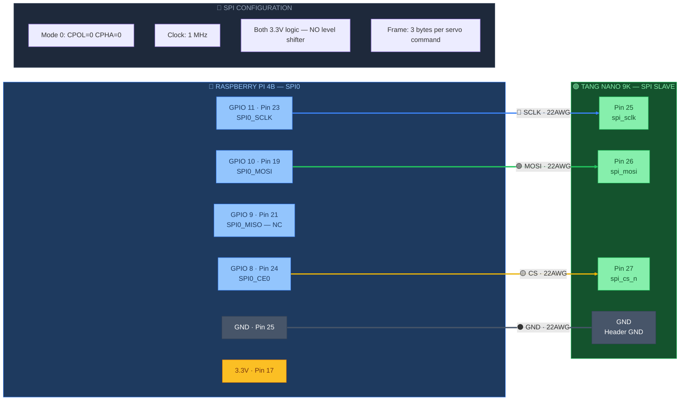

# 🔵 SPI Bus — Raspberry Pi ↔ Tang Nano 9K

> Part of [VIGIL-RQ Wiring Documentation](wiring_diagram.md)

---

---

## SPI Pin Mapping

| RPi GPIO | RPi Pin | Signal | FPGA Pin | Wire Colour | Notes |
|----------|---------|--------|----------|-------------|-------|
| GPIO 11 | 23 | SCLK | 25 | 🔵 Blue | Clock, 1 MHz |
| GPIO 10 | 19 | MOSI | 26 | 🟢 Green | Data RPi→FPGA |
| GPIO 9 | 21 | MISO | — | — | Reserved, not connected |
| GPIO 8 | 24 | CE0 (CS) | 27 | 🟡 Yellow | Active low chip select |
| GND | 25 | Ground | GND | ⚫ Black | Shared ground |

## SPI Frame Format

Each servo command is **3 bytes**:

| Byte | Content | Range |
|------|---------|-------|
| 0 | Channel ID | 0–11 |
| 1 | Pulse width MSB | High 8 bits of µs value |
| 2 | Pulse width LSB | Low 8 bits of µs value |

> [!IMPORTANT]
> Both RPi 4B SPI0 and Tang Nano 9K GPIO run at **3.3V** — **no level shifter needed** on the SPI bus. Keep SPI wires **short** (<15cm) to avoid noise. SPI MISO is reserved but not connected since the FPGA is receive-only.

> [!NOTE]
> The **Notes** box in the diagram is intentionally disconnected — it's a reference info panel, not a wired component.
